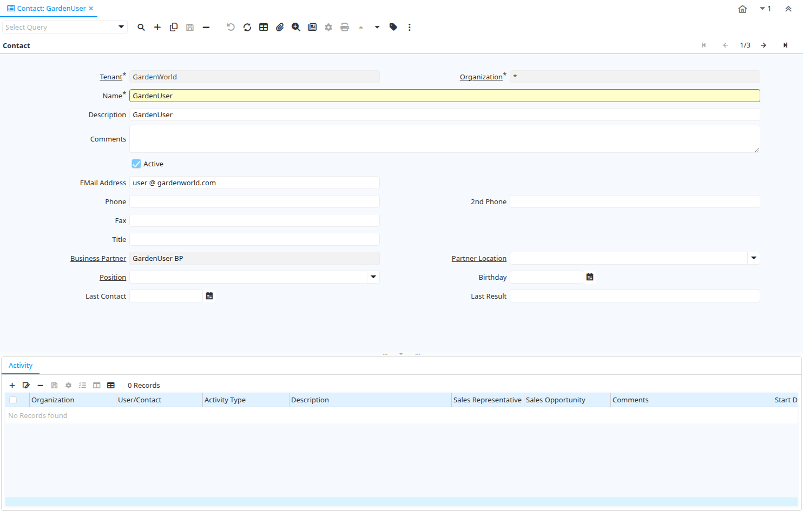

# Contact

Window ID 53152

*25/08/2013 → 12/09/2013*

**Description:** Maintain Contacts

**Comment/Help:** The Contact Window allows you to maintain Contacts who are individuals you deal with.  Contacts may also be internal or external users who can log into the system and have access to functionality via one or more roles.  A contact can also be a business partner contact.

## Tab: Contact

*Tab Level 0 · Created 25/08/2013 · Updated 12/09/2013*

**Description:** The contact details

| **Name** | **Description** | **Comment/Help** | **Technical Data** |
|---|---|---|---|
| Tenant | Tenant for this installation. | A Tenant is a company or a legal entity. You cannot share data between Tenants. | AD_User.AD_Client_ID<small> numeric(10)   Table Direct</small> |
| Organization | Organizational entity within tenant | An organization is a unit of your tenant or legal entity - examples are store, department. You can share data between organizations. | AD_User.AD_Org_ID<small> numeric(10)   Table Direct</small> |
| Name | Alphanumeric identifier of the entity | The name of an entity (record) is used as an default search option in addition to the search key. The name is up to 60 characters in length. | AD_User.Name<small> character varying(60)   String</small> |
| Description | Optional short description of the record | A description is limited to 255 characters. | AD_User.Description<small> character varying(255)   String</small> |
| Comments | Comments or additional information | The Comments field allows for free form entry of additional information. | AD_User.Comments<small> character varying(2000)   Text</small> |
| Active | The record is active in the system | There are two methods of making records unavailable in the system: One is to delete the record, the other is to de-activate the record. A de-activated record is not available for selection, but available for reports. There are two reasons for de-activating and not deleting records: (1) The system requires the record for audit purposes. (2) The record is referenced by other records. E.g., you cannot delete a Business Partner, if there are invoices for this partner record existing. You de-activate the Business Partner and prevent that this record is used for future entries. | AD_User.IsActive<small> character(1)   Yes-No</small> |
| EMail Address | Electronic Mail Address | The Email Address is the Electronic Mail ID for this User and should be fully qualified (e.g. joe.smith@company.com). The Email Address is used to access the self service application functionality from the web. | AD_User.EMail<small> character varying(60)   String</small> |
| Phone | Identifies a telephone number | The Phone field identifies a telephone number | AD_User.Phone<small> character varying(40)   String</small> |
| 2nd Phone | Identifies an alternate telephone number. | The 2nd Phone field identifies an alternate telephone number. | AD_User.Phone2<small> character varying(40)   String</small> |
| Fax | Facsimile number | The Fax identifies a facsimile number for this Business Partner or  Location | AD_User.Fax<small> character varying(40)   String</small> |
| Title | Name this entity is referred to as | The Title indicates the name that an entity is referred to as. | AD_User.Title<small> character varying(40)   String</small> |
| Business Partner | Identifies a Business Partner | A Business Partner is anyone with whom you transact.  This can include Vendor, Customer, Employee or Salesperson | AD_User.C_BPartner_ID<small> numeric(10)   Search</small> |
| Partner Location | Identifies the (ship to) address for this Business Partner | The Partner address indicates the location of a Business Partner | AD_User.C_BPartner_Location_ID<small> numeric(10)   Table Direct</small> |
| Position | Job Position |  | AD_User.C_Job_ID<small> numeric(10)   Table Direct</small> |
| Birthday | Birthday or Anniversary day | Birthday or Anniversary day | AD_User.Birthday<small> timestamp without time zone   Date</small> |
| Last Contact | Date this individual was last contacted | The Last Contact indicates the date that this Business Partner Contact was last contacted. | AD_User.LastContact<small> timestamp without time zone   Date</small> |
| Last Result | Result of last contact | The Last Result identifies the result of the last contact made. | AD_User.LastResult<small> character varying(255)   String</small> |

## Tab: › Activity

*Tab Level 1 · Created 25/08/2013 · Updated 25/08/2013*

**Description:** Contact Activity

| **Name** | **Description** | **Comment/Help** | **Technical Data** |
|---|---|---|---|
| Tenant | Tenant for this installation. | A Tenant is a company or a legal entity. You cannot share data between Tenants. | C_ContactActivity.AD_Client_ID<small> numeric(10)   Table Direct</small> |
| Organization | Organizational entity within tenant | An organization is a unit of your tenant or legal entity - examples are store, department. You can share data between organizations. | C_ContactActivity.AD_Org_ID<small> numeric(10)   Table Direct</small> |
| User/Contact | User within the system - Internal or Business Partner Contact | The User identifies a unique user in the system. This could be an internal user or a business partner contact | C_ContactActivity.AD_User_ID<small> numeric(10)   Search</small> |
| Activity Type | Type of activity, e.g. task, email, phone call |  | C_ContactActivity.ContactActivityType<small> character varying(10)   List</small> |
| Description | Optional short description of the record | A description is limited to 255 characters. | C_ContactActivity.Description<small> character varying(255)   String</small> |
| Sales Representative | Sales Representative or Company Agent | The Sales Representative indicates the Sales Rep for this Region.  Any Sales Rep must be a valid internal user. | C_ContactActivity.SalesRep_ID<small> numeric(10)   Table</small> |
| Sales Opportunity |  |  | C_ContactActivity.C_Opportunity_ID<small> numeric(10)   Table Direct</small> |
| Comments | Comments or additional information | The Comments field allows for free form entry of additional information. | C_ContactActivity.Comments<small> text   Text</small> |
| Start Date | First effective day (inclusive) | The Start Date indicates the first or starting date | C_ContactActivity.StartDate<small> timestamp without time zone   Date+Time</small> |
| End Date | Last effective date (inclusive) | The End Date indicates the last date in this range. | C_ContactActivity.EndDate<small> timestamp without time zone   Date+Time</small> |
| Complete | It is complete | Indication that this is complete | C_ContactActivity.IsComplete<small> character(1)   Yes-No</small> |

