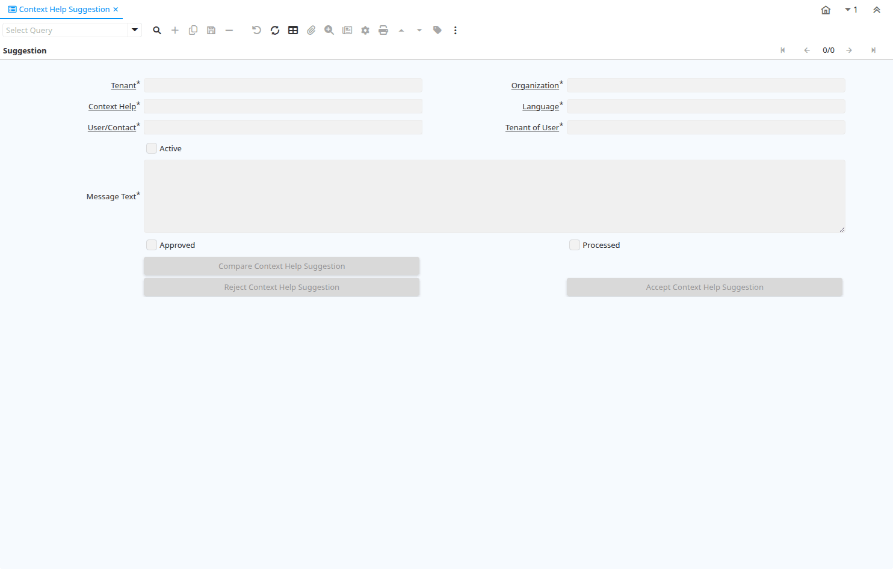

# Context Help Suggestion

Window ID 200088

*05/07/2016 → 05/07/2016*

**Description:** Review context help suggestion from tenant

## Tab: Suggestion

*Tab Level 0 · Created 05/07/2016 · Updated 12/05/2022*

| **Name** | **Description** | **Comment/Help** | **Technical Data** |
|---|---|---|---|
| Tenant | Tenant for this installation. | A Tenant is a company or a legal entity. You cannot share data between Tenants. | AD_CtxHelpSuggestion.AD_Client_ID<small> numeric(10)   Table Direct</small> |
| Organization | Organizational entity within tenant | An organization is a unit of your tenant or legal entity - examples are store, department. You can share data between organizations. | AD_CtxHelpSuggestion.AD_Org_ID<small> numeric(10)   Table Direct</small> |
| Context Help |  |  | AD_CtxHelpSuggestion.AD_CtxHelp_ID<small> numeric(10)   Search</small> |
| Language | Language for this entity | The Language identifies the language to use for display and formatting | AD_CtxHelpSuggestion.AD_Language<small> character varying(6)   Table</small> |
| User/Contact | User within the system - Internal or Business Partner Contact | The User identifies a unique user in the system. This could be an internal user or a business partner contact | AD_CtxHelpSuggestion.AD_User_ID<small> numeric(10)   Search</small> |
| Tenant of User |  |  | AD_CtxHelpSuggestion.AD_UserClient_ID<small> numeric(10)   Table</small> |
| Active | The record is active in the system | There are two methods of making records unavailable in the system: One is to delete the record, the other is to de-activate the record. A de-activated record is not available for selection, but available for reports. There are two reasons for de-activating and not deleting records: (1) The system requires the record for audit purposes. (2) The record is referenced by other records. E.g., you cannot delete a Business Partner, if there are invoices for this partner record existing. You de-activate the Business Partner and prevent that this record is used for future entries. | AD_CtxHelpSuggestion.IsActive<small> character(1)   Yes-No</small> |
| Message Text | Textual Informational, Menu or Error Message | The Message Text indicates the message that will display  | AD_CtxHelpSuggestion.MsgText<small> character varying(2000)   Text</small> |
| Approved | Indicates if this document requires approval | The Approved checkbox indicates if this document requires approval before it can be processed. | AD_CtxHelpSuggestion.IsApproved<small> character(1)   Yes-No</small> |
| Processed | The document has been processed | The Processed checkbox indicates that a document has been processed. | AD_CtxHelpSuggestion.Processed<small> character(1)   Yes-No</small> |
| Save As Tenant Customization | Apply changes as tenant customization | Changes is keep as tenant specific customization and wouldn't effect other tenants in the system | AD_CtxHelpSuggestion.IsSaveAsTenantCustomization<small> character(1)   Yes-No</small> |
| Compare Context Help Suggestion |  |  | AD_CtxHelpSuggestion.CompareSuggestion<small> character(1)   Button</small> |
| Reject Context Help Suggestion | Reject suggested changes for context help |  | AD_CtxHelpSuggestion.RejectSuggestion<small> character(1)   Button</small> |
| Accept Context Help Suggestion | Accept suggested changes for context help |  | AD_CtxHelpSuggestion.AcceptSuggestion<small> character(1)   Button</small> |

