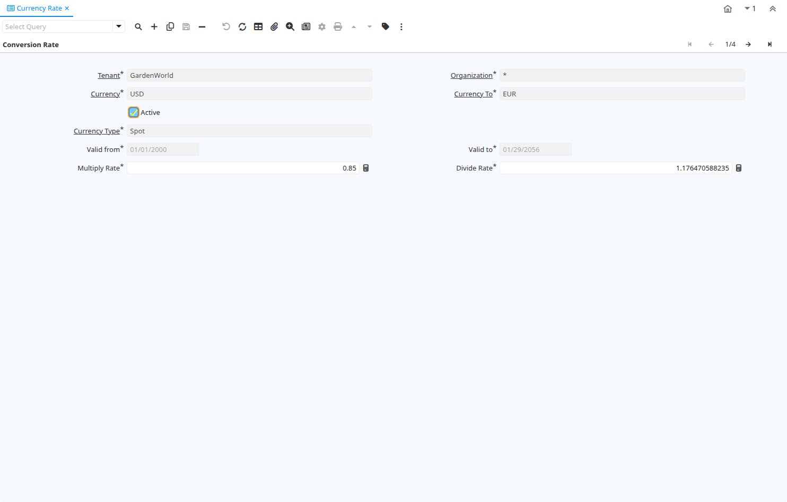

# Currency Rate

Window ID 116

*11/06/1999 → 02/01/2000*

**Description:** Maintain Currency Conversion Rates

**Comment/Help:** The Conversion Rates window is used to define the conversion rates that will be used when converting document amounts from one currency to another. Note that only the multiply rate is used; The divide rate is for visualization only.

## Tab: Conversion Rate

*Tab Level 0 · Created 30/08/1999 · Updated 02/01/2000*

**Description:** Define Currency Conversion Rates

**Comment/Help:** The Conversion Rates tab is used to define conversion rates to be used when converting document amounts from one currency to another.  Conversion rates can be defined for multiple rate types.  They can also be effective for a defined range of dates. Note that only the multiply rate is used; The divide rate is for visualization only.

| **Name** | **Description** | **Comment/Help** | **Technical Data** |
|---|---|---|---|
| Tenant | Tenant for this installation. | A Tenant is a company or a legal entity. You cannot share data between Tenants. | C_Conversion_Rate.AD_Client_ID<small> numeric(10)   Table Direct</small> |
| Organization | Organizational entity within tenant | An organization is a unit of your tenant or legal entity - examples are store, department. You can share data between organizations. | C_Conversion_Rate.AD_Org_ID<small> numeric(10)   Table Direct</small> |
| Currency | The Currency for this record | Indicates the Currency to be used when processing or reporting on this record | C_Conversion_Rate.C_Currency_ID<small> numeric(10)   Table</small> |
| Currency To | Target currency | The Currency To defines the target currency for this conversion rate. | C_Conversion_Rate.C_Currency_ID_To<small> numeric(10)   Table</small> |
| Active | The record is active in the system | There are two methods of making records unavailable in the system: One is to delete the record, the other is to de-activate the record. A de-activated record is not available for selection, but available for reports. There are two reasons for de-activating and not deleting records: (1) The system requires the record for audit purposes. (2) The record is referenced by other records. E.g., you cannot delete a Business Partner, if there are invoices for this partner record existing. You de-activate the Business Partner and prevent that this record is used for future entries. | C_Conversion_Rate.IsActive<small> character(1)   Yes-No</small> |
| Currency Type | Currency Conversion Rate Type | The Currency Conversion Rate Type lets you define different type of rates, e.g. Spot, Corporate and/or Sell/Buy rates. | C_Conversion_Rate.C_ConversionType_ID<small> numeric(10)   Table Direct</small> |
| Valid from | Valid from including this date (first day) | The Valid From date indicates the first day of a date range | C_Conversion_Rate.ValidFrom<small> timestamp without time zone   Date</small> |
| Valid to | Valid to including this date (last day) | The Valid To date indicates the last day of a date range | C_Conversion_Rate.ValidTo<small> timestamp without time zone   Date</small> |
| Multiply Rate | Rate to multiple the source by to calculate the target. | To convert Source number to Target number, the Source is multiplied by the multiply rate.  If the Multiply Rate is entered, then the Divide Rate will be automatically calculated. | C_Conversion_Rate.MultiplyRate<small> numeric   Number</small> |
| Divide Rate | To convert Source number to Target number, the Source is divided | To convert Source number to Target number, the Source is divided by the divide rate.  If you enter a Divide Rate, the Multiply Rate will be automatically calculated. | C_Conversion_Rate.DivideRate<small> numeric   Number</small> |

