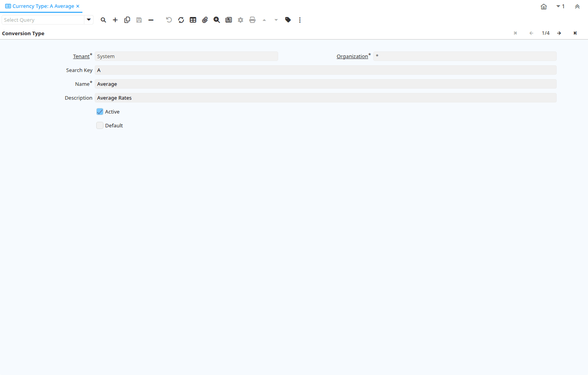

# Currency Type

Window ID 295

*21/12/2003 → 02/01/2000*

**Description:** Maintain Currency Conversion Rate Types

**Comment/Help:** The Currency Conversion Rate Type lets you define different type of rates, e.g. Spot, Corporate and/or Sell/Buy rates.

## Tab: Conversion Type

*Tab Level 0 · Created 21/12/2003 · Updated 08/09/2005*

**Description:** Maintain Currency Conversion Rate Type

**Comment/Help:** The Currency Conversion Rate Type lets you define different type of rates, e.g. Spot, Corporate and/or Sell/Buy rates.

| **Name** | **Description** | **Comment/Help** | **Technical Data** |
|---|---|---|---|
| Tenant | Tenant for this installation. | A Tenant is a company or a legal entity. You cannot share data between Tenants. | C_ConversionType.AD_Client_ID<small> numeric(10)   Table Direct</small> |
| Organization | Organizational entity within tenant | An organization is a unit of your tenant or legal entity - examples are store, department. You can share data between organizations. | C_ConversionType.AD_Org_ID<small> numeric(10)   Table Direct</small> |
| Search Key | Search key for the record in the format required - must be unique | A search key allows you a fast method of finding a particular record. If you leave the search key empty, the system automatically creates a numeric number.  The document sequence used for this fallback number is defined in the "Maintain Sequence" window with the name "DocumentNo_&lt;TableName&gt;", where TableName is the actual name of the table (e.g. C_Order). | C_ConversionType.Value<small> character varying(40)   String</small> |
| Name | Alphanumeric identifier of the entity | The name of an entity (record) is used as an default search option in addition to the search key. The name is up to 60 characters in length. | C_ConversionType.Name<small> character varying(60)   String</small> |
| Description | Optional short description of the record | A description is limited to 255 characters. | C_ConversionType.Description<small> character varying(255)   String</small> |
| Active | The record is active in the system | There are two methods of making records unavailable in the system: One is to delete the record, the other is to de-activate the record. A de-activated record is not available for selection, but available for reports. There are two reasons for de-activating and not deleting records: (1) The system requires the record for audit purposes. (2) The record is referenced by other records. E.g., you cannot delete a Business Partner, if there are invoices for this partner record existing. You de-activate the Business Partner and prevent that this record is used for future entries. | C_ConversionType.IsActive<small> character(1)   Yes-No</small> |
| Default | Default value | The Default Checkbox indicates if this record will be used as a default value. | C_ConversionType.IsDefault<small> character(1)   Yes-No</small> |

