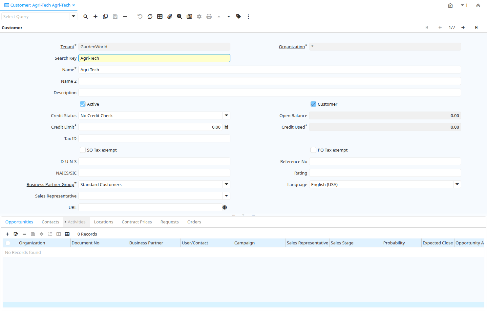

# Customer

Window ID 53165

*25/08/2013 → 12/09/2013*

## Tab: Customer

*Tab Level 0 · Created 25/08/2013 · Updated 25/08/2013*

**Description:** Customer information

| **Name** | **Description** | **Comment/Help** | **Technical Data** |
|---|---|---|---|
| Tenant | Tenant for this installation. | A Tenant is a company or a legal entity. You cannot share data between Tenants. | C_BPartner.AD_Client_ID<small> numeric(10)   Table Direct</small> |
| Organization | Organizational entity within tenant | An organization is a unit of your tenant or legal entity - examples are store, department. You can share data between organizations. | C_BPartner.AD_Org_ID<small> numeric(10)   Table Direct</small> |
| Search Key | Search key for the record in the format required - must be unique | A search key allows you a fast method of finding a particular record. If you leave the search key empty, the system automatically creates a numeric number.  The document sequence used for this fallback number is defined in the "Maintain Sequence" window with the name "DocumentNo_&lt;TableName&gt;", where TableName is the actual name of the table (e.g. C_Order). | C_BPartner.Value<small> character varying(40)   String</small> |
| Name | Alphanumeric identifier of the entity | The name of an entity (record) is used as an default search option in addition to the search key. The name is up to 60 characters in length. | C_BPartner.Name<small> character varying(120)   String</small> |
| Name 2 | Additional Name |  | C_BPartner.Name2<small> character varying(60)   String</small> |
| Description | Optional short description of the record | A description is limited to 255 characters. | C_BPartner.Description<small> character varying(255)   String</small> |
| Active | The record is active in the system | There are two methods of making records unavailable in the system: One is to delete the record, the other is to de-activate the record. A de-activated record is not available for selection, but available for reports. There are two reasons for de-activating and not deleting records: (1) The system requires the record for audit purposes. (2) The record is referenced by other records. E.g., you cannot delete a Business Partner, if there are invoices for this partner record existing. You de-activate the Business Partner and prevent that this record is used for future entries. | C_BPartner.IsActive<small> character(1)   Yes-No</small> |
| Customer | Indicates if this Business Partner is a Customer | The Customer checkbox indicates if this Business Partner is a customer.  If it is select additional fields will display which further define this customer. | C_BPartner.IsCustomer<small> character(1)   Yes-No</small> |
| Credit Status | Business Partner Credit Status | Credit Management is inactive if Credit Status is No Credit Check, Credit Stop or if the Credit Limit is 0. If active, the status is set automatically set to Credit Hold, if the Total Open Balance (including Vendor activities)  is higher then the Credit Limit. It is set to Credit Watch, if above 90% of the Credit Limit and Credit OK otherwise. | C_BPartner.SOCreditStatus<small> character(1)   List</small> |
| Open Balance | Total Open Balance Amount in primary Accounting Currency | The Total Open Balance Amount is the calculated open item amount for Customer and Vendor activity.  If the Balance is below zero, we owe the Business Partner.  The amount is used for Credit Management. Invoices and Payment Allocations determine the Open Balance (i.e. not Orders or Payments). | C_BPartner.TotalOpenBalance<small> numeric   Amount</small> |
| Credit Limit | Total outstanding invoice amounts allowed | The Credit Limit indicates the total amount allowed "on account" in primary accounting currency.  If the Credit Limit is 0, no check is performed.  Credit Management is based on the Total Open Amount, which includes Vendor activities. | C_BPartner.SO_CreditLimit<small> numeric   Amount</small> |
| Credit Used | Current open balance | The Credit Used indicates the total amount of open or unpaid invoices in primary accounting currency for the Business Partner. Credit Management is based on the Total Open Amount, which includes Vendor activities. | C_BPartner.SO_CreditUsed<small> numeric   Amount</small> |
| Tax ID | Tax Identification | The Tax ID field identifies the legal Identification number of this Entity. | C_BPartner.TaxID<small> character varying(20)   String</small> |
| SO Tax exempt | Business partner is exempt from tax on sales | If a business partner is exempt from tax on sales, the exempt tax rate is used. For this, you need to set up a tax rate with a 0% rate and indicate that this is your tax exempt rate.  This is required for tax reporting, so that you can track tax exempt transactions. | C_BPartner.IsTaxExempt<small> character(1)   Yes-No</small> |
| PO Tax exempt | Business partner is exempt from tax on purchases | If a business partner is exempt from tax on purchases, the exempt tax rate is used. For this, you need to set up a tax rate with a 0% rate and indicate that this is your tax exempt rate.  This is required for tax reporting, so that you can track tax exempt transactions. | C_BPartner.IsPOTaxExempt<small> character(1)   Yes-No</small> |
| D-U-N-S | Dun &amp; Bradstreet Number | Used for EDI - For details see   www.dnb.com/dunsno/list.htm | C_BPartner.DUNS<small> character varying(11)   String</small> |
| Reference No | Your customer or vendor number at the Business Partner's site | The reference number can be printed on orders and invoices to allow your business partner to faster identify your records. | C_BPartner.ReferenceNo<small> character varying(40)   String</small> |
| NAICS/SIC | Standard Industry Code or its successor NAIC - http://www.osha.gov/oshstats/sicser.html | The NAICS/SIC identifies either of these codes that may be applicable to this Business Partner. | C_BPartner.NAICS<small> character varying(6)   String</small> |
| Rating | Classification or Importance | The Rating is used to differentiate the importance | C_BPartner.Rating<small> character(1)   String</small> |
| Business Partner Group | Business Partner Group | The Business Partner Group provides a method of defining defaults to be used for individual Business Partners. | C_BPartner.C_BP_Group_ID<small> numeric(10)   Table Direct</small> |
| Language | Language for this Business Partner if Multi-Language enabled | The Language identifies the language to use for display and formatting documents. It requires, that on Tenant level, Multi-Lingual documents are selected and that you have created/loaded the language. | C_BPartner.AD_Language<small> character varying(6)   Table</small> |
| Sales Representative | Sales Representative or Company Agent | The Sales Representative indicates the Sales Rep for this Region.  Any Sales Rep must be a valid internal user. | C_BPartner.SalesRep_ID<small> numeric(10)   Table</small> |
| URL | Full URL address - e.g. http://www.idempiere.org | The URL defines an fully qualified web address like http://www.idempiere.org | C_BPartner.URL<small> character varying(120)   URL</small> |
| Prospect | Indicates this is a Prospect | The Prospect checkbox indicates an entity that is an active prospect. | C_BPartner.IsProspect<small> character(1)   Yes-No</small> |
| Potential Life Time Value | Total Revenue expected | The Potential Life Time Value is the anticipated revenue in primary accounting currency to be generated by the Business Partner. | C_BPartner.PotentialLifeTimeValue<small> numeric   Amount</small> |
| Actual Life Time Value | Actual Life Time Revenue | The Actual Life Time Value is the recorded revenue in primary accounting currency generated by the Business Partner. | C_BPartner.ActualLifeTimeValue<small> numeric   Amount</small> |
| Acquisition Cost | The cost of gaining the prospect as a customer | The Acquisition Cost identifies the cost associated with making this prospect a customer. | C_BPartner.AcqusitionCost<small> numeric   Costs+Prices</small> |
| Employees | Number of employees | Indicates the number of employees for this Business Partner.  This field displays only for Prospects. | C_BPartner.NumberEmployees<small> numeric(10)   Integer</small> |
| Share | Share of Customer's business as a percentage | The Share indicates the percentage of this Business Partner's volume of the products supplied. | C_BPartner.ShareOfCustomer<small> numeric(10)   Integer</small> |
| Sales Volume in 1.000 | Total Volume of Sales in Thousands of Currency | The Sales Volume indicates the total volume of sales for a Business Partner. | C_BPartner.SalesVolume<small> numeric(10)   Integer</small> |
| First Sale | Date of First Sale | The First Sale Date identifies the date of the first sale to this Business Partner | C_BPartner.FirstSale<small> timestamp without time zone   Date</small> |
| Price List | Unique identifier of a Price List | Price Lists are used to determine the pricing, margin and cost of items purchased or sold. | C_BPartner.M_PriceList_ID<small> numeric(10)   Table Direct</small> |
| Discount Schema | Schema to calculate the trade discount percentage | After calculation of the (standard) price, the trade discount percentage is calculated and applied resulting in the final price. | C_BPartner.M_DiscountSchema_ID<small> numeric(10)   Table</small> |
| Flat Discount % | Flat discount percentage  |  | C_BPartner.FlatDiscount<small> numeric   Number</small> |
| Discount Printed | Print Discount on Invoice and Order | The Discount Printed Checkbox indicates if the discount will be printed on the document. | C_BPartner.IsDiscountPrinted<small> character(1)   Yes-No</small> |
| Order Description | Description to be used on orders | The Order Description identifies the standard description to use on orders for this Customer. | C_BPartner.SO_Description<small> character varying(255)   String</small> |
| Order Reference | Transaction Reference Number (Sales Order, Purchase Order) of your Business Partner | The business partner order reference is the order reference for this specific transaction; Often Purchase Order numbers are given to print on Invoices for easier reference.  A standard number can be defined in the Business Partner (Customer) window. | C_BPartner.POReference<small> character varying(20)   String</small> |
| Document Copies | Number of copies to be printed | The Document Copies indicates the number of copies of each document that will be generated. | C_BPartner.DocumentCopies<small> numeric(10)   Integer</small> |
| Delivery Rule | Defines the timing of Delivery | The Delivery Rule indicates when an order should be delivered. For example should the order be delivered when the entire order is complete, when a line is complete or as the products become available. | C_BPartner.DeliveryRule<small> character(1)   List</small> |
| Delivery Via | How the order will be delivered | The Delivery Via indicates how the products should be delivered. For example, will the order be picked up or shipped. | C_BPartner.DeliveryViaRule<small> character(1)   List</small> |
| Invoice Rule | Frequency and method of invoicing  | The Invoice Rule defines how a Business Partner is invoiced and the frequency of invoicing. | C_BPartner.InvoiceRule<small> character(1)   List</small> |
| Invoice Schedule | Schedule for generating Invoices | The Invoice Schedule identifies the frequency used when generating invoices. | C_BPartner.C_InvoiceSchedule_ID<small> numeric(10)   Table Direct</small> |
| Invoice Print Format | Print Format for printing Invoices | You need to define a Print Format to print the document. | C_BPartner.Invoice_PrintFormat_ID<small> numeric(10)   Table</small> |
| Payment Rule | How you pay the invoice | The Payment Rule indicates the method of invoice payment. | C_BPartner.PaymentRule<small> character(1)   List</small> |
| Payment Term | The terms of Payment (timing, discount) | Payment Terms identify the method and timing of payment. | C_BPartner.C_PaymentTerm_ID<small> numeric(10)   Table</small> |
| Dunning | Dunning Rules for overdue invoices | The Dunning indicates the rules and method of dunning for past due payments. | C_BPartner.C_Dunning_ID<small> numeric(10)   Table Direct</small> |

## Tab: › Opportunities

*Tab Level 1 · Created 25/08/2013 · Updated 25/08/2013*

**Description:** Opportunities

| **Name** | **Description** | **Comment/Help** | **Technical Data** |
|---|---|---|---|
| Tenant | Tenant for this installation. | A Tenant is a company or a legal entity. You cannot share data between Tenants. | C_Opportunity.AD_Client_ID<small> numeric(10)   Table Direct</small> |
| Organization | Organizational entity within tenant | An organization is a unit of your tenant or legal entity - examples are store, department. You can share data between organizations. | C_Opportunity.AD_Org_ID<small> numeric(10)   Table Direct</small> |
| Document No | Document sequence number of the document | The document number is usually automatically generated by the system and determined by the document type of the document. If the document is not saved, the preliminary number is displayed in "&lt;&gt;".  If the document type of your document has no automatic document sequence defined, the field is empty if you create a new document. This is for documents which usually have an external number (like vendor invoice).  If you leave the field empty, the system will generate a document number for you. The document sequence used for this fallback number is defined in the "Maintain Sequence" window with the name "DocumentNo_&lt;TableName&gt;", where TableName is the actual name of the table (e.g. C_Order). | C_Opportunity.DocumentNo<small> character varying(60)   String</small> |
| Business Partner | Identifies a Business Partner | A Business Partner is anyone with whom you transact.  This can include Vendor, Customer, Employee or Salesperson | C_Opportunity.C_BPartner_ID<small> numeric(10)   Search</small> |
| User/Contact | User within the system - Internal or Business Partner Contact | The User identifies a unique user in the system. This could be an internal user or a business partner contact | C_Opportunity.AD_User_ID<small> numeric(10)   Table Direct</small> |
| Campaign | Marketing Campaign | The Campaign defines a unique marketing program.  Projects can be associated with a pre defined Marketing Campaign.  You can then report based on a specific Campaign. | C_Opportunity.C_Campaign_ID<small> numeric(10)   Table Direct</small> |
| Sales Representative | Sales Representative or Company Agent | The Sales Representative indicates the Sales Rep for this Region.  Any Sales Rep must be a valid internal user. | C_Opportunity.SalesRep_ID<small> numeric(10)   Table</small> |
| Sales Stage | Stages of the sales process | Define what stages your sales process will move through | C_Opportunity.C_SalesStage_ID<small> numeric(10)   Table</small> |
| Probability |  |  | C_Opportunity.Probability<small> numeric   Amount</small> |
| Expected Close | Expected Close | The Expected Close Date indicates the expected last or final date | C_Opportunity.ExpectedCloseDate<small> timestamp without time zone   Date</small> |
| Opportunity Amount | The estimated value of this opportunity. |  | C_Opportunity.OpportunityAmt<small> numeric   Amount</small> |
| Weighted Amount | The amount adjusted by the probability. |  | C_Opportunity.WeightedAmt<small>    Amount</small> |
| Currency | The Currency for this record | Indicates the Currency to be used when processing or reporting on this record | C_Opportunity.C_Currency_ID<small> numeric(10)   Table Direct</small> |
| Description | Optional short description of the record | A description is limited to 255 characters. | C_Opportunity.Description<small> character varying(255)   String</small> |
| Comments | Comments or additional information | The Comments field allows for free form entry of additional information. | C_Opportunity.Comments<small> text   Text</small> |
| Order | Order | The Order is a control document.  The  Order is complete when the quantity ordered is the same as the quantity shipped and invoiced.  When you close an order, unshipped (backordered) quantities are cancelled. | C_Opportunity.C_Order_ID<small> numeric(10)   Search</small> |
| Close Date | Close Date | The Start Date indicates the last or final date | C_Opportunity.CloseDate<small> timestamp without time zone   Date</small> |
| Cost | Cost information |  | C_Opportunity.Cost<small> numeric   Amount</small> |

## Tab: › Contacts

*Tab Level 1 · Created 25/08/2013 · Updated 25/08/2013*

**Description:** Customer Contacts

| **Name** | **Description** | **Comment/Help** | **Technical Data** |
|---|---|---|---|
| Tenant | Tenant for this installation. | A Tenant is a company or a legal entity. You cannot share data between Tenants. | AD_User.AD_Client_ID<small> numeric(10)   Table Direct</small> |
| Organization | Organizational entity within tenant | An organization is a unit of your tenant or legal entity - examples are store, department. You can share data between organizations. | AD_User.AD_Org_ID<small> numeric(10)   Table Direct</small> |
| Business Partner | Identifies a Business Partner | A Business Partner is anyone with whom you transact.  This can include Vendor, Customer, Employee or Salesperson | AD_User.C_BPartner_ID<small> numeric(10)   Search</small> |
| Name | Alphanumeric identifier of the entity | The name of an entity (record) is used as an default search option in addition to the search key. The name is up to 60 characters in length. | AD_User.Name<small> character varying(60)   String</small> |
| Description | Optional short description of the record | A description is limited to 255 characters. | AD_User.Description<small> character varying(255)   String</small> |
| Comments | Comments or additional information | The Comments field allows for free form entry of additional information. | AD_User.Comments<small> character varying(2000)   Text</small> |
| Active | The record is active in the system | There are two methods of making records unavailable in the system: One is to delete the record, the other is to de-activate the record. A de-activated record is not available for selection, but available for reports. There are two reasons for de-activating and not deleting records: (1) The system requires the record for audit purposes. (2) The record is referenced by other records. E.g., you cannot delete a Business Partner, if there are invoices for this partner record existing. You de-activate the Business Partner and prevent that this record is used for future entries. | AD_User.IsActive<small> character(1)   Yes-No</small> |
| EMail Address | Electronic Mail Address | The Email Address is the Electronic Mail ID for this User and should be fully qualified (e.g. joe.smith@company.com). The Email Address is used to access the self service application functionality from the web. | AD_User.EMail<small> character varying(60)   String</small> |
| Password | Password of any length (case sensitive) | The Password for this User.  Passwords are required to identify authorized users.  For iDempiere Users, you can change the password via the Process "Reset Password". | AD_User.Password<small> character varying(1024)   String</small> |
| Greeting | Greeting to print on correspondence | The Greeting identifies the greeting to print on correspondence. | AD_User.C_Greeting_ID<small> numeric(10)   Table Direct</small> |
| Partner Location | Identifies the (ship to) address for this Business Partner | The Partner address indicates the location of a Business Partner | AD_User.C_BPartner_Location_ID<small> numeric(10)   Table Direct</small> |
| Title | Name this entity is referred to as | The Title indicates the name that an entity is referred to as. | AD_User.Title<small> character varying(40)   String</small> |
| Birthday | Birthday or Anniversary day | Birthday or Anniversary day | AD_User.Birthday<small> timestamp without time zone   Date</small> |
| Phone | Identifies a telephone number | The Phone field identifies a telephone number | AD_User.Phone<small> character varying(40)   String</small> |
| 2nd Phone | Identifies an alternate telephone number. | The 2nd Phone field identifies an alternate telephone number. | AD_User.Phone2<small> character varying(40)   String</small> |
| Fax | Facsimile number | The Fax identifies a facsimile number for this Business Partner or  Location | AD_User.Fax<small> character varying(40)   String</small> |
| Notification Type | Type of Notifications | Emails or Notification sent out for Request Updates, etc. | AD_User.NotificationType<small> character(1)   List</small> |
| Position | Job Position |  | AD_User.C_Job_ID<small> numeric(10)   Table Direct</small> |
| Full BP Access | The user/contact has full access to Business Partner information and resources | If selected, the user has full access to the Business Partner (BP) information (Business Documents like Orders, Invoices - Requests) or resources (Assets, Downloads). If you deselect it, the user has no access rights unless, you explicitly grant it in tab "BP Access" | AD_User.IsFullBPAccess<small> character(1)   Yes-No</small> |
| EMail Verify | Date Email was verified |  | AD_User.EMailVerifyDate<small> timestamp without time zone   Date+Time</small> |
| Verification Info | Verification information of EMail Address | The field contains additional information how the EMail Address has been verified | AD_User.EMailVerify<small> character varying(40)   String</small> |
| Last Contact | Date this individual was last contacted | The Last Contact indicates the date that this Business Partner Contact was last contacted. | AD_User.LastContact<small> timestamp without time zone   Date</small> |
| Last Result | Result of last contact | The Last Result identifies the result of the last contact made. | AD_User.LastResult<small> character varying(255)   String</small> |

## Tab: › › Activities

*Tab Level 2 · Created 25/08/2013 · Updated 25/08/2013*

**Description:** Customer Contact Activities

| **Name** | **Description** | **Comment/Help** | **Technical Data** |
|---|---|---|---|
| Tenant | Tenant for this installation. | A Tenant is a company or a legal entity. You cannot share data between Tenants. | C_ContactActivity.AD_Client_ID<small> numeric(10)   Table Direct</small> |
| Organization | Organizational entity within tenant | An organization is a unit of your tenant or legal entity - examples are store, department. You can share data between organizations. | C_ContactActivity.AD_Org_ID<small> numeric(10)   Table Direct</small> |
| Sales Representative | Sales Representative or Company Agent | The Sales Representative indicates the Sales Rep for this Region.  Any Sales Rep must be a valid internal user. | C_ContactActivity.SalesRep_ID<small> numeric(10)   Table</small> |
| Activity Type | Type of activity, e.g. task, email, phone call |  | C_ContactActivity.ContactActivityType<small> character varying(10)   List</small> |
| Description | Optional short description of the record | A description is limited to 255 characters. | C_ContactActivity.Description<small> character varying(255)   String</small> |
| User/Contact | User within the system - Internal or Business Partner Contact | The User identifies a unique user in the system. This could be an internal user or a business partner contact | C_ContactActivity.AD_User_ID<small> numeric(10)   Search</small> |
| Sales Opportunity |  |  | C_ContactActivity.C_Opportunity_ID<small> numeric(10)   Table Direct</small> |
| Comments | Comments or additional information | The Comments field allows for free form entry of additional information. | C_ContactActivity.Comments<small> text   Text</small> |
| Start Date | First effective day (inclusive) | The Start Date indicates the first or starting date | C_ContactActivity.StartDate<small> timestamp without time zone   Date+Time</small> |
| End Date | Last effective date (inclusive) | The End Date indicates the last date in this range. | C_ContactActivity.EndDate<small> timestamp without time zone   Date+Time</small> |
| Complete | It is complete | Indication that this is complete | C_ContactActivity.IsComplete<small> character(1)   Yes-No</small> |

## Tab: › Locations

*Tab Level 1 · Created 25/08/2013 · Updated 25/08/2013*

**Description:** Customer Locations

| **Name** | **Description** | **Comment/Help** | **Technical Data** |
|---|---|---|---|
| Tenant | Tenant for this installation. | A Tenant is a company or a legal entity. You cannot share data between Tenants. | C_BPartner_Location.AD_Client_ID<small> numeric(10)   Table Direct</small> |
| Organization | Organizational entity within tenant | An organization is a unit of your tenant or legal entity - examples are store, department. You can share data between organizations. | C_BPartner_Location.AD_Org_ID<small> numeric(10)   Table Direct</small> |
| Business Partner | Identifies a Business Partner | A Business Partner is anyone with whom you transact.  This can include Vendor, Customer, Employee or Salesperson | C_BPartner_Location.C_BPartner_ID<small> numeric(10)   Search</small> |
| Name | Alphanumeric identifier of the entity | The name of an entity (record) is used as an default search option in addition to the search key. The name is up to 60 characters in length. | C_BPartner_Location.Name<small> character varying(60)   String</small> |
| Active | The record is active in the system | There are two methods of making records unavailable in the system: One is to delete the record, the other is to de-activate the record. A de-activated record is not available for selection, but available for reports. There are two reasons for de-activating and not deleting records: (1) The system requires the record for audit purposes. (2) The record is referenced by other records. E.g., you cannot delete a Business Partner, if there are invoices for this partner record existing. You de-activate the Business Partner and prevent that this record is used for future entries. | C_BPartner_Location.IsActive<small> character(1)   Yes-No</small> |
| Address | Location or Address | The Location / Address field defines the location of an entity. | C_BPartner_Location.C_Location_ID<small> numeric(10)   Location (Address)</small> |
| Phone | Identifies a telephone number | The Phone field identifies a telephone number | C_BPartner_Location.Phone<small> character varying(40)   String</small> |
| 2nd Phone | Identifies an alternate telephone number. | The 2nd Phone field identifies an alternate telephone number. | C_BPartner_Location.Phone2<small> character varying(40)   String</small> |
| Fax | Facsimile number | The Fax identifies a facsimile number for this Business Partner or  Location | C_BPartner_Location.Fax<small> character varying(40)   String</small> |
| ISDN | ISDN or modem line | The ISDN identifies a ISDN or Modem line number. | C_BPartner_Location.ISDN<small> character varying(40)   String</small> |
| Ship Address | Business Partner Shipment Address | If the Ship Address is selected, the location is used to ship goods to a customer or receive goods from a vendor. | C_BPartner_Location.IsShipTo<small> character(1)   Yes-No</small> |
| Invoice Address | Business Partner Invoice/Bill Address | If the Invoice Address is selected, the location is used to send invoices to a customer or receive invoices from a vendor. | C_BPartner_Location.IsBillTo<small> character(1)   Yes-No</small> |
| Pay-From | Business Partner can pay invoices from the related Business Partner | Proxy business partner is allowed to pay and allocate payments from the related Business Partner | C_BPartner_Location.IsPayFrom<small> character(1)   Yes-No</small> |
| Remit-To Address | Business Partner payment address | If the Remit-To Address is selected, the location is used to send payments to the vendor. | C_BPartner_Location.IsRemitTo<small> character(1)   Yes-No</small> |
| Sales Region | Sales coverage region | The Sales Region indicates a specific area of sales coverage. | C_BPartner_Location.C_SalesRegion_ID<small> numeric(10)   Table</small> |

## Tab: › Contract Prices

*Tab Level 1 · Created 25/08/2013 · Updated 25/08/2013*

**Description:** Customer specific prices

| **Name** | **Description** | **Comment/Help** | **Technical Data** |
|---|---|---|---|
| Tenant | Tenant for this installation. | A Tenant is a company or a legal entity. You cannot share data between Tenants. | M_BP_Price.AD_Client_ID<small> numeric(10)   Table Direct</small> |
| Organization | Organizational entity within tenant | An organization is a unit of your tenant or legal entity - examples are store, department. You can share data between organizations. | M_BP_Price.AD_Org_ID<small> numeric(10)   Table Direct</small> |
| Business Partner | Identifies a Business Partner | A Business Partner is anyone with whom you transact.  This can include Vendor, Customer, Employee or Salesperson | M_BP_Price.C_BPartner_ID<small> numeric(10)   Search</small> |
| Product | Product, Service, Item | Identifies an item which is either purchased or sold in this organization. | M_BP_Price.M_Product_ID<small> numeric(10)   Search</small> |
| Active | The record is active in the system | There are two methods of making records unavailable in the system: One is to delete the record, the other is to de-activate the record. A de-activated record is not available for selection, but available for reports. There are two reasons for de-activating and not deleting records: (1) The system requires the record for audit purposes. (2) The record is referenced by other records. E.g., you cannot delete a Business Partner, if there are invoices for this partner record existing. You de-activate the Business Partner and prevent that this record is used for future entries. | M_BP_Price.IsActive<small> character(1)   Yes-No</small> |
| Valid from | Valid from including this date (first day) | The Valid From date indicates the first day of a date range | M_BP_Price.ValidFrom<small> timestamp without time zone   Date</small> |
| Valid to | Valid to including this date (last day) | The Valid To date indicates the last day of a date range | M_BP_Price.ValidTo<small> timestamp without time zone   Date</small> |
| Comments | Comments or additional information | The Comments field allows for free form entry of additional information. | M_BP_Price.Comments<small> character varying(2000)   Text</small> |
| Price Override Type | Type of price override, fixed price or discount off list |  | M_BP_Price.PriceOverrideType<small> character(1)   List</small> |
| Break Value | Low Value of trade discount break level | Starting Quantity or Amount Value for break level | M_BP_Price.BreakValue<small> numeric   Number</small> |
| Discount % | Discount in percent | The Discount indicates the discount applied or taken as a percentage. | M_BP_Price.Discount<small> numeric   Amount</small> |
| Currency | The Currency for this record | Indicates the Currency to be used when processing or reporting on this record | M_BP_Price.C_Currency_ID<small> numeric(10)   Table Direct</small> |
| List Price | List Price | The List Price is the official List Price in the document currency. | M_BP_Price.PriceList<small> numeric   Costs+Prices</small> |
| Standard Price | Standard Price | The Standard Price indicates the standard or normal price for a product on this price list | M_BP_Price.PriceStd<small> numeric   Costs+Prices</small> |
| Limit Price | Lowest price for a product | The Price Limit indicates the lowest price for a product stated in the Price List Currency. | M_BP_Price.PriceLimit<small> numeric   Costs+Prices</small> |
| Net Price | Net Price including all discounts | If price is set as "Net Price" no further discounts will be applied. | M_BP_Price.IsNetPrice<small> character(1)   Yes-No</small> |

## Tab: › Requests

*Tab Level 1 · Created 25/08/2013 · Updated 25/08/2013*

**Description:** Customer requests

| **Name** | **Description** | **Comment/Help** | **Technical Data** |
|---|---|---|---|
| Tenant | Tenant for this installation. | A Tenant is a company or a legal entity. You cannot share data between Tenants. | R_Request.AD_Client_ID<small> numeric(10)   Table Direct</small> |
| Organization | Organizational entity within tenant | An organization is a unit of your tenant or legal entity - examples are store, department. You can share data between organizations. | R_Request.AD_Org_ID<small> numeric(10)   Table Direct</small> |
| Request Type | Type of request (e.g. Inquiry, Complaint, ..) | Request Types are used for processing and categorizing requests. Options are Account Inquiry, Warranty Issue, etc. | R_Request.R_RequestType_ID<small> numeric(10)   Table Direct</small> |
| Document No | Document sequence number of the document | The document number is usually automatically generated by the system and determined by the document type of the document. If the document is not saved, the preliminary number is displayed in "&lt;&gt;".  If the document type of your document has no automatic document sequence defined, the field is empty if you create a new document. This is for documents which usually have an external number (like vendor invoice).  If you leave the field empty, the system will generate a document number for you. The document sequence used for this fallback number is defined in the "Maintain Sequence" window with the name "DocumentNo_&lt;TableName&gt;", where TableName is the actual name of the table (e.g. C_Order). | R_Request.DocumentNo<small> character varying(30)   String</small> |
| Group | Request Group | Group of requests (e.g. version numbers, responsibility, ...) | R_Request.R_Group_ID<small> numeric(10)   Table Direct</small> |
| Category | Request Category | Category or Topic of the Request  | R_Request.R_Category_ID<small> numeric(10)   Table Direct</small> |
| Status | Request Status | Status if the request (open, closed, investigating, ..) | R_Request.R_Status_ID<small> numeric(10)   Table Direct</small> |
| Resolution | Request Resolution | Resolution status (e.g. Fixed, Rejected, ..) | R_Request.R_Resolution_ID<small> numeric(10)   Table Direct</small> |
| Priority | Indicates if this request is of a high, medium or low priority. | The Priority indicates the importance of this request. | R_Request.Priority<small> character(1)   List</small> |
| User Importance | Priority of the issue for the User |  | R_Request.PriorityUser<small> character(1)   List</small> |
| Sales Representative | Sales Representative or Company Agent | The Sales Representative indicates the Sales Rep for this Region.  Any Sales Rep must be a valid internal user. | R_Request.SalesRep_ID<small> numeric(10)   Table</small> |
| Summary | Textual summary of this request | The Summary allows free form text entry of a recap of this request. | R_Request.Summary<small> character varying(2000)   Text</small> |
| Date Last Action | Date this request was last acted on | The Date Last Action indicates that last time that the request was acted on. | R_Request.DateLastAction<small> timestamp without time zone   Date+Time</small> |
| Last Result | Result of last contact | The Last Result identifies the result of the last contact made. | R_Request.LastResult<small> character varying(2000)   String</small> |
| Due type | Status of the next action for this Request | The Due Type indicates if this request is Due, Overdue or Scheduled. | R_Request.DueType<small> character(1)   List</small> |
| Date Next Action | Date that this request should be acted on | The Date Next Action indicates the next scheduled date for an action to occur for this request. | R_Request.DateNextAction<small> timestamp without time zone   Date+Time</small> |
| Cost Center |  |  | R_Request.C_CostCenter_ID<small> numeric(10)   Table Direct</small> |
| Department |  |  | R_Request.C_Department_ID<small> numeric(10)   Table Direct</small> |

## Tab: › Orders

*Tab Level 1 · Created 25/08/2013 · Updated 25/08/2013*

| **Name** | **Description** | **Comment/Help** | **Technical Data** |
|---|---|---|---|
| Tenant | Tenant for this installation. | A Tenant is a company or a legal entity. You cannot share data between Tenants. | RV_OrderDetail.AD_Client_ID<small> numeric(10)   Table Direct</small> |
| Organization | Organizational entity within tenant | An organization is a unit of your tenant or legal entity - examples are store, department. You can share data between organizations. | RV_OrderDetail.AD_Org_ID<small> numeric(10)   Table Direct</small> |
| Order | Order | The Order is a control document.  The  Order is complete when the quantity ordered is the same as the quantity shipped and invoiced.  When you close an order, unshipped (backordered) quantities are cancelled. | RV_OrderDetail.C_Order_ID<small> numeric(10)   Search</small> |
| Order Reference | Transaction Reference Number (Sales Order, Purchase Order) of your Business Partner | The business partner order reference is the order reference for this specific transaction; Often Purchase Order numbers are given to print on Invoices for easier reference.  A standard number can be defined in the Business Partner (Customer) window. | RV_OrderDetail.POReference<small> character varying(20)   String</small> |
| Date Ordered | Date of Order | Indicates the Date an item was ordered. | RV_OrderDetail.DateOrdered<small> timestamp without time zone   Date</small> |
| Date Promised | Date Order was promised | The Date Promised indicates the date, if any, that an Order was promised for. | RV_OrderDetail.DatePromised<small> timestamp without time zone   Date</small> |
| Document Type | Document type or rules | The Document Type determines document sequence and processing rules | RV_OrderDetail.C_DocType_ID<small> numeric(10)   Table Direct</small> |
| Document Status | The current status of the document | The Document Status indicates the status of a document at this time.  If you want to change the document status, use the Document Action field | RV_OrderDetail.DocStatus<small> character(2)   List</small> |
| Business Partner | Identifies a Business Partner | A Business Partner is anyone with whom you transact.  This can include Vendor, Customer, Employee or Salesperson | RV_OrderDetail.C_BPartner_ID<small> numeric(10)   Search</small> |
| Partner Location | Identifies the (ship to) address for this Business Partner | The Partner address indicates the location of a Business Partner | RV_OrderDetail.C_BPartner_Location_ID<small> numeric(10)   Search</small> |
| User/Contact | User within the system - Internal or Business Partner Contact | The User identifies a unique user in the system. This could be an internal user or a business partner contact | RV_OrderDetail.AD_User_ID<small> numeric(10)   Search</small> |
| Currency | The Currency for this record | Indicates the Currency to be used when processing or reporting on this record | RV_OrderDetail.C_Currency_ID<small> numeric(10)   Search</small> |
| Warehouse | Storage Warehouse and Service Point | The Warehouse identifies a unique Warehouse where products are stored or Services are provided. | RV_OrderDetail.M_Warehouse_ID<small> numeric(10)   Table Direct</small> |
| Sales Representative | Sales Representative or Company Agent | The Sales Representative indicates the Sales Rep for this Region.  Any Sales Rep must be a valid internal user. | RV_OrderDetail.SalesRep_ID<small> numeric(10)   Table</small> |
| Product | Product, Service, Item | Identifies an item which is either purchased or sold in this organization. | RV_OrderDetail.M_Product_ID<small> numeric(10)   Search</small> |
| Quantity | The Quantity Entered is based on the selected UoM | The Quantity Entered is converted to base product UoM quantity | RV_OrderDetail.QtyEntered<small> numeric   Quantity</small> |
| UOM | Unit of Measure | The UOM defines a unique non monetary Unit of Measure | RV_OrderDetail.C_UOM_ID<small> numeric(10)   Table Direct</small> |
| Unit Price | Actual Price  | The Actual or Unit Price indicates the Price for a product in source currency. | RV_OrderDetail.PriceActual<small> numeric   Costs+Prices</small> |
| Ordered Quantity | Ordered Quantity | The Ordered Quantity indicates the quantity of a product that was ordered. | RV_OrderDetail.QtyOrdered<small> numeric   Quantity</small> |
| Price | Price Entered - the price based on the selected/base UoM | The price entered is converted to the actual price based on the UoM conversion | RV_OrderDetail.PriceEntered<small> numeric   Costs+Prices</small> |
| Qty to deliver |  |  | RV_OrderDetail.QtyToDeliver<small> numeric   Quantity</small> |
| Qty to invoice |  |  | RV_OrderDetail.QtyToInvoice<small> numeric   Quantity</small> |

