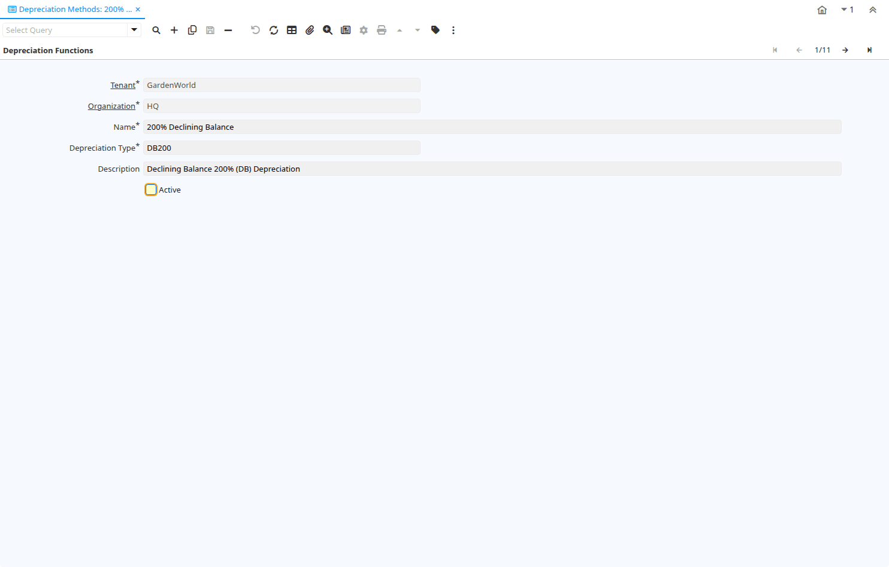

# Depreciation Methods

Window ID 53058

*30/05/2008 → 12/04/2012*

**Description:** Depreciation Methods

**Comment/Help:** The Depreciation method windows allows the user to review the depreciation calculations available in Adempiere

## Tab: Depreciation Functions

*Tab Level 0 · Created 30/05/2008 · Updated 28/03/2013*

| **Name** | **Description** | **Comment/Help** | **Technical Data** |
|---|---|---|---|
| Tenant | Tenant for this installation. | A Tenant is a company or a legal entity. You cannot share data between Tenants. | A_Depreciation.AD_Client_ID<small> numeric(10)   Table Direct</small> |
| Organization | Organizational entity within tenant | An organization is a unit of your tenant or legal entity - examples are store, department. You can share data between organizations. | A_Depreciation.AD_Org_ID<small> numeric(10)   Table Direct</small> |
| Name |  |  | A_Depreciation.Name<small> character varying(120)   String</small> |
| Depreciation Type |  |  | A_Depreciation.DepreciationType<small> character varying(10)   String</small> |
| Description | Optional short description of the record | A description is limited to 255 characters. | A_Depreciation.Description<small> character varying(510)   String</small> |
| Active | The record is active in the system | There are two methods of making records unavailable in the system: One is to delete the record, the other is to de-activate the record. A de-activated record is not available for selection, but available for reports. There are two reasons for de-activating and not deleting records: (1) The system requires the record for audit purposes. (2) The record is referenced by other records. E.g., you cannot delete a Business Partner, if there are invoices for this partner record existing. You de-activate the Business Partner and prevent that this record is used for future entries. | A_Depreciation.IsActive<small> character(1)   Yes-No</small> |

