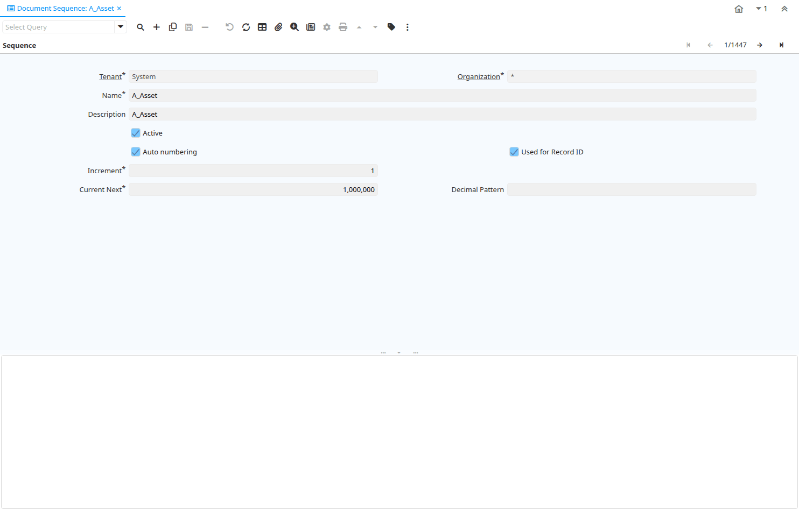

# Document Sequence

Window ID 112

*11/06/1999 → 02/01/2000*

**Description:** Maintain System and Document Sequences

**Comment/Help:** The Sequence Window defines how document numbers will be sequenced.
Change the way document numbers are generated. You may add a prefix or a suffix or change the current number.

## Tab: Sequence

*Tab Level 0 · Created 19/06/1999 · Updated 02/01/2000*

**Description:** Sequence Definition

**Comment/Help:** The Sequence Tab defines the numeric sequencing to use for documents.  These can also include a alpha suffix and / or prefix.

| **Name** | **Description** | **Comment/Help** | **Technical Data** |
|---|---|---|---|
| Tenant | Tenant for this installation. | A Tenant is a company or a legal entity. You cannot share data between Tenants. | AD_Sequence.AD_Client_ID<small> numeric(10)   Table Direct</small> |
| Organization | Organizational entity within tenant | An organization is a unit of your tenant or legal entity - examples are store, department. You can share data between organizations. | AD_Sequence.AD_Org_ID<small> numeric(10)   Table Direct</small> |
| Name | Alphanumeric identifier of the entity | The name of an entity (record) is used as an default search option in addition to the search key. The name is up to 60 characters in length. | AD_Sequence.Name<small> character varying(60)   String</small> |
| Description | Optional short description of the record | A description is limited to 255 characters. | AD_Sequence.Description<small> character varying(255)   String</small> |
| Active | The record is active in the system | There are two methods of making records unavailable in the system: One is to delete the record, the other is to de-activate the record. A de-activated record is not available for selection, but available for reports. There are two reasons for de-activating and not deleting records: (1) The system requires the record for audit purposes. (2) The record is referenced by other records. E.g., you cannot delete a Business Partner, if there are invoices for this partner record existing. You de-activate the Business Partner and prevent that this record is used for future entries. | AD_Sequence.IsActive<small> character(1)   Yes-No</small> |
| Auto numbering | Automatically assign the next number | The Auto Numbering checkbox indicates if the system will assign the next number automatically. | AD_Sequence.IsAutoSequence<small> character(1)   Yes-No</small> |
| Used for Record ID | The document number  will be used as the record key | The Used for Record ID checkbox indicates if the document id will be used as the key to the record | AD_Sequence.IsTableID<small> character(1)   Yes-No</small> |
| Value Format | Format of the value; Can contain fixed format elements, Variables: "_lLoOaAcCa09", or ~regex | &lt;B&gt;Validation elements:&lt;/B&gt;  ~regex - Validates a regular expression   	(Space) any character _	Space (fixed character) l	any Letter a..Z NO space L	any Letter a..Z NO space converted to upper case o	any Letter a..Z or space O	any Letter a..Z or space converted to upper case a	any Letters &amp; Digits NO space A	any Letters &amp; Digits NO space converted to upper case c	any Letters &amp; Digits or space C	any Letters &amp; Digits or space converted to upper case 0	Digits 0..9 NO space 9	Digits 0..9 or space  Example of format "(000)_000-0000" | AD_Sequence.VFormat<small> character varying(40)   String</small> |
| Increment | The number to increment the last document number by | The Increment indicates the number to increment the last document number by to arrive at the next sequence number | AD_Sequence.IncrementNo<small> numeric(10)   Integer</small> |
| Current Next | The next number to be used | The Current Next indicates the next number to use for this document | AD_Sequence.CurrentNext<small> numeric(10)   Integer</small> |
| Decimal Pattern | Java Decimal Pattern | Option Decimal pattern in Java notation. Examples: 0000 will format 23 to 0023 | AD_Sequence.DecimalPattern<small> character varying(40)   String</small> |
| Prefix | Prefix before the sequence number | The Prefix indicates the characters to print in front of the document number. | AD_Sequence.Prefix<small> character varying(255)   String</small> |
| Suffix | Suffix after the number | The Suffix indicates the characters to append to the document number. | AD_Sequence.Suffix<small> character varying(255)   String</small> |
| Organization level | This sequence can be defined for each organization |  | AD_Sequence.IsOrgLevelSequence<small> character(1)   Yes-No</small> |
| Org Column | Fully qualified Organization column (AD_Org_ID) | The Organization Column indicates the organization to be used in calculating this measurement. | AD_Sequence.OrgColumn<small> character varying(124)   String</small> |
| Restart sequence every Year | Restart the sequence with Start on every 1/1 | The Restart Sequence Every Year checkbox indicates that the documents sequencing should return to the starting number on the first day of the year. | AD_Sequence.StartNewYear<small> character(1)   Yes-No</small> |
| Date Column | Fully qualified date column | The Date Column indicates the date to be used when calculating this measurement | AD_Sequence.DateColumn<small> character varying(124)   String</small> |
| Restart sequence every month |  |  | AD_Sequence.StartNewMonth<small> character(1)   Yes-No</small> |
| Start No | Starting number/position | The Start Number indicates the starting position in the line or field number in the line | AD_Sequence.StartNo<small> numeric(10)   Integer</small> |

## Tab: › Sequence No

*Tab Level 1 · Created 15/03/2012 · Updated 28/07/2025*

| **Name** | **Description** | **Comment/Help** | **Technical Data** |
|---|---|---|---|
| Tenant | Tenant for this installation. | A Tenant is a company or a legal entity. You cannot share data between Tenants. | AD_Sequence_No.AD_Client_ID<small> numeric(10)   Table Direct</small> |
| Organization | Organizational entity within tenant | An organization is a unit of your tenant or legal entity - examples are store, department. You can share data between organizations. | AD_Sequence_No.AD_Org_ID<small> numeric(10)   Table Direct</small> |
| Sequence | Document Sequence | The Sequence defines the numbering sequence to be used for documents. | AD_Sequence_No.AD_Sequence_ID<small> numeric(10)   Table Direct</small> |
| Active | The record is active in the system | There are two methods of making records unavailable in the system: One is to delete the record, the other is to de-activate the record. A de-activated record is not available for selection, but available for reports. There are two reasons for de-activating and not deleting records: (1) The system requires the record for audit purposes. (2) The record is referenced by other records. E.g., you cannot delete a Business Partner, if there are invoices for this partner record existing. You de-activate the Business Partner and prevent that this record is used for future entries. | AD_Sequence_No.IsActive<small> character(1)   Yes-No</small> |
| Sequence Key | Stores a unique key that determines the sequence numbering scope. | The key can be composed of various elements like organization, year/month, prefix, or suffix values based on the Document Sequence configuration. | AD_Sequence_No.SequenceKey<small> character varying(255)   String</small> |
| Current Next | The next number to be used | The Current Next indicates the next number to use for this document | AD_Sequence_No.CurrentNext<small> numeric(10)   Integer</small> |

