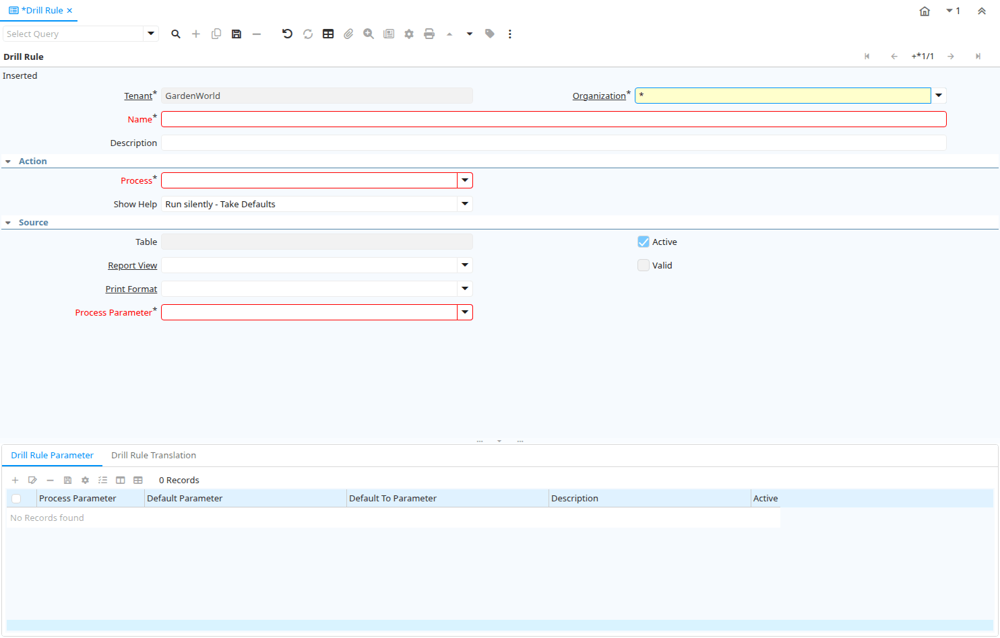

# Drill Rule

Window ID 200123

*08/07/2022 → 08/07/2022*

## Tab: Drill Rule

*Tab Level 0 · Created 08/07/2022 · Updated 08/07/2022*

| **Name** | **Description** | **Comment/Help** | **Technical Data** |
|---|---|---|---|
| Tenant | Tenant for this installation. | A Tenant is a company or a legal entity. You cannot share data between Tenants. | AD_Process_DrillRule.AD_Client_ID<small> numeric(10)   Table Direct</small> |
| Organization | Organizational entity within tenant | An organization is a unit of your tenant or legal entity - examples are store, department. You can share data between organizations. | AD_Process_DrillRule.AD_Org_ID<small> numeric(10)   Table Direct</small> |
| Name | Alphanumeric identifier of the entity | The name of an entity (record) is used as an default search option in addition to the search key. The name is up to 60 characters in length. | AD_Process_DrillRule.Name<small> character varying(255)   String</small> |
| Description | Optional short description of the record | A description is limited to 255 characters. | AD_Process_DrillRule.Description<small> character varying(255)   String</small> |
| Process | Process or Report | The Process field identifies a unique Process or Report in the system. | AD_Process_DrillRule.AD_Process_ID<small> numeric(10)   Table Direct</small> |
| Show Help |  |  | AD_Process_DrillRule.ShowHelp<small> character(1)   List</small> |
| Table | Database Table information | The Database Table provides the information of the table definition | AD_Process_DrillRule.AD_Table_ID<small> numeric(10)   Table Direct</small> |
| Active | The record is active in the system | There are two methods of making records unavailable in the system: One is to delete the record, the other is to de-activate the record. A de-activated record is not available for selection, but available for reports. There are two reasons for de-activating and not deleting records: (1) The system requires the record for audit purposes. (2) The record is referenced by other records. E.g., you cannot delete a Business Partner, if there are invoices for this partner record existing. You de-activate the Business Partner and prevent that this record is used for future entries. | AD_Process_DrillRule.IsActive<small> character(1)   Yes-No</small> |
| Report View | View used to generate this report | The Report View indicates the view used to generate this report. | AD_Process_DrillRule.AD_ReportView_ID<small> numeric(10)   Table Direct</small> |
| Valid | Element is valid | The element passed the validation check | AD_Process_DrillRule.IsValid<small> character(1)   Yes-No</small> |
| Print Format | Data Print Format | The print format determines how data is rendered for print. | AD_Process_DrillRule.AD_PrintFormat_ID<small> numeric(10)   Table Direct</small> |
| Process Parameter |  |  | AD_Process_DrillRule.AD_Process_Para_ID<small> numeric(10)   Table Direct</small> |

## Tab: › Drill Rule Parameter

*Tab Level 1 · Created 08/07/2022 · Updated 15/03/2023*

| **Name** | **Description** | **Comment/Help** | **Technical Data** |
|---|---|---|---|
| Tenant | Tenant for this installation. | A Tenant is a company or a legal entity. You cannot share data between Tenants. | AD_Process_DrillRule_Para.AD_Client_ID<small> numeric(10)   Table Direct</small> |
| Organization | Organizational entity within tenant | An organization is a unit of your tenant or legal entity - examples are store, department. You can share data between organizations. | AD_Process_DrillRule_Para.AD_Org_ID<small> numeric(10)   Table Direct</small> |
| Process Parameter |  |  | AD_Process_DrillRule_Para.AD_Process_Para_ID<small> numeric(10)   Table Direct</small> |
| Active | The record is active in the system | There are two methods of making records unavailable in the system: One is to delete the record, the other is to de-activate the record. A de-activated record is not available for selection, but available for reports. There are two reasons for de-activating and not deleting records: (1) The system requires the record for audit purposes. (2) The record is referenced by other records. E.g., you cannot delete a Business Partner, if there are invoices for this partner record existing. You de-activate the Business Partner and prevent that this record is used for future entries. | AD_Process_DrillRule_Para.IsActive<small> character(1)   Yes-No</small> |
| Default Parameter | Default value of the parameter | The default value can be a variable like @#Date@  | AD_Process_DrillRule_Para.ParameterDefault<small> character varying(255)   String</small> |
| Default To Parameter | Default value of the to parameter | The default value can be a variable like @#Date@  | AD_Process_DrillRule_Para.ParameterToDefault<small> character varying(255)   String</small> |
| Description | Optional short description of the record | A description is limited to 255 characters. | AD_Process_DrillRule_Para.Description<small> character varying(255)   String</small> |

## Tab: › Drill Rule Translation

*Tab Level 1 · Created 08/07/2022 · Updated 27/10/2024*

| **Name** | **Description** | **Comment/Help** | **Technical Data** |
|---|---|---|---|
| Tenant | Tenant for this installation. | A Tenant is a company or a legal entity. You cannot share data between Tenants. | AD_Process_DrillRule_Trl.AD_Client_ID<small> numeric(10)   Table Direct</small> |
| Organization | Organizational entity within tenant | An organization is a unit of your tenant or legal entity - examples are store, department. You can share data between organizations. | AD_Process_DrillRule_Trl.AD_Org_ID<small> numeric(10)   Table Direct</small> |
| Drill Rule |  |  | AD_Process_DrillRule_Trl.AD_Process_DrillRule_ID<small> numeric(10)   Search</small> |
| Name | Alphanumeric identifier of the entity | The name of an entity (record) is used as an default search option in addition to the search key. The name is up to 60 characters in length. | AD_Process_DrillRule_Trl.Name<small> character varying(255)   String</small> |
| Description | Optional short description of the record | A description is limited to 255 characters. | AD_Process_DrillRule_Trl.Description<small> character varying(255)   String</small> |
| Language | Language for this entity | The Language identifies the language to use for display and formatting | AD_Process_DrillRule_Trl.AD_Language<small> character varying(6)   Table</small> |
| Translated | This column is translated | The Translated checkbox indicates if this column is translated. | AD_Process_DrillRule_Trl.IsTranslated<small> character(1)   Yes-No</small> |
| Active | The record is active in the system | There are two methods of making records unavailable in the system: One is to delete the record, the other is to de-activate the record. A de-activated record is not available for selection, but available for reports. There are two reasons for de-activating and not deleting records: (1) The system requires the record for audit purposes. (2) The record is referenced by other records. E.g., you cannot delete a Business Partner, if there are invoices for this partner record existing. You de-activate the Business Partner and prevent that this record is used for future entries. | AD_Process_DrillRule_Trl.IsActive<small> character(1)   Yes-No</small> |

