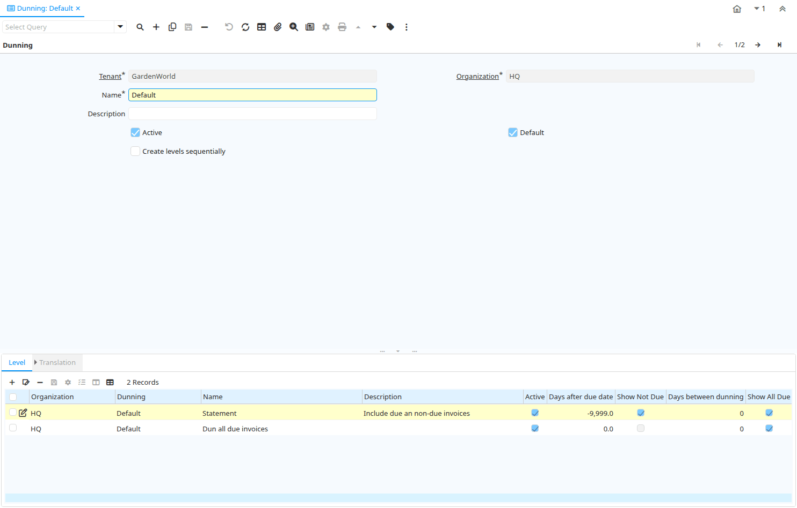

# Dunning

Window ID 159

*04/12/1999 → 02/01/2000*

**Description:** Maintain Dunning Levels

**Comment/Help:** The Dunning Window defines the parameters that will be used when generating Dunning Letters.  Each customer can be associated with a Dunning Code.  

## Tab: Dunning

*Tab Level 0 · Created 04/12/1999 · Updated 02/01/2000*

**Description:** Maintain Dunning Rules

**Comment/Help:** The Dunning Tab defines the parameters for a dunning level.

| **Name** | **Description** | **Comment/Help** | **Technical Data** |
|---|---|---|---|
| Tenant | Tenant for this installation. | A Tenant is a company or a legal entity. You cannot share data between Tenants. | C_Dunning.AD_Client_ID<small> numeric(10)   Table Direct</small> |
| Organization | Organizational entity within tenant | An organization is a unit of your tenant or legal entity - examples are store, department. You can share data between organizations. | C_Dunning.AD_Org_ID<small> numeric(10)   Table Direct</small> |
| Name | Alphanumeric identifier of the entity | The name of an entity (record) is used as an default search option in addition to the search key. The name is up to 60 characters in length. | C_Dunning.Name<small> character varying(60)   String</small> |
| Description | Optional short description of the record | A description is limited to 255 characters. | C_Dunning.Description<small> character varying(255)   String</small> |
| Active | The record is active in the system | There are two methods of making records unavailable in the system: One is to delete the record, the other is to de-activate the record. A de-activated record is not available for selection, but available for reports. There are two reasons for de-activating and not deleting records: (1) The system requires the record for audit purposes. (2) The record is referenced by other records. E.g., you cannot delete a Business Partner, if there are invoices for this partner record existing. You de-activate the Business Partner and prevent that this record is used for future entries. | C_Dunning.IsActive<small> character(1)   Yes-No</small> |
| Default | Default value | The Default Checkbox indicates if this record will be used as a default value. | C_Dunning.IsDefault<small> character(1)   Yes-No</small> |
| Create levels sequentially | Create Dunning Letter by level sequentially | If selected, the dunning letters are created in the sequence of the dunning levels.  Otherwise, the dunning level is based on the days (over)due. | C_Dunning.CreateLevelsSequentially<small> character(1)   Yes-No</small> |

## Tab: › Level

*Tab Level 1 · Created 25/01/2000 · Updated 02/01/2000*

**Description:** Maintain Dunning Level

**Comment/Help:** The Dunning Level Tab defines the timing and frequency of the dunning notices.

| **Name** | **Description** | **Comment/Help** | **Technical Data** |
|---|---|---|---|
| Tenant | Tenant for this installation. | A Tenant is a company or a legal entity. You cannot share data between Tenants. | C_DunningLevel.AD_Client_ID<small> numeric(10)   Table Direct</small> |
| Organization | Organizational entity within tenant | An organization is a unit of your tenant or legal entity - examples are store, department. You can share data between organizations. | C_DunningLevel.AD_Org_ID<small> numeric(10)   Table Direct</small> |
| Dunning | Dunning Rules for overdue invoices | The Dunning indicates the rules and method of dunning for past due payments. | C_DunningLevel.C_Dunning_ID<small> numeric(10)   Table Direct</small> |
| Name | Alphanumeric identifier of the entity | The name of an entity (record) is used as an default search option in addition to the search key. The name is up to 60 characters in length. | C_DunningLevel.Name<small> character varying(60)   String</small> |
| Description | Optional short description of the record | A description is limited to 255 characters. | C_DunningLevel.Description<small> character varying(255)   String</small> |
| Active | The record is active in the system | There are two methods of making records unavailable in the system: One is to delete the record, the other is to de-activate the record. A de-activated record is not available for selection, but available for reports. There are two reasons for de-activating and not deleting records: (1) The system requires the record for audit purposes. (2) The record is referenced by other records. E.g., you cannot delete a Business Partner, if there are invoices for this partner record existing. You de-activate the Business Partner and prevent that this record is used for future entries. | C_DunningLevel.IsActive<small> character(1)   Yes-No</small> |
| Days after due date | Days after due date to dun (if negative days until due) | The Days After Due Date indicates the number of days after the payment due date to initiate dunning. If the number is negative, it includes not the not due invoices. | C_DunningLevel.DaysAfterDue<small> numeric(10)   Number</small> |
| Show Not Due | Show/print all invoices which are not due (yet). | The dunning letter with this level includes all not due invoices. | C_DunningLevel.IsShowNotDue<small> character(1)   Yes-No</small> |
| Days between dunning | Days between sending dunning notices | The Days Between Dunning indicates the number of days between sending dunning notices. | C_DunningLevel.DaysBetweenDunning<small> numeric(10)   Integer</small> |
| Show All Due | Show/print all due invoices | The dunning letter with this level includes all due invoices. | C_DunningLevel.IsShowAllDue<small> character(1)   Yes-No</small> |
| Charge fee | Indicates if fees will be charged for overdue invoices | The Charge Fee checkbox indicates if the dunning letter will include fees for overdue invoices | C_DunningLevel.ChargeFee<small> character(1)   Yes-No</small> |
| Fee Amount | Fee amount in invoice currency | The Fee Amount indicates the charge amount on a dunning letter for overdue invoices.  This field will only display if the charge fee checkbox has been selected. | C_DunningLevel.FeeAmt<small> numeric   Amount</small> |
| Print Text | The label text to be printed on a document or correspondence. | The Label to be printed indicates the name that will be printed on a document or correspondence. The max length is 2000 characters. | C_DunningLevel.PrintName<small> character varying(60)   String</small> |
| Note | Optional additional user defined information | The Note field allows for optional entry of user defined information regarding this record | C_DunningLevel.Note<small> character varying(2000)   Text</small> |
| Dunning Print Format | Print Format for printing Dunning Letters | You need to define a Print Format to print the document. | C_DunningLevel.Dunning_PrintFormat_ID<small> numeric(10)   Table</small> |
| Credit Stop | Set the business partner to credit stop | If a dunning letter of this level is created, the business partner is set to Credit Stop (needs to be manually changed). | C_DunningLevel.IsSetCreditStop<small> character(1)   Yes-No</small> |
| Set Payment Term | Set the payment term of the Business Partner | If a dunning letter of this level is created, the payment term of this business partner is overwritten. | C_DunningLevel.IsSetPaymentTerm<small> character(1)   Yes-No</small> |
| Payment Term | The terms of Payment (timing, discount) | Payment Terms identify the method and timing of payment. | C_DunningLevel.C_PaymentTerm_ID<small> numeric(10)   Table Direct</small> |
| Collection Status | Invoice Collection Status | Status of the invoice collection process | C_DunningLevel.InvoiceCollectionType<small> character(1)   List</small> |
| Is Statement | Dunning Level is a definition of a statement |  | C_DunningLevel.IsStatement<small> character(1)   Yes-No</small> |

## Tab: › › Translation

*Tab Level 2 · Created 25/01/2000 · Updated 27/10/2024*

**Description:** Dunning Level Translation

| **Name** | **Description** | **Comment/Help** | **Technical Data** |
|---|---|---|---|
| Tenant | Tenant for this installation. | A Tenant is a company or a legal entity. You cannot share data between Tenants. | C_DunningLevel_Trl.AD_Client_ID<small> numeric(10)   Table Direct</small> |
| Organization | Organizational entity within tenant | An organization is a unit of your tenant or legal entity - examples are store, department. You can share data between organizations. | C_DunningLevel_Trl.AD_Org_ID<small> numeric(10)   Table Direct</small> |
| Dunning Level |  |  | C_DunningLevel_Trl.C_DunningLevel_ID<small> numeric(10)   Table Direct</small> |
| Language | Language for this entity | The Language identifies the language to use for display and formatting | C_DunningLevel_Trl.AD_Language<small> character varying(6)   Table</small> |
| Active | The record is active in the system | There are two methods of making records unavailable in the system: One is to delete the record, the other is to de-activate the record. A de-activated record is not available for selection, but available for reports. There are two reasons for de-activating and not deleting records: (1) The system requires the record for audit purposes. (2) The record is referenced by other records. E.g., you cannot delete a Business Partner, if there are invoices for this partner record existing. You de-activate the Business Partner and prevent that this record is used for future entries. | C_DunningLevel_Trl.IsActive<small> character(1)   Yes-No</small> |
| Print Text | The label text to be printed on a document or correspondence. | The Label to be printed indicates the name that will be printed on a document or correspondence. The max length is 2000 characters. | C_DunningLevel_Trl.PrintName<small> character varying(60)   String</small> |
| Note | Optional additional user defined information | The Note field allows for optional entry of user defined information regarding this record | C_DunningLevel_Trl.Note<small> character varying(2000)   Text</small> |
| Translated | This column is translated | The Translated checkbox indicates if this column is translated. | C_DunningLevel_Trl.IsTranslated<small> character(1)   Yes-No</small> |

