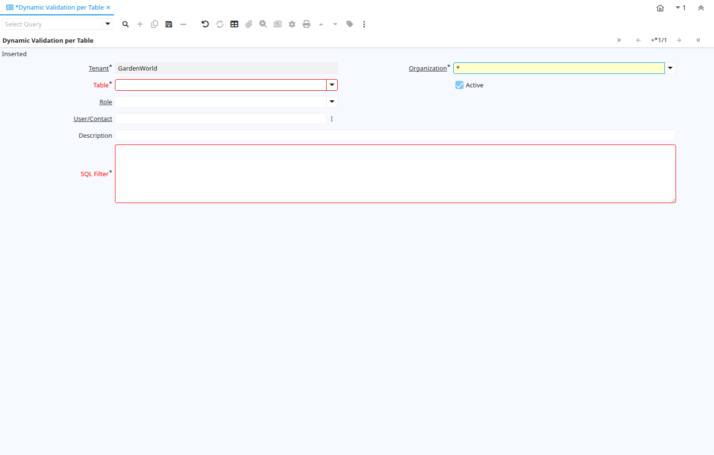

# Dynamic Validation per Table

Window ID 200150

*25/01/2024 → 25/01/2024*

## Tab: Dynamic Validation per Table

*Tab Level 0 · Created 25/01/2024 · Updated 25/01/2024*

| **Name** | **Description** | **Comment/Help** | **Technical Data** |
|---|---|---|---|
| Tenant | Tenant for this installation. | A Tenant is a company or a legal entity. You cannot share data between Tenants. | AD_TableValRule.AD_Client_ID<small> numeric(10)   Search</small> |
| Organization | Organizational entity within tenant | An organization is a unit of your tenant or legal entity - examples are store, department. You can share data between organizations. | AD_TableValRule.AD_Org_ID<small> numeric(10)   Table Direct</small> |
| Table | Database Table information | The Database Table provides the information of the table definition | AD_TableValRule.AD_Table_ID<small> numeric(10)   Table Direct</small> |
| Active | The record is active in the system | There are two methods of making records unavailable in the system: One is to delete the record, the other is to de-activate the record. A de-activated record is not available for selection, but available for reports. There are two reasons for de-activating and not deleting records: (1) The system requires the record for audit purposes. (2) The record is referenced by other records. E.g., you cannot delete a Business Partner, if there are invoices for this partner record existing. You de-activate the Business Partner and prevent that this record is used for future entries. | AD_TableValRule.IsActive<small> character(1)   Yes-No</small> |
| Role | Responsibility Role | The Role determines security and access a user who has this Role will have in the System. | AD_TableValRule.AD_Role_ID<small> numeric(10)   Table Direct</small> |
| User/Contact | User within the system - Internal or Business Partner Contact | The User identifies a unique user in the system. This could be an internal user or a business partner contact | AD_TableValRule.AD_User_ID<small> numeric(10)   Search</small> |
| Description | Optional short description of the record | A description is limited to 255 characters. | AD_TableValRule.Description<small> character varying(255)   String</small> |
| SQL Filter | SQL Filter | Enter a valid WHERE SQL fully qualified clause.  The WHERE is not needed, the code will be surrounded within parenthesis before applied | AD_TableValRule.Code<small> character varying(4000)   String</small> |

