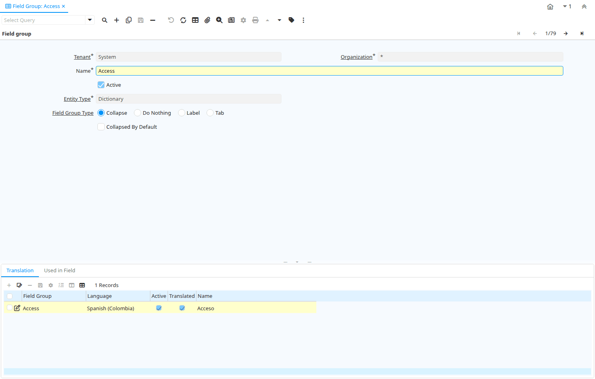

# Field Group

Window ID 200

*11/01/2001 → 02/01/2000*

**Description:** Define Field Group

**Comment/Help:** The Field Group Window allows you to define subsections in a tab.  For System Admin use only.

## Tab: Field group

*Tab Level 0 · Created 11/01/2001 · Updated 02/01/2000*

**Description:** System Admin use only.  Field Groups allow for grouping of fields within a window

| **Name** | **Description** | **Comment/Help** | **Technical Data** |
|---|---|---|---|
| Tenant | Tenant for this installation. | A Tenant is a company or a legal entity. You cannot share data between Tenants. | AD_FieldGroup.AD_Client_ID<small> numeric(10)   Table Direct</small> |
| Organization | Organizational entity within tenant | An organization is a unit of your tenant or legal entity - examples are store, department. You can share data between organizations. | AD_FieldGroup.AD_Org_ID<small> numeric(10)   Table Direct</small> |
| Name | Alphanumeric identifier of the entity | The name of an entity (record) is used as an default search option in addition to the search key. The name is up to 60 characters in length. | AD_FieldGroup.Name<small> character varying(60)   String</small> |
| Active | The record is active in the system | There are two methods of making records unavailable in the system: One is to delete the record, the other is to de-activate the record. A de-activated record is not available for selection, but available for reports. There are two reasons for de-activating and not deleting records: (1) The system requires the record for audit purposes. (2) The record is referenced by other records. E.g., you cannot delete a Business Partner, if there are invoices for this partner record existing. You de-activate the Business Partner and prevent that this record is used for future entries. | AD_FieldGroup.IsActive<small> character(1)   Yes-No</small> |
| Entity Type | Dictionary Entity Type; Determines ownership and synchronization | The Entity Types "Dictionary", "iDempiere" and "Application" might be automatically synchronized and customizations deleted or overwritten.    For customizations, copy the entity and select "User"! | AD_FieldGroup.EntityType<small> character varying(40)   Table</small> |
| Field Group Type |  |  | AD_FieldGroup.FieldGroupType<small> character varying(10)   Radio Group List</small> |
| Collapsed By Default | Flag to set the initial state of collapsible field group. |  | AD_FieldGroup.IsCollapsedByDefault<small> character(1)   Yes-No</small> |

## Tab: › Translation

*Tab Level 1 · Created 11/01/2001 · Updated 27/10/2024*

| **Name** | **Description** | **Comment/Help** | **Technical Data** |
|---|---|---|---|
| Tenant | Tenant for this installation. | A Tenant is a company or a legal entity. You cannot share data between Tenants. | AD_FieldGroup_Trl.AD_Client_ID<small> numeric(10)   Table Direct</small> |
| Organization | Organizational entity within tenant | An organization is a unit of your tenant or legal entity - examples are store, department. You can share data between organizations. | AD_FieldGroup_Trl.AD_Org_ID<small> numeric(10)   Table Direct</small> |
| Field Group | Logical grouping of fields | The Field Group indicates the logical group that this field belongs to (History, Amounts, Quantities) | AD_FieldGroup_Trl.AD_FieldGroup_ID<small> numeric(10)   Table Direct</small> |
| Language | Language for this entity | The Language identifies the language to use for display and formatting | AD_FieldGroup_Trl.AD_Language<small> character varying(6)   Table</small> |
| Active | The record is active in the system | There are two methods of making records unavailable in the system: One is to delete the record, the other is to de-activate the record. A de-activated record is not available for selection, but available for reports. There are two reasons for de-activating and not deleting records: (1) The system requires the record for audit purposes. (2) The record is referenced by other records. E.g., you cannot delete a Business Partner, if there are invoices for this partner record existing. You de-activate the Business Partner and prevent that this record is used for future entries. | AD_FieldGroup_Trl.IsActive<small> character(1)   Yes-No</small> |
| Translated | This column is translated | The Translated checkbox indicates if this column is translated. | AD_FieldGroup_Trl.IsTranslated<small> character(1)   Yes-No</small> |
| Name | Alphanumeric identifier of the entity | The name of an entity (record) is used as an default search option in addition to the search key. The name is up to 60 characters in length. | AD_FieldGroup_Trl.Name<small> character varying(60)   String</small> |

## Tab: › Used in Field

*Tab Level 1 · Created 10/03/2013 · Updated 10/03/2013*

| **Name** | **Description** | **Comment/Help** | **Technical Data** |
|---|---|---|---|
| Tab | Tab within a Window | The Tab indicates a tab that displays within a window. | AD_Field.AD_Tab_ID<small> numeric(10)   Table Direct</small> |
| Field | Field on a database table | The Field identifies a field on a database table. | AD_Field.AD_Field_ID<small> numeric(10)   ID</small> |
| Name | Alphanumeric identifier of the entity | The name of an entity (record) is used as an default search option in addition to the search key. The name is up to 60 characters in length. | AD_Field.Name<small> character varying(60)   String</small> |

