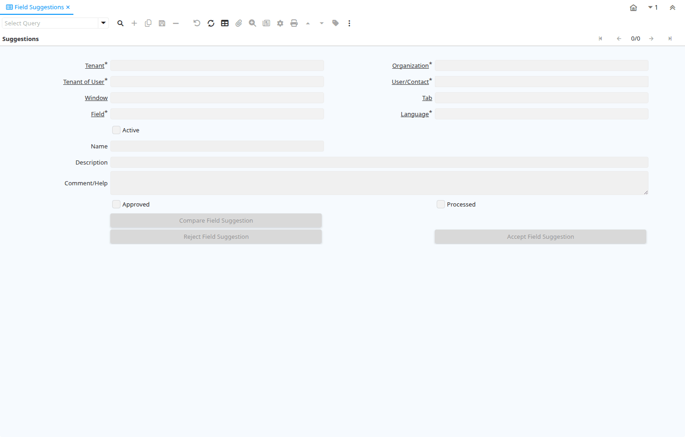

# Field Suggestions

Window ID 200087

*29/06/2016 → 29/06/2016*

**Description:** Suggestions for field name, description and help.

## Tab: Suggestions

*Tab Level 0 · Created 29/06/2016 · Updated 29/06/2016*

| **Name** | **Description** | **Comment/Help** | **Technical Data** |
|---|---|---|---|
| Tenant | Tenant for this installation. | A Tenant is a company or a legal entity. You cannot share data between Tenants. | AD_FieldSuggestion.AD_Client_ID<small> numeric(10)   Table Direct</small> |
| Organization | Organizational entity within tenant | An organization is a unit of your tenant or legal entity - examples are store, department. You can share data between organizations. | AD_FieldSuggestion.AD_Org_ID<small> numeric(10)   Table Direct</small> |
| Tenant of User |  |  | AD_FieldSuggestion.AD_UserClient_ID<small> numeric(10)   Table</small> |
| User/Contact | User within the system - Internal or Business Partner Contact | The User identifies a unique user in the system. This could be an internal user or a business partner contact | AD_FieldSuggestion.AD_User_ID<small> numeric(10)   Search</small> |
| Window | Data entry or display window | The Window field identifies a unique Window in the system. | AD_FieldSuggestion.AD_Window_ID<small>    Table Direct</small> |
| Tab | Tab within a Window | The Tab indicates a tab that displays within a window. | AD_FieldSuggestion.AD_Tab_ID<small>    Table Direct</small> |
| Field | Field on a database table | The Field identifies a field on a database table. | AD_FieldSuggestion.AD_Field_ID<small> numeric(10)   Table Direct</small> |
| Language | Language for this entity | The Language identifies the language to use for display and formatting | AD_FieldSuggestion.AD_Language<small> character varying(6)   Table</small> |
| Active | The record is active in the system | There are two methods of making records unavailable in the system: One is to delete the record, the other is to de-activate the record. A de-activated record is not available for selection, but available for reports. There are two reasons for de-activating and not deleting records: (1) The system requires the record for audit purposes. (2) The record is referenced by other records. E.g., you cannot delete a Business Partner, if there are invoices for this partner record existing. You de-activate the Business Partner and prevent that this record is used for future entries. | AD_FieldSuggestion.IsActive<small> character(1)   Yes-No</small> |
| Name | Alphanumeric identifier of the entity | The name of an entity (record) is used as an default search option in addition to the search key. The name is up to 60 characters in length. | AD_FieldSuggestion.Name<small> character varying(60)   String</small> |
| Description | Optional short description of the record | A description is limited to 255 characters. | AD_FieldSuggestion.Description<small> character varying(255)   String</small> |
| Comment/Help | Comment or Hint | The Help field contains a hint, comment or help about the use of this item. | AD_FieldSuggestion.Help<small> character varying(2000)   Text</small> |
| Approved | Indicates if this document requires approval | The Approved checkbox indicates if this document requires approval before it can be processed. | AD_FieldSuggestion.IsApproved<small> character(1)   Yes-No</small> |
| Processed | The document has been processed | The Processed checkbox indicates that a document has been processed. | AD_FieldSuggestion.Processed<small> character(1)   Yes-No</small> |
| Compare Field Suggestion |  |  | AD_FieldSuggestion.CompareSuggestion<small> character(1)   Button</small> |
| Reject Field Suggestion | Reject suggested name, description and help changes |  | AD_FieldSuggestion.RejectSuggestion<small> character(1)   Button</small> |
| Accept Field Suggestion | Accept suggested changes for field |  | AD_FieldSuggestion.AcceptSuggestion<small> character(1)   Button</small> |

