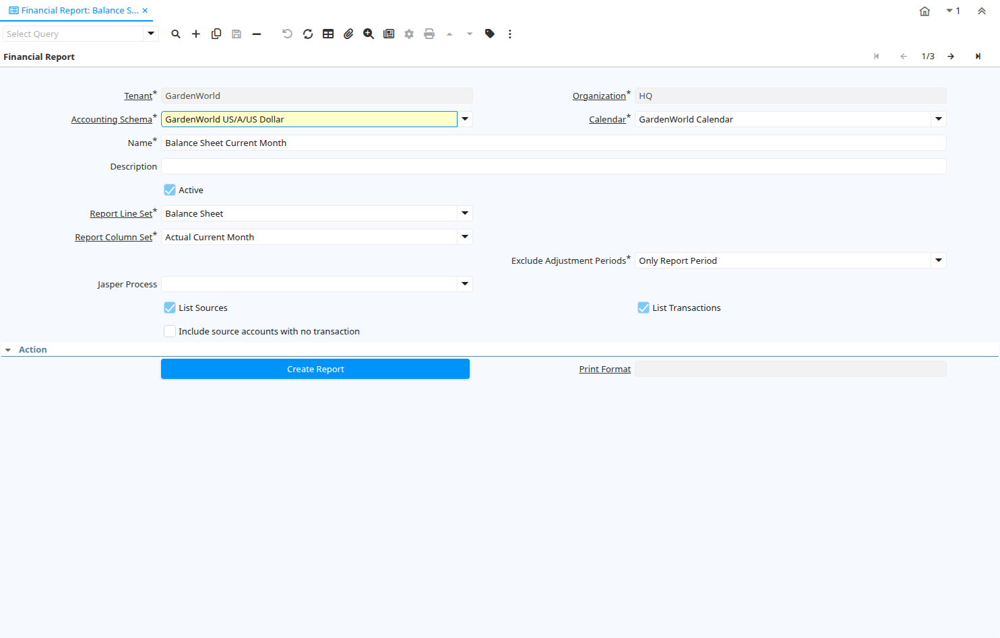

# Financial Report

Window ID 216

*13/05/2001 → 03/06/2021*

**Description:** Maintain Financial Reports

**Comment/Help:** Financial Reports are the combination of a Report Column Set and Line Set.

## Tab: Financial Report

*Tab Level 0 · Created 13/05/2001 · Updated 02/01/2000*

| **Name** | **Description** | **Comment/Help** | **Technical Data** |
|---|---|---|---|
| Tenant | Tenant for this installation. | A Tenant is a company or a legal entity. You cannot share data between Tenants. | PA_Report.AD_Client_ID<small> numeric(10)   Table Direct</small> |
| Organization | Organizational entity within tenant | An organization is a unit of your tenant or legal entity - examples are store, department. You can share data between organizations. | PA_Report.AD_Org_ID<small> numeric(10)   Table Direct</small> |
| Accounting Schema | Rules for accounting | An Accounting Schema defines the rules used in accounting such as costing method, currency and calendar | PA_Report.C_AcctSchema_ID<small> numeric(10)   Table Direct</small> |
| Calendar | Accounting Calendar Name | The Calendar uniquely identifies an accounting calendar.  Multiple calendars can be used.  For example you may need a standard calendar that runs from Jan 1 to Dec 31 and a fiscal calendar that runs from July 1 to June 30. | PA_Report.C_Calendar_ID<small> numeric(10)   Table Direct</small> |
| Name | Alphanumeric identifier of the entity | The name of an entity (record) is used as an default search option in addition to the search key. The name is up to 60 characters in length. | PA_Report.Name<small> character varying(60)   String</small> |
| Description | Optional short description of the record | A description is limited to 255 characters. | PA_Report.Description<small> character varying(255)   String</small> |
| Active | The record is active in the system | There are two methods of making records unavailable in the system: One is to delete the record, the other is to de-activate the record. A de-activated record is not available for selection, but available for reports. There are two reasons for de-activating and not deleting records: (1) The system requires the record for audit purposes. (2) The record is referenced by other records. E.g., you cannot delete a Business Partner, if there are invoices for this partner record existing. You de-activate the Business Partner and prevent that this record is used for future entries. | PA_Report.IsActive<small> character(1)   Yes-No</small> |
| Report Line Set |  |  | PA_Report.PA_ReportLineSet_ID<small> numeric(10)   Table Direct</small> |
| Report Column Set | Collection of Columns for Report | The Report Column Set identifies the columns used in a Report. | PA_Report.PA_ReportColumnSet_ID<small> numeric(10)   Table Direct</small> |
| Report Cube | Define reporting cube for pre-calculation of summary accounting data. | Summary data will be generated for each period of the selected calendar, grouped by the selected dimensions.. | PA_Report.PA_ReportCube_ID<small> numeric(10)   Table</small> |
| Exclude Adjustment Periods |  |  | PA_Report.ExcludeAdjustmentPeriods<small> character(1)   List</small> |
| Jasper Process | The Jasper Process used by the print engine if any process defined |  | PA_Report.JasperProcess_ID<small> numeric(10)   Table</small> |
| List Sources | List Report Line Sources | List the Source Accounts for Summary Accounts selected | PA_Report.ListSources<small> character(1)   Yes-No</small> |
| List Transactions | List the report transactions | List the transactions of the report source lines | PA_Report.ListTrx<small> character(1)   Yes-No</small> |
| Include source accounts with no transaction | Include source accounts with no transaction for list report line sources | List the Source Accounts with or without transactions for Summary Accounts selected | PA_Report.ListSourcesXTrx<small> character(1)   Yes-No</small> |
| Create Report | Create Financial Report | The default period is the current period. You can optionally enter other restrictions.  You can select an alternative Reporting Hierarchy. | PA_Report.Processing<small> character(1)   Button</small> |
| Print Format | Data Print Format | The print format determines how data is rendered for print. | PA_Report.AD_PrintFormat_ID<small> numeric(10)   Table Direct</small> |
| Create Report (Jasper) | Create Financial Report  (Jasper) | The default period is the current period. You can optionally enter other restrictions.  You can select an alternative Reporting Hierarchy. | PA_Report.JasperProcessing<small> character(1)   Button</small> |

