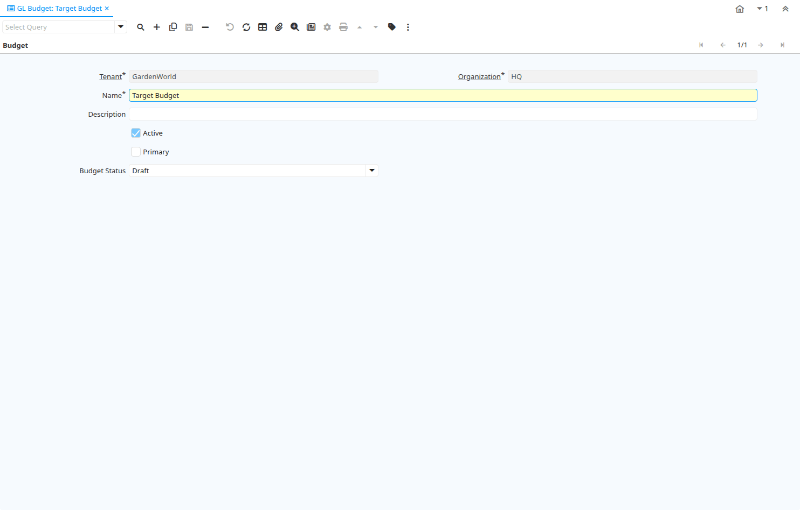

# GL Budget

Window ID 154

*26/09/1999 → 02/01/2000*

**Description:** Maintain General Ledger Budgets

## Tab: Budget

*Tab Level 0 · Created 26/09/1999 · Updated 02/01/2000*

**Description:** The GL Budget Tab defines a General Ledger Budget

**Comment/Help:** The GL Budgets are used to define the anticipated costs of doing business.  They are used in reporting as a comparison to actual amounts.

| **Name** | **Description** | **Comment/Help** | **Technical Data** |
|---|---|---|---|
| Tenant | Tenant for this installation. | A Tenant is a company or a legal entity. You cannot share data between Tenants. | GL_Budget.AD_Client_ID<small> numeric(10)   Table Direct</small> |
| Organization | Organizational entity within tenant | An organization is a unit of your tenant or legal entity - examples are store, department. You can share data between organizations. | GL_Budget.AD_Org_ID<small> numeric(10)   Table Direct</small> |
| Name | Alphanumeric identifier of the entity | The name of an entity (record) is used as an default search option in addition to the search key. The name is up to 60 characters in length. | GL_Budget.Name<small> character varying(60)   String</small> |
| Description | Optional short description of the record | A description is limited to 255 characters. | GL_Budget.Description<small> character varying(255)   String</small> |
| Active | The record is active in the system | There are two methods of making records unavailable in the system: One is to delete the record, the other is to de-activate the record. A de-activated record is not available for selection, but available for reports. There are two reasons for de-activating and not deleting records: (1) The system requires the record for audit purposes. (2) The record is referenced by other records. E.g., you cannot delete a Business Partner, if there are invoices for this partner record existing. You de-activate the Business Partner and prevent that this record is used for future entries. | GL_Budget.IsActive<small> character(1)   Yes-No</small> |
| Primary | Indicates if this is the primary budget | The Primary checkbox indicates if this budget is the primary budget. | GL_Budget.IsPrimary<small> character(1)   Yes-No</small> |
| Budget Status | Indicates the current status of this budget | The Budget Status indicates the current status of this budget (i.e Draft, Approved) | GL_Budget.BudgetStatus<small> character(1)   List</small> |

