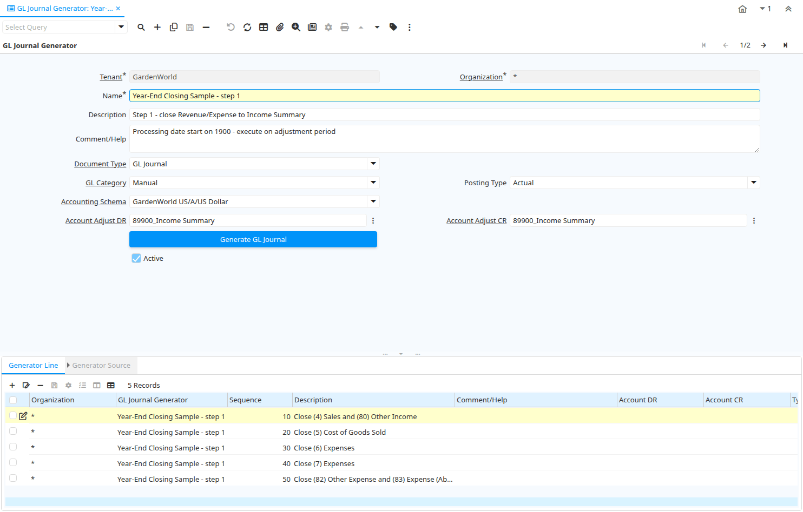

# GL Journal Generator

Window ID 200013

*24/09/2012 → 03/06/2021*

## Tab: GL Journal Generator

*Tab Level 0 · Created 24/09/2012 · Updated 24/09/2012*

| **Name** | **Description** | **Comment/Help** | **Technical Data** |
|---|---|---|---|
| Tenant | Tenant for this installation. | A Tenant is a company or a legal entity. You cannot share data between Tenants. | GL_JournalGenerator.AD_Client_ID<small> numeric(10)   Table Direct</small> |
| Organization | Organizational entity within tenant | An organization is a unit of your tenant or legal entity - examples are store, department. You can share data between organizations. | GL_JournalGenerator.AD_Org_ID<small> numeric(10)   Table Direct</small> |
| Name | Alphanumeric identifier of the entity | The name of an entity (record) is used as an default search option in addition to the search key. The name is up to 60 characters in length. | GL_JournalGenerator.Name<small> character varying(60)   String</small> |
| Description | Optional short description of the record | A description is limited to 255 characters. | GL_JournalGenerator.Description<small> character varying(255)   String</small> |
| Comment/Help | Comment or Hint | The Help field contains a hint, comment or help about the use of this item. | GL_JournalGenerator.Help<small> character varying(2000)   Text</small> |
| Document Type | Document type or rules | The Document Type determines document sequence and processing rules | GL_JournalGenerator.C_DocType_ID<small> numeric(10)   Table Direct</small> |
| GL Category | General Ledger Category | The General Ledger Category is an optional, user defined method of grouping journal lines. | GL_JournalGenerator.GL_Category_ID<small> numeric(10)   Table Direct</small> |
| Posting Type | The type of posted amount for the transaction | The Posting Type indicates the type of amount (Actual, Budget, Reservation, Commitment, Statistical) the transaction. | GL_JournalGenerator.PostingType<small> character(1)   List</small> |
| Accounting Schema | Rules for accounting | An Accounting Schema defines the rules used in accounting such as costing method, currency and calendar | GL_JournalGenerator.C_AcctSchema_ID<small> numeric(10)   Table Direct</small> |
| Account Adjust DR |  |  | GL_JournalGenerator.C_ElementValueAdjustDR_ID<small> numeric(10)   Search</small> |
| Account Adjust CR |  |  | GL_JournalGenerator.C_ElementValueAdjustCR_ID<small> numeric(10)   Search</small> |
| Generate GL Journal |  |  | GL_JournalGenerator.GenerateGLJournal<small> character(1)   Button</small> |
| Active | The record is active in the system | There are two methods of making records unavailable in the system: One is to delete the record, the other is to de-activate the record. A de-activated record is not available for selection, but available for reports. There are two reasons for de-activating and not deleting records: (1) The system requires the record for audit purposes. (2) The record is referenced by other records. E.g., you cannot delete a Business Partner, if there are invoices for this partner record existing. You de-activate the Business Partner and prevent that this record is used for future entries. | GL_JournalGenerator.IsActive<small> character(1)   Yes-No</small> |

## Tab: › Generator Line

*Tab Level 1 · Created 24/09/2012 · Updated 24/09/2012*

| **Name** | **Description** | **Comment/Help** | **Technical Data** |
|---|---|---|---|
| Tenant | Tenant for this installation. | A Tenant is a company or a legal entity. You cannot share data between Tenants. | GL_JournalGeneratorLine.AD_Client_ID<small> numeric(10)   Table Direct</small> |
| Organization | Organizational entity within tenant | An organization is a unit of your tenant or legal entity - examples are store, department. You can share data between organizations. | GL_JournalGeneratorLine.AD_Org_ID<small> numeric(10)   Table Direct</small> |
| GL Journal Generator |  |  | GL_JournalGeneratorLine.GL_JournalGenerator_ID<small> numeric(10)   Table Direct</small> |
| Sequence | Method of ordering records; lowest number comes first | The Sequence indicates the order of records | GL_JournalGeneratorLine.SeqNo<small> numeric(10)   Integer</small> |
| Description | Optional short description of the record | A description is limited to 255 characters. | GL_JournalGeneratorLine.Description<small> character varying(255)   String</small> |
| Comment/Help | Comment or Hint | The Help field contains a hint, comment or help about the use of this item. | GL_JournalGeneratorLine.Help<small> character varying(2000)   Text</small> |
| Account DR |  |  | GL_JournalGeneratorLine.C_ElementValueDR_ID<small> numeric(10)   Search</small> |
| Account CR |  |  | GL_JournalGeneratorLine.C_ElementValueCR_ID<small> numeric(10)   Search</small> |
| Type of BP Dimension |  |  | GL_JournalGeneratorLine.BPDimensionType<small> character(1)   List</small> |
| Business Partner | Identifies a Business Partner | A Business Partner is anyone with whom you transact.  This can include Vendor, Customer, Employee or Salesperson | GL_JournalGeneratorLine.C_BPartner_ID<small> numeric(10)   Search</small> |
| BP Column |  |  | GL_JournalGeneratorLine.BPColumn<small> character varying(124)   String</small> |
| Same Product |  |  | GL_JournalGeneratorLine.IsSameProduct<small> character(1)   Yes-No</small> |
| Copy All Dimensions |  |  | GL_JournalGeneratorLine.IsCopyAllDimensions<small> character(1)   Yes-No</small> |
| Multiplier Amount | Multiplier Amount for generating commissions | The Multiplier Amount indicates the amount to multiply the total amount generated by this commission run by. | GL_JournalGeneratorLine.AmtMultiplier<small> numeric   Number</small> |
| Round Factor |  |  | GL_JournalGeneratorLine.RoundFactor<small> numeric(10)   Integer</small> |
| Active | The record is active in the system | There are two methods of making records unavailable in the system: One is to delete the record, the other is to de-activate the record. A de-activated record is not available for selection, but available for reports. There are two reasons for de-activating and not deleting records: (1) The system requires the record for audit purposes. (2) The record is referenced by other records. E.g., you cannot delete a Business Partner, if there are invoices for this partner record existing. You de-activate the Business Partner and prevent that this record is used for future entries. | GL_JournalGeneratorLine.IsActive<small> character(1)   Yes-No</small> |

## Tab: › › Generator Source

*Tab Level 2 · Created 24/09/2012 · Updated 24/09/2012*

| **Name** | **Description** | **Comment/Help** | **Technical Data** |
|---|---|---|---|
| Tenant | Tenant for this installation. | A Tenant is a company or a legal entity. You cannot share data between Tenants. | GL_JournalGeneratorSource.AD_Client_ID<small> numeric(10)   Table Direct</small> |
| Organization | Organizational entity within tenant | An organization is a unit of your tenant or legal entity - examples are store, department. You can share data between organizations. | GL_JournalGeneratorSource.AD_Org_ID<small> numeric(10)   Table Direct</small> |
| Generator Line |  |  | GL_JournalGeneratorSource.GL_JournalGeneratorLine_ID<small> numeric(10)   Table Direct</small> |
| Account Element | Account Element | Account Elements can be natural accounts or user defined values. | GL_JournalGeneratorSource.C_ElementValue_ID<small> numeric(10)   Search</small> |
| GL Category | General Ledger Category | The General Ledger Category is an optional, user defined method of grouping journal lines. | GL_JournalGeneratorSource.GL_Category_ID<small> numeric(10)   Table Direct</small> |
| Multiplier Amount | Multiplier Amount for generating commissions | The Multiplier Amount indicates the amount to multiply the total amount generated by this commission run by. | GL_JournalGeneratorSource.AmtMultiplier<small> numeric   Number</small> |
| Round Factor |  |  | GL_JournalGeneratorSource.RoundFactor<small> numeric(10)   Integer</small> |
| Comment/Help | Comment or Hint | The Help field contains a hint, comment or help about the use of this item. | GL_JournalGeneratorSource.Help<small> character varying(2000)   Text</small> |
| Active | The record is active in the system | There are two methods of making records unavailable in the system: One is to delete the record, the other is to de-activate the record. A de-activated record is not available for selection, but available for reports. There are two reasons for de-activating and not deleting records: (1) The system requires the record for audit purposes. (2) The record is referenced by other records. E.g., you cannot delete a Business Partner, if there are invoices for this partner record existing. You de-activate the Business Partner and prevent that this record is used for future entries. | GL_JournalGeneratorSource.IsActive<small> character(1)   Yes-No</small> |

