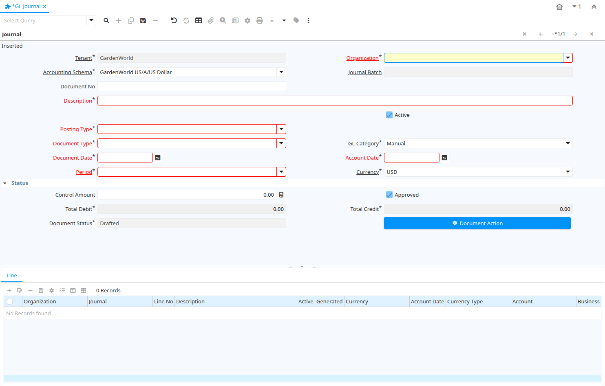

# GL Journal

Window ID 200005

*23/07/2012 → 03/06/2021*

**Description:** Enter and change Manual Journal Entries

**Comment/Help:** The GL Journal Window allows you to enter and modify manual journal entries

## Tab: Journal

*Tab Level 0 · Created 23/07/2012 · Updated 25/07/2012*

**Description:** General Ledger Journal

| **Name** | **Description** | **Comment/Help** | **Technical Data** |
|---|---|---|---|
| Tenant | Tenant for this installation. | A Tenant is a company or a legal entity. You cannot share data between Tenants. | GL_Journal.AD_Client_ID<small> numeric(10)   Table Direct</small> |
| Organization | Organizational entity within tenant | An organization is a unit of your tenant or legal entity - examples are store, department. You can share data between organizations. | GL_Journal.AD_Org_ID<small> numeric(10)   Table Direct</small> |
| Accounting Schema | Rules for accounting | An Accounting Schema defines the rules used in accounting such as costing method, currency and calendar | GL_Journal.C_AcctSchema_ID<small> numeric(10)   Table Direct</small> |
| Journal Batch | General Ledger Journal Batch | The General Ledger Journal Batch identifies a group of journals to be processed as a group. | GL_Journal.GL_JournalBatch_ID<small> numeric(10)   Search</small> |
| Document No | Document sequence number of the document | The document number is usually automatically generated by the system and determined by the document type of the document. If the document is not saved, the preliminary number is displayed in "&lt;&gt;".  If the document type of your document has no automatic document sequence defined, the field is empty if you create a new document. This is for documents which usually have an external number (like vendor invoice).  If you leave the field empty, the system will generate a document number for you. The document sequence used for this fallback number is defined in the "Maintain Sequence" window with the name "DocumentNo_&lt;TableName&gt;", where TableName is the actual name of the table (e.g. C_Order). | GL_Journal.DocumentNo<small> character varying(30)   String</small> |
| Description | Optional short description of the record | A description is limited to 255 characters. | GL_Journal.Description<small> character varying(255)   String</small> |
| Active | The record is active in the system | There are two methods of making records unavailable in the system: One is to delete the record, the other is to de-activate the record. A de-activated record is not available for selection, but available for reports. There are two reasons for de-activating and not deleting records: (1) The system requires the record for audit purposes. (2) The record is referenced by other records. E.g., you cannot delete a Business Partner, if there are invoices for this partner record existing. You de-activate the Business Partner and prevent that this record is used for future entries. | GL_Journal.IsActive<small> character(1)   Yes-No</small> |
| Posting Type | The type of posted amount for the transaction | The Posting Type indicates the type of amount (Actual, Budget, Reservation, Commitment, Statistical) the transaction. | GL_Journal.PostingType<small> character(1)   List</small> |
| Budget | General Ledger Budget | The General Ledger Budget identifies a user defined budget.  These can be used in reporting as a comparison against your actual amounts. | GL_Journal.GL_Budget_ID<small> numeric(10)   Table Direct</small> |
| Document Type | Document type or rules | The Document Type determines document sequence and processing rules | GL_Journal.C_DocType_ID<small> numeric(10)   Table Direct</small> |
| GL Category | General Ledger Category | The General Ledger Category is an optional, user defined method of grouping journal lines. | GL_Journal.GL_Category_ID<small> numeric(10)   Table Direct</small> |
| Document Date | Date of the Document | The Document Date indicates the date the document was generated.  It may or may not be the same as the accounting date. | GL_Journal.DateDoc<small> timestamp without time zone   Date</small> |
| Account Date | Accounting Date | The Accounting Date indicates the date to be used on the General Ledger account entries generated from this document. It is also used for any currency conversion. | GL_Journal.DateAcct<small> timestamp without time zone   Date</small> |
| Period | Period of the Calendar | The Period indicates an exclusive range of dates for a calendar. | GL_Journal.C_Period_ID<small> numeric(10)   Table</small> |
| Currency | The Currency for this record | Indicates the Currency to be used when processing or reporting on this record | GL_Journal.C_Currency_ID<small> numeric(10)   Table Direct</small> |
| Currency Type | Currency Conversion Rate Type | The Currency Conversion Rate Type lets you define different type of rates, e.g. Spot, Corporate and/or Sell/Buy rates. | GL_Journal.C_ConversionType_ID<small> numeric(10)   Table Direct</small> |
| Rate | Currency Conversion Rate | The Currency Conversion Rate indicates the rate to use when converting the source currency to the accounting currency | GL_Journal.CurrencyRate<small> numeric   Number</small> |
| Control Amount | If not zero, the Debit amount of the document must be equal this amount | If the control amount is zero, no check is performed. Otherwise the total Debit amount must be equal to the control amount, before the document is processed. | GL_Journal.ControlAmt<small> numeric   Amount</small> |
| Approved | Indicates if this document requires approval | The Approved checkbox indicates if this document requires approval before it can be processed. | GL_Journal.IsApproved<small> character(1)   Yes-No</small> |
| Total Debit | Total debit in document currency | The Total Debit indicates the total debit amount for a journal or journal batch in the source currency | GL_Journal.TotalDr<small> numeric   Amount</small> |
| Total Credit | Total Credit in document currency | The Total Credit indicates the total credit amount for a journal or journal batch in the source currency | GL_Journal.TotalCr<small> numeric   Amount</small> |
| Document Status | The current status of the document | The Document Status indicates the status of a document at this time.  If you want to change the document status, use the Document Action field | GL_Journal.DocStatus<small> character(2)   List</small> |
| Process Journal |  |  | GL_Journal.DocAction<small> character(2)   Button</small> |
| Copy Details | Copy Journal/Lines from other Journal |  | GL_Journal.CopyFrom<small> character(1)   Button</small> |
| Posted | Posting status | The Posted field indicates the status of the Generation of General Ledger Accounting Lines  | GL_Journal.Posted<small> character(1)   Button</small> |

## Tab: › Line

*Tab Level 1 · Created 23/07/2012 · Updated 16/03/2021*

**Description:** General Ledger Journal Line

**Comment/Help:** The GL Journal Line Tab defines the individual debit and credit transactions that comprise a journal.

| **Name** | **Description** | **Comment/Help** | **Technical Data** |
|---|---|---|---|
| Tenant | Tenant for this installation. | A Tenant is a company or a legal entity. You cannot share data between Tenants. | GL_JournalLine.AD_Client_ID<small> numeric(10)   Table Direct</small> |
| Organization | Organizational entity within tenant | An organization is a unit of your tenant or legal entity - examples are store, department. You can share data between organizations. | GL_JournalLine.AD_Org_ID<small> numeric(10)   Table Direct</small> |
| Journal | General Ledger Journal | The General Ledger Journal identifies a group of journal lines which represent a logical business transaction | GL_JournalLine.GL_Journal_ID<small> numeric(10)   Search</small> |
| Line No | Unique line for this document | Indicates the unique line for a document.  It will also control the display order of the lines within a document. | GL_JournalLine.Line<small> numeric(10)   Integer</small> |
| Description | Optional short description of the record | A description is limited to 255 characters. | GL_JournalLine.Description<small> character varying(255)   String</small> |
| Active | The record is active in the system | There are two methods of making records unavailable in the system: One is to delete the record, the other is to de-activate the record. A de-activated record is not available for selection, but available for reports. There are two reasons for de-activating and not deleting records: (1) The system requires the record for audit purposes. (2) The record is referenced by other records. E.g., you cannot delete a Business Partner, if there are invoices for this partner record existing. You de-activate the Business Partner and prevent that this record is used for future entries. | GL_JournalLine.IsActive<small> character(1)   Yes-No</small> |
| Generated | This Line is generated | The Generated checkbox identifies a journal line that was generated from a source document.  Lines could also be entered manually or imported. | GL_JournalLine.IsGenerated<small> character(1)   Yes-No</small> |
| Currency | The Currency for this record | Indicates the Currency to be used when processing or reporting on this record | GL_JournalLine.C_Currency_ID<small> numeric(10)   Table Direct</small> |
| Account Date | Accounting Date | The Accounting Date indicates the date to be used on the General Ledger account entries generated from this document. It is also used for any currency conversion. | GL_JournalLine.DateAcct<small> timestamp without time zone   Date</small> |
| Currency Type | Currency Conversion Rate Type | The Currency Conversion Rate Type lets you define different type of rates, e.g. Spot, Corporate and/or Sell/Buy rates. | GL_JournalLine.C_ConversionType_ID<small> numeric(10)   Table Direct</small> |
| Account | Account used | The (natural) account used | GL_JournalLine.Account_ID<small> numeric(10)   Search</small> |
| Business Partner | Identifies a Business Partner | A Business Partner is anyone with whom you transact.  This can include Vendor, Customer, Employee or Salesperson | GL_JournalLine.C_BPartner_ID<small> numeric(10)   Search</small> |
| Trx Organization | Performing or initiating organization | The organization which performs or initiates this transaction (for another organization).  The owning Organization may not be the transaction organization in a service bureau environment, with centralized services, and inter-organization transactions. | GL_JournalLine.AD_OrgTrx_ID<small> numeric(10)   Table</small> |
| Activity | Business Activity | Activities indicate tasks that are performed and used to utilize Activity based Costing | GL_JournalLine.C_Activity_ID<small> numeric(10)   Table</small> |
| Campaign | Marketing Campaign | The Campaign defines a unique marketing program.  Projects can be associated with a pre defined Marketing Campaign.  You can then report based on a specific Campaign. | GL_JournalLine.C_Campaign_ID<small> numeric(10)   Table</small> |
| Sales Region | Sales coverage region | The Sales Region indicates a specific area of sales coverage. | GL_JournalLine.C_SalesRegion_ID<small> numeric(10)   Table</small> |
| Project | Financial Project | A Project allows you to track and control internal or external activities. | GL_JournalLine.C_Project_ID<small> numeric(10)   Table</small> |
| Sub Account | Sub account for Element Value | The Element Value (e.g. Account) may have optional sub accounts for further detail. The sub account is dependent on the value of the account, so a further specification. If the sub-accounts are more or less the same, consider using another accounting dimension. | GL_JournalLine.C_SubAcct_ID<small> numeric(10)   Table Direct</small> |
| Product | Product, Service, Item | Identifies an item which is either purchased or sold in this organization. | GL_JournalLine.M_Product_ID<small> numeric(10)   Search</small> |
| Location From | Location that inventory was moved from | The Location From indicates the location that a product was moved from. | GL_JournalLine.C_LocFrom_ID<small> numeric(10)   Search</small> |
| Location To | Location that inventory was moved to | The Location To indicates the location that a product was moved to. | GL_JournalLine.C_LocTo_ID<small> numeric(10)   Search</small> |
| User Element List 1 | User defined list element #1 | The user defined element displays the optional elements that have been defined for this account combination. | GL_JournalLine.User1_ID<small> numeric(10)   Search</small> |
| User Element List 2 | User defined list element #2 | The user defined element displays the optional elements that have been defined for this account combination. | GL_JournalLine.User2_ID<small> numeric(10)   Search</small> |
| Alias List | Valid Account Alias List | The Combination identifies a valid combination of element which represent a GL account. | GL_JournalLine.Alias_ValidCombination_ID<small> numeric(10)   Table</small> |
| Rate | Currency Conversion Rate | The Currency Conversion Rate indicates the rate to use when converting the source currency to the accounting currency | GL_JournalLine.CurrencyRate<small> numeric   Number</small> |
| Cost Center |  |  | GL_JournalLine.C_CostCenter_ID<small> numeric(10)   Table Direct</small> |
| Department |  |  | GL_JournalLine.C_Department_ID<small> numeric(10)   Table Direct</small> |
| Charge | Additional document charges | The Charge indicates a type of Charge (Handling, Shipping, Restocking) | GL_JournalLine.C_Charge_ID<small> numeric(10)   Table Direct</small> |
| Warehouse | Storage Warehouse and Service Point | The Warehouse identifies a unique Warehouse where products are stored or Services are provided. | GL_JournalLine.M_Warehouse_ID<small> numeric(10)   Table Direct</small> |
| Employee | Identifies a Business Partner | A Business Partner is anyone with whom you transact.  This can include Vendor, Customer, Employee or Salesperson | GL_JournalLine.C_Employee_ID<small> numeric(10)   Search</small> |
| Attribute Set Instance | Product Attribute Set Instance | The values of the actual Product Attribute Instances.  The product level attributes are defined on Product level. | GL_JournalLine.M_AttributeSetInstance_ID<small> numeric(10)   Table Direct</small> |
| Tax | Tax identifier | The Tax indicates the type of tax used in document line. | GL_JournalLine.C_Tax_ID<small> numeric(10)   Table Direct</small> |
| Combination | Valid Account Combination | The Combination identifies a valid combination of element which represent a GL account. | GL_JournalLine.C_ValidCombination_ID<small> numeric(10)   Account</small> |
| Create Asset |  |  | GL_JournalLine.A_CreateAsset<small> character(1)   Yes-No</small> |
| Asset | Asset used internally or by customers | An asset is either created by purchasing or by delivering a product.  An asset can be used internally or be a customer asset. | GL_JournalLine.A_Asset_ID<small> numeric(10)   Search</small> |
| Asset Group | Group of Assets | The group of assets determines default accounts.  If an asset group is selected in the product category, assets are created when delivering the asset. | GL_JournalLine.A_Asset_Group_ID<small> numeric(10)   Table Direct</small> |
| Source Debit | Source Debit Amount | The Source Debit Amount indicates the credit amount for this line in the source currency. | GL_JournalLine.AmtSourceDr<small> numeric   Amount</small> |
| Source Credit | Source Credit Amount | The Source Credit Amount indicates the credit amount for this line in the source currency. | GL_JournalLine.AmtSourceCr<small> numeric   Amount</small> |
| Accounted Debit | Accounted Debit Amount | The Account Debit Amount indicates the transaction amount converted to this organization's accounting currency | GL_JournalLine.AmtAcctDr<small> numeric   Amount</small> |
| Accounted Credit | Accounted Credit Amount | The Account Credit Amount indicates the transaction amount converted to this organization's accounting currency | GL_JournalLine.AmtAcctCr<small> numeric   Amount</small> |
| UOM | Unit of Measure | The UOM defines a unique non monetary Unit of Measure | GL_JournalLine.C_UOM_ID<small> numeric(10)   Table Direct</small> |
| Quantity | Quantity | The Quantity indicates the number of a specific product or item for this document. | GL_JournalLine.Qty<small> numeric   Amount</small> |

