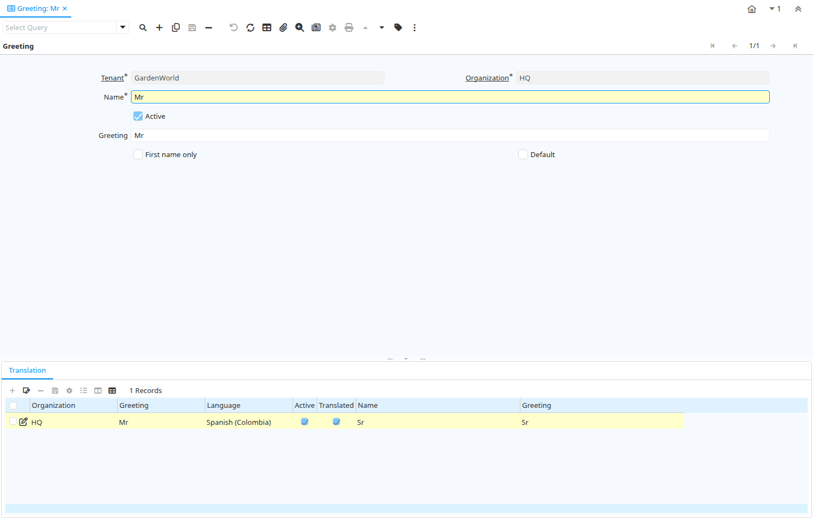

# Greeting

Window ID 178

*19/03/2000 → 02/01/2000*

**Description:** Maintain Greetings

**Comment/Help:** The Greeting Window defines a greeting that is then associated with a Business Partner or Business Partner Contact.

## Tab: Greeting

*Tab Level 0 · Created 19/03/2000 · Updated 02/01/2000*

**Description:** Define Greeting

**Comment/Help:** The Greeting Tab defines the manner in which you will address business partners on documents.

| **Name** | **Description** | **Comment/Help** | **Technical Data** |
|---|---|---|---|
| Tenant | Tenant for this installation. | A Tenant is a company or a legal entity. You cannot share data between Tenants. | C_Greeting.AD_Client_ID<small> numeric(10)   Table Direct</small> |
| Organization | Organizational entity within tenant | An organization is a unit of your tenant or legal entity - examples are store, department. You can share data between organizations. | C_Greeting.AD_Org_ID<small> numeric(10)   Table Direct</small> |
| Name | Alphanumeric identifier of the entity | The name of an entity (record) is used as an default search option in addition to the search key. The name is up to 60 characters in length. | C_Greeting.Name<small> character varying(60)   String</small> |
| Active | The record is active in the system | There are two methods of making records unavailable in the system: One is to delete the record, the other is to de-activate the record. A de-activated record is not available for selection, but available for reports. There are two reasons for de-activating and not deleting records: (1) The system requires the record for audit purposes. (2) The record is referenced by other records. E.g., you cannot delete a Business Partner, if there are invoices for this partner record existing. You de-activate the Business Partner and prevent that this record is used for future entries. | C_Greeting.IsActive<small> character(1)   Yes-No</small> |
| Greeting | For letters, e.g. "Dear &#123;0&#125;" or "Dear Mr. &#123;0&#125;" - At runtime, "&#123;0&#125;" is replaced by the name | The Greeting indicates what will print on letters sent to a Business Partner. | C_Greeting.Greeting<small> character varying(60)   String</small> |
| First name only | Print only the first name in greetings | The First Name Only checkbox indicates that only the first name of this contact should print in greetings. | C_Greeting.IsFirstNameOnly<small> character(1)   Yes-No</small> |
| Default | Default value | The Default Checkbox indicates if this record will be used as a default value. | C_Greeting.IsDefault<small> character(1)   Yes-No</small> |

## Tab: › Translation

*Tab Level 1 · Created 19/03/2000 · Updated 27/10/2024*

| **Name** | **Description** | **Comment/Help** | **Technical Data** |
|---|---|---|---|
| Tenant | Tenant for this installation. | A Tenant is a company or a legal entity. You cannot share data between Tenants. | C_Greeting_Trl.AD_Client_ID<small> numeric(10)   Table Direct</small> |
| Organization | Organizational entity within tenant | An organization is a unit of your tenant or legal entity - examples are store, department. You can share data between organizations. | C_Greeting_Trl.AD_Org_ID<small> numeric(10)   Table Direct</small> |
| Greeting | Greeting to print on correspondence | The Greeting identifies the greeting to print on correspondence. | C_Greeting_Trl.C_Greeting_ID<small> numeric(10)   Table Direct</small> |
| Language | Language for this entity | The Language identifies the language to use for display and formatting | C_Greeting_Trl.AD_Language<small> character varying(6)   Table</small> |
| Active | The record is active in the system | There are two methods of making records unavailable in the system: One is to delete the record, the other is to de-activate the record. A de-activated record is not available for selection, but available for reports. There are two reasons for de-activating and not deleting records: (1) The system requires the record for audit purposes. (2) The record is referenced by other records. E.g., you cannot delete a Business Partner, if there are invoices for this partner record existing. You de-activate the Business Partner and prevent that this record is used for future entries. | C_Greeting_Trl.IsActive<small> character(1)   Yes-No</small> |
| Translated | This column is translated | The Translated checkbox indicates if this column is translated. | C_Greeting_Trl.IsTranslated<small> character(1)   Yes-No</small> |
| Name | Alphanumeric identifier of the entity | The name of an entity (record) is used as an default search option in addition to the search key. The name is up to 60 characters in length. | C_Greeting_Trl.Name<small> character varying(60)   String</small> |
| Greeting | For letters, e.g. "Dear &#123;0&#125;" or "Dear Mr. &#123;0&#125;" - At runtime, "&#123;0&#125;" is replaced by the name | The Greeting indicates what will print on letters sent to a Business Partner. | C_Greeting_Trl.Greeting<small> character varying(60)   String</small> |

