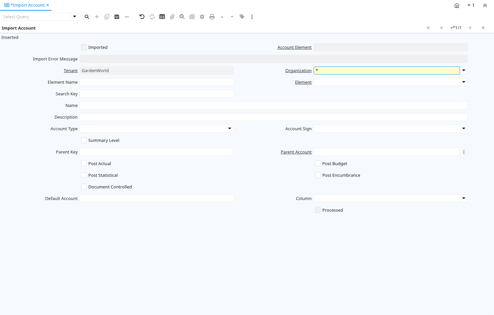

# Import Account

Window ID 248

*11/01/2003 → 02/01/2000*

**Description:** Import Natural Account Values

**Comment/Help:** The Import Natural Account Window is an interim table which is used when importing external data into the system.  Selecting the 'Process' button will either add or modify the appropriate records.

## Tab: Import Account

*Tab Level 0 · Created 11/01/2003 · Updated 02/01/2000*

| **Name** | **Description** | **Comment/Help** | **Technical Data** |
|---|---|---|---|
| Import Account | Import Account Value |  | I_ElementValue.I_ElementValue_ID<small> numeric(10)   ID</small> |
| Imported | Has this import been processed | The Imported check box indicates if this import has been processed. | I_ElementValue.I_IsImported<small> character(1)   Yes-No</small> |
| Account Element | Account Element | Account Elements can be natural accounts or user defined values. | I_ElementValue.C_ElementValue_ID<small> numeric(10)   Search</small> |
| Import Error Message | Messages generated from import process | The Import Error Message displays any error messages generated during the import process. | I_ElementValue.I_ErrorMsg<small> character varying(2000)   String</small> |
| Tenant | Tenant for this installation. | A Tenant is a company or a legal entity. You cannot share data between Tenants. | I_ElementValue.AD_Client_ID<small> numeric(10)   Table Direct</small> |
| Organization | Organizational entity within tenant | An organization is a unit of your tenant or legal entity - examples are store, department. You can share data between organizations. | I_ElementValue.AD_Org_ID<small> numeric(10)   Table Direct</small> |
| Element Name | Name of the Element |  | I_ElementValue.ElementName<small> character varying(60)   String</small> |
| Element | Accounting Element | The Account Element uniquely identifies an Account Type.  These are commonly known as a Chart of Accounts. | I_ElementValue.C_Element_ID<small> numeric(10)   Table Direct</small> |
| Search Key | Search key for the record in the format required - must be unique | A search key allows you a fast method of finding a particular record. If you leave the search key empty, the system automatically creates a numeric number.  The document sequence used for this fallback number is defined in the "Maintain Sequence" window with the name "DocumentNo_&lt;TableName&gt;", where TableName is the actual name of the table (e.g. C_Order). | I_ElementValue.Value<small> character varying(40)   String</small> |
| Name | Alphanumeric identifier of the entity | The name of an entity (record) is used as an default search option in addition to the search key. The name is up to 60 characters in length. | I_ElementValue.Name<small> character varying(60)   String</small> |
| Description | Optional short description of the record | A description is limited to 255 characters. | I_ElementValue.Description<small> character varying(255)   String</small> |
| Account Type | Indicates the type of account | Valid account types are A - Asset, E - Expense, L - Liability, O- Owner's Equity, R -Revenue and M- Memo.  The account type is used to determine what taxes, if any are applicable, validating payables and receivables for business partners.  Note:  Memo account amounts are ignored when checking for balancing | I_ElementValue.AccountType<small> character(1)   List</small> |
| Account Sign | Indicates the Natural Sign of the Account as a Debit or Credit | Indicates if the expected balance for this account should be a Debit or a Credit. If set to Natural, the account sign for an asset or expense account is Debit Sign (i.e. negative if a credit balance). | I_ElementValue.AccountSign<small> character(1)   List</small> |
| Summary Level | This is a summary entity | A summary entity represents a branch in a tree rather than an end-node. Summary entities are used for reporting and do not have own values. | I_ElementValue.IsSummary<small> character(1)   Yes-No</small> |
| Parent Key | Key if the Parent |  | I_ElementValue.ParentValue<small> character varying(40)   String</small> |
| Parent Account | The parent (summary) account |  | I_ElementValue.ParentElementValue_ID<small> numeric(10)   Search</small> |
| Post Actual | Actual Values can be posted | The Post Actual indicates if actual values can be posted to this element value. | I_ElementValue.PostActual<small> character(1)   Yes-No</small> |
| Post Budget | Budget values can be posted | The Post Budget indicates if budget values can be posted to this element value. | I_ElementValue.PostBudget<small> character(1)   Yes-No</small> |
| Post Statistical | Post statistical quantities to this account? |  | I_ElementValue.PostStatistical<small> character(1)   Yes-No</small> |
| Post Encumbrance | Post commitments to this account |  | I_ElementValue.PostEncumbrance<small> character(1)   Yes-No</small> |
| Document Controlled | Control account - If an account is controlled by a document, you cannot post manually to it |  | I_ElementValue.IsDocControlled<small> character(1)   Yes-No</small> |
| Default Account | Name of the Default Account Column |  | I_ElementValue.Default_Account<small> character varying(30)   String</small> |
| Column | Column in the table | Link to the database column of the table | I_ElementValue.AD_Column_ID<small> numeric(10)   Table</small> |
| Import Accounts | Import Natural Accounts | Import accounts and their hierarchies and optional update the default accounts.   Updating the Default Accounts changes the natural account segment of the used account, e.g. account 01-240 becomes 01-300).  If you create a new combination, the old account (e.g. 01-240) will remain, otherwise replaced. If you select this, make sure that you not multiple default accounts using one natural account and HAVE A BACKUP !! &lt;p&gt;The Parameters are default values for null import record values, they do not overwrite any data. | I_ElementValue.Processing<small> character(1)   Button</small> |
| Processed | The document has been processed | The Processed checkbox indicates that a document has been processed. | I_ElementValue.Processed<small> character(1)   Yes-No</small> |

