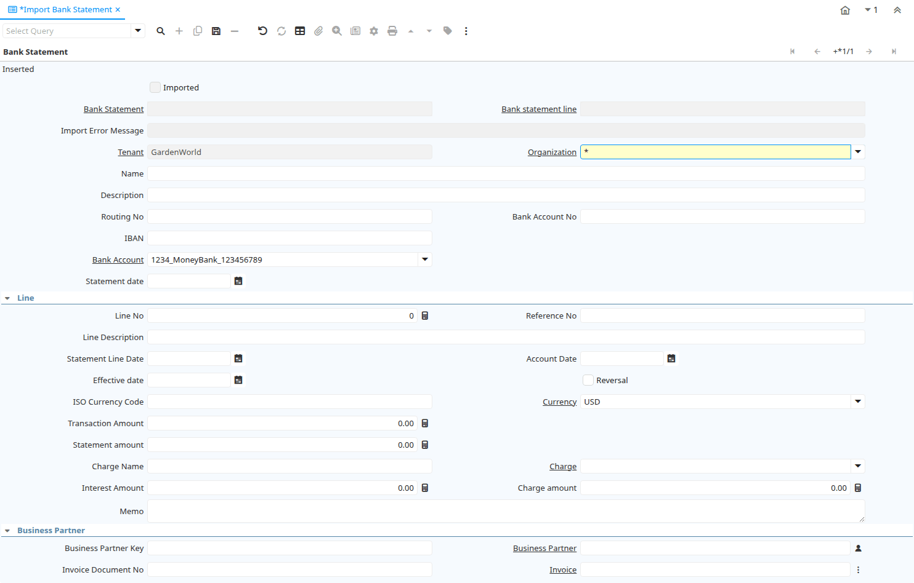

# Import Bank Statement

Window ID 277

*07/06/2003 → 03/06/2021*

**Description:** Import Bank Statements

## Tab: Bank Statement

*Tab Level 0 · Created 07/06/2003 · Updated 02/01/2000*

**Description:** Import Bank Statement

| **Name** | **Description** | **Comment/Help** | **Technical Data** |
|---|---|---|---|
| Import Bank Statement | Import of the Bank Statement |  | I_BankStatement.I_BankStatement_ID<small> numeric(10)   ID</small> |
| Imported | Has this import been processed | The Imported check box indicates if this import has been processed. | I_BankStatement.I_IsImported<small> character(1)   Yes-No</small> |
| Bank Statement | Bank Statement of account | The Bank Statement identifies a unique Bank Statement for a defined time period.  The statement defines all transactions that occurred | I_BankStatement.C_BankStatement_ID<small> numeric(10)   Search</small> |
| Bank statement line | Line on a statement from this Bank | The Bank Statement Line identifies a unique transaction (Payment, Withdrawal, Charge) for the defined time period at this Bank. | I_BankStatement.C_BankStatementLine_ID<small> numeric(10)   Search</small> |
| Import Error Message | Messages generated from import process | The Import Error Message displays any error messages generated during the import process. | I_BankStatement.I_ErrorMsg<small> character varying(2000)   String</small> |
| Tenant | Tenant for this installation. | A Tenant is a company or a legal entity. You cannot share data between Tenants. | I_BankStatement.AD_Client_ID<small> numeric(10)   Table Direct</small> |
| Organization | Organizational entity within tenant | An organization is a unit of your tenant or legal entity - examples are store, department. You can share data between organizations. | I_BankStatement.AD_Org_ID<small> numeric(10)   Table Direct</small> |
| Name | Alphanumeric identifier of the entity | The name of an entity (record) is used as an default search option in addition to the search key. The name is up to 60 characters in length. | I_BankStatement.Name<small> character varying(60)   String</small> |
| Description | Optional short description of the record | A description is limited to 255 characters. | I_BankStatement.Description<small> character varying(255)   String</small> |
| Routing No | Bank Routing Number | The Bank Routing Number (ABA Number) identifies a legal Bank.  It is used in routing checks and electronic transactions. | I_BankStatement.RoutingNo<small> character varying(20)   String</small> |
| Bank Account No | Bank Account Number |  | I_BankStatement.BankAccountNo<small> character varying(20)   String</small> |
| IBAN | International Bank Account Number | If your bank provides an International Bank Account Number, enter it here Details ISO 13616 and http://www.ecbs.org. The account number has the maximum length of 22 characters (without spaces). The IBAN is often printed with a apace after 4 characters. Do not enter the spaces in iDempiere. | I_BankStatement.IBAN<small> character varying(40)   String</small> |
| Bank Account | Account at the Bank | The Bank Account identifies an account at this Bank. | I_BankStatement.C_BankAccount_ID<small> numeric(10)   Table Direct</small> |
| Statement date | Date of the statement | The Statement Date field defines the date of the statement. | I_BankStatement.StatementDate<small> timestamp without time zone   Date</small> |
| Line No | Unique line for this document | Indicates the unique line for a document.  It will also control the display order of the lines within a document. | I_BankStatement.Line<small> numeric(10)   Integer</small> |
| Reference No | Your customer or vendor number at the Business Partner's site | The reference number can be printed on orders and invoices to allow your business partner to faster identify your records. | I_BankStatement.ReferenceNo<small> character varying(255)   String</small> |
| Line Description | Description of the Line |  | I_BankStatement.LineDescription<small> character varying(1000)   String</small> |
| Statement Line Date | Date of the Statement Line |  | I_BankStatement.StatementLineDate<small> timestamp without time zone   Date</small> |
| Account Date | Accounting Date | The Accounting Date indicates the date to be used on the General Ledger account entries generated from this document. It is also used for any currency conversion. | I_BankStatement.DateAcct<small> timestamp without time zone   Date</small> |
| Effective date | Date when money is available | The Effective Date indicates the date that money is available from the bank. | I_BankStatement.ValutaDate<small> timestamp without time zone   Date</small> |
| Reversal | This is a reversing transaction | The Reversal check box indicates if this is a reversal of a prior transaction. | I_BankStatement.IsReversal<small> character(1)   Yes-No</small> |
| ISO Currency Code | Three letter ISO 4217 Code of the Currency | For details - http://www.unece.org/trade/rec/rec09en.htm | I_BankStatement.ISO_Code<small> character(3)   String</small> |
| Currency | The Currency for this record | Indicates the Currency to be used when processing or reporting on this record | I_BankStatement.C_Currency_ID<small> numeric(10)   Table Direct</small> |
| Transaction Amount | Amount of a transaction | The Transaction Amount indicates the amount for a single transaction. | I_BankStatement.TrxAmt<small> numeric   Amount</small> |
| Statement amount | Statement Amount | The Statement Amount indicates the amount of a single statement line. | I_BankStatement.StmtAmt<small> numeric   Amount</small> |
| Charge Name | Name of the Charge |  | I_BankStatement.ChargeName<small> character varying(60)   String</small> |
| Charge | Additional document charges | The Charge indicates a type of Charge (Handling, Shipping, Restocking) | I_BankStatement.C_Charge_ID<small> numeric(10)   Table Direct</small> |
| Interest Amount | Interest Amount | The Interest Amount indicates any interest charged or received on a Bank Statement. | I_BankStatement.InterestAmt<small> numeric   Amount</small> |
| Charge amount | Charge Amount | The Charge Amount indicates the amount for an additional charge. | I_BankStatement.ChargeAmt<small> numeric   Amount</small> |
| Memo | Memo Text |  | I_BankStatement.Memo<small> character varying(4000)   String</small> |
| Business Partner Key | Key of the Business Partner |  | I_BankStatement.BPartnerValue<small> character varying(40)   String</small> |
| Business Partner | Identifies a Business Partner | A Business Partner is anyone with whom you transact.  This can include Vendor, Customer, Employee or Salesperson | I_BankStatement.C_BPartner_ID<small> numeric(10)   Search</small> |
| Invoice Document No | Document Number of the Invoice |  | I_BankStatement.InvoiceDocumentNo<small> character varying(30)   String</small> |
| Invoice | Invoice Identifier | The Invoice Document. | I_BankStatement.C_Invoice_ID<small> numeric(10)   Search</small> |
| Payment Document No | Document number of the Payment |  | I_BankStatement.PaymentDocumentNo<small> character varying(30)   String</small> |
| Payment | Payment identifier | The Payment is a unique identifier of this payment. | I_BankStatement.C_Payment_ID<small> numeric(10)   Search</small> |
| Transaction Type | Type of credit card transaction | The Transaction Type indicates the type of transaction to be submitted to the Credit Card Company. | I_BankStatement.TrxType<small> character varying(20)   List</small> |
| Match Bank Statement | Match Bank Statement Info to Business Partners, Invoices and Payments |  | I_BankStatement.MatchStatement<small> character(1)   Button</small> |
| Import Bank Statement | Import Bank Statement | The Parameters are default values for null import record values, they do not overwrite any data. | I_BankStatement.Processing<small> character(1)   Button</small> |
| Create Payment | Create Payment from Bank Statement Info |  | I_BankStatement.CreatePayment<small> character(1)   Button</small> |
| Processed | The document has been processed | The Processed checkbox indicates that a document has been processed. | I_BankStatement.Processed<small> character(1)   Yes-No</small> |
| EFT Statement Reference | Electronic Funds Transfer Statement Reference | Information from EFT media | I_BankStatement.EftStatementReference<small> character varying(60)   String</small> |
| EFT Statement Date | Electronic Funds Transfer Statement Date | Information from EFT media | I_BankStatement.EftStatementDate<small> timestamp without time zone   Date</small> |
| EFT Trx ID | Electronic Funds Transfer Transaction ID | Information from EFT media | I_BankStatement.EftTrxID<small> character varying(40)   String</small> |
| EFT Trx Type | Electronic Funds Transfer Transaction Type | Information from EFT media | I_BankStatement.EftTrxType<small> character varying(255)   String</small> |
| EFT Check No | Electronic Funds Transfer Check No | Information from EFT media | I_BankStatement.EftCheckNo<small> character varying(20)   String</small> |
| EFT Reference | Electronic Funds Transfer Reference | Information from EFT media | I_BankStatement.EftReference<small> character varying(255)   String</small> |
| EFT Memo | Electronic Funds Transfer Memo | Information from EFT media | I_BankStatement.EftMemo<small> character varying(4000)   String</small> |
| EFT Payee | Electronic Funds Transfer Payee information | Information from EFT media | I_BankStatement.EftPayee<small> character varying(255)   String</small> |
| EFT Payee Account | Electronic Funds Transfer Payee Account Information | Information from EFT media | I_BankStatement.EftPayeeAccount<small> character varying(40)   String</small> |
| EFT Statement Line Date | Electronic Funds Transfer Statement Line Date | Information from EFT media | I_BankStatement.EftStatementLineDate<small> timestamp without time zone   Date</small> |
| EFT Effective Date | Electronic Funds Transfer Valuta (effective) Date | Information from EFT media | I_BankStatement.EftValutaDate<small> timestamp without time zone   Date</small> |
| EFT Currency | Electronic Funds Transfer Currency | Information from EFT media | I_BankStatement.EftCurrency<small> character varying(20)   String</small> |
| EFT Amount | Electronic Funds Transfer Amount |  | I_BankStatement.EftAmt<small> numeric   Amount</small> |

