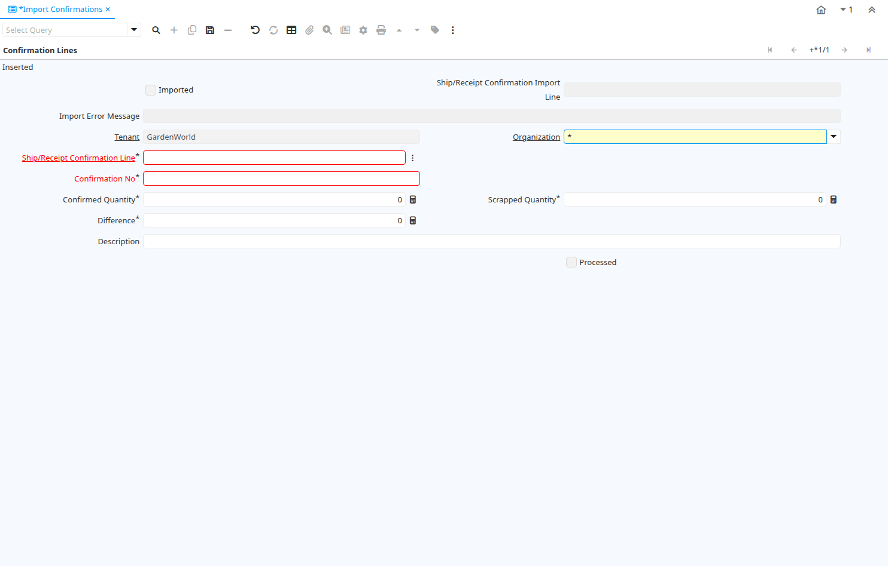

# Import Confirmations

Window ID 334

*02/07/2004 → 02/01/2000*

**Description:** Import Receipt/Shipment Confirmation Lines

**Comment/Help:** Import Confirmation data of existing Receipt/Shipment Confirmations

## Tab: Confirmation Lines

*Tab Level 0 · Created 02/07/2004 · Updated 02/01/2000*

**Description:** Import Receipt/Shipment Confirmation Lines

**Comment/Help:** Import Confirmation data of existing Receipt/Shipment Confirmations

| **Name** | **Description** | **Comment/Help** | **Technical Data** |
|---|---|---|---|
| Imported | Has this import been processed | The Imported check box indicates if this import has been processed. | I_InOutLineConfirm.I_IsImported<small> character(1)   Yes-No</small> |
| Ship/Receipt Confirmation Import Line | Material Shipment or Receipt Confirmation Import Line | Import Confirmation Line Details | I_InOutLineConfirm.I_InOutLineConfirm_ID<small> numeric(10)   ID</small> |
| Import Error Message | Messages generated from import process | The Import Error Message displays any error messages generated during the import process. | I_InOutLineConfirm.I_ErrorMsg<small> character varying(2000)   String</small> |
| Tenant | Tenant for this installation. | A Tenant is a company or a legal entity. You cannot share data between Tenants. | I_InOutLineConfirm.AD_Client_ID<small> numeric(10)   Table Direct</small> |
| Organization | Organizational entity within tenant | An organization is a unit of your tenant or legal entity - examples are store, department. You can share data between organizations. | I_InOutLineConfirm.AD_Org_ID<small> numeric(10)   Table Direct</small> |
| Ship/Receipt Confirmation Line | Material Shipment or Receipt Confirmation Line | Confirmation details | I_InOutLineConfirm.M_InOutLineConfirm_ID<small> numeric(10)   Search</small> |
| Confirmation No | Confirmation Number |  | I_InOutLineConfirm.ConfirmationNo<small> character varying(20)   String</small> |
| Confirmed Quantity | Confirmation of a received quantity | Confirmation of a received quantity | I_InOutLineConfirm.ConfirmedQty<small> numeric   Quantity</small> |
| Scrapped Quantity | The Quantity scrapped due to QA issues |  | I_InOutLineConfirm.ScrappedQty<small> numeric   Quantity</small> |
| Difference | Difference Quantity |  | I_InOutLineConfirm.DifferenceQty<small> numeric   Quantity</small> |
| Description | Optional short description of the record | A description is limited to 255 characters. | I_InOutLineConfirm.Description<small> character varying(255)   String</small> |
| Import Confirmations | Import Confirmations | The Parameters are default values for null import record values, they do not overwrite any data. | I_InOutLineConfirm.Processing<small> character(1)   Button</small> |
| Processed | The document has been processed | The Processed checkbox indicates that a document has been processed. | I_InOutLineConfirm.Processed<small> character(1)   Yes-No</small> |

