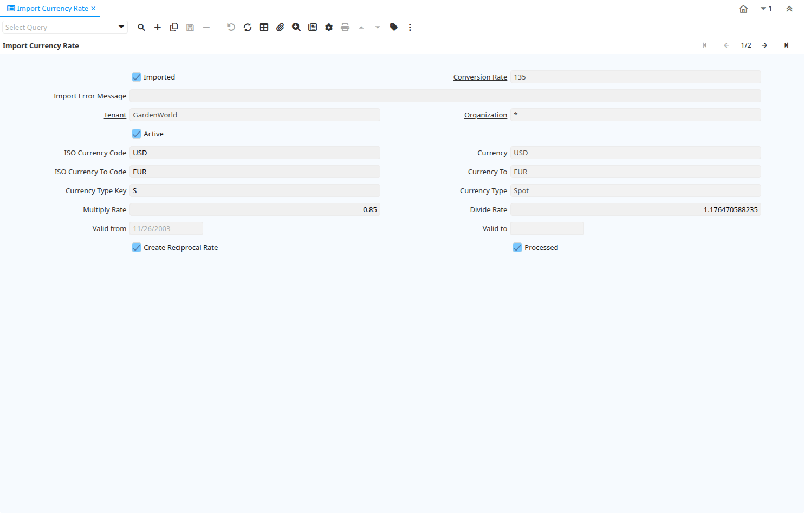

# Import Currency Rate

Window ID 296

*29/12/2003 → 02/01/2000*

**Description:** Import Currency Conversion Rates

**Comment/Help:** The rates are imported after validation of currencies and conversion rate type as well as rates. The multiply rate is used. If a reciprocal rate is to be created, the divide rate is used. 

## Tab: Import Currency Rate

*Tab Level 0 · Created 29/12/2003 · Updated 02/01/2000*

**Description:** Import Currency Conversion Rate

| **Name** | **Description** | **Comment/Help** | **Technical Data** |
|---|---|---|---|
| Import Conversion Rate | Import Currency Conversion Rate |  | I_Conversion_Rate.I_Conversion_Rate_ID<small> numeric(10)   ID</small> |
| Imported | Has this import been processed | The Imported check box indicates if this import has been processed. | I_Conversion_Rate.I_IsImported<small> character(1)   Yes-No</small> |
| Conversion Rate | Rate used for converting currencies | The Conversion Rate defines the rate (multiply or divide) to use when converting a source currency to an accounting currency. | I_Conversion_Rate.C_Conversion_Rate_ID<small> numeric(10)   Table Direct</small> |
| Import Error Message | Messages generated from import process | The Import Error Message displays any error messages generated during the import process. | I_Conversion_Rate.I_ErrorMsg<small> character varying(2000)   String</small> |
| Tenant | Tenant for this installation. | A Tenant is a company or a legal entity. You cannot share data between Tenants. | I_Conversion_Rate.AD_Client_ID<small> numeric(10)   Table Direct</small> |
| Organization | Organizational entity within tenant | An organization is a unit of your tenant or legal entity - examples are store, department. You can share data between organizations. | I_Conversion_Rate.AD_Org_ID<small> numeric(10)   Table Direct</small> |
| Active | The record is active in the system | There are two methods of making records unavailable in the system: One is to delete the record, the other is to de-activate the record. A de-activated record is not available for selection, but available for reports. There are two reasons for de-activating and not deleting records: (1) The system requires the record for audit purposes. (2) The record is referenced by other records. E.g., you cannot delete a Business Partner, if there are invoices for this partner record existing. You de-activate the Business Partner and prevent that this record is used for future entries. | I_Conversion_Rate.IsActive<small> character(1)   Yes-No</small> |
| ISO Currency Code | Three letter ISO 4217 Code of the Currency | For details - http://www.unece.org/trade/rec/rec09en.htm | I_Conversion_Rate.ISO_Code<small> character(3)   String</small> |
| Currency | The Currency for this record | Indicates the Currency to be used when processing or reporting on this record | I_Conversion_Rate.C_Currency_ID<small> numeric(10)   Table Direct</small> |
| ISO Currency To Code | Three letter ISO 4217 Code of the To Currency | For details - http://www.unece.org/trade/rec/rec09en.htm | I_Conversion_Rate.ISO_Code_To<small> character(3)   String</small> |
| Currency To | Target currency | The Currency To defines the target currency for this conversion rate. | I_Conversion_Rate.C_Currency_ID_To<small> numeric(10)   Table</small> |
| Currency Type Key | Key value for the Currency Conversion Rate Type | The date type key for the conversion of foreign currency transactions | I_Conversion_Rate.ConversionTypeValue<small> character varying(40)   String</small> |
| Currency Type | Currency Conversion Rate Type | The Currency Conversion Rate Type lets you define different type of rates, e.g. Spot, Corporate and/or Sell/Buy rates. | I_Conversion_Rate.C_ConversionType_ID<small> numeric(10)   Table Direct</small> |
| Multiply Rate | Rate to multiple the source by to calculate the target. | To convert Source number to Target number, the Source is multiplied by the multiply rate.  If the Multiply Rate is entered, then the Divide Rate will be automatically calculated. | I_Conversion_Rate.MultiplyRate<small> numeric   Number</small> |
| Divide Rate | To convert Source number to Target number, the Source is divided | To convert Source number to Target number, the Source is divided by the divide rate.  If you enter a Divide Rate, the Multiply Rate will be automatically calculated. | I_Conversion_Rate.DivideRate<small> numeric   Number</small> |
| Valid from | Valid from including this date (first day) | The Valid From date indicates the first day of a date range | I_Conversion_Rate.ValidFrom<small> timestamp without time zone   Date</small> |
| Valid to | Valid to including this date (last day) | The Valid To date indicates the last day of a date range | I_Conversion_Rate.ValidTo<small> timestamp without time zone   Date</small> |
| Create Reciprocal Rate | Create Reciprocal Rate from current information | If selected, the imported USD-&gt;EUR rate is used to create/calculate the reciprocal rate EUR-&gt;USD. | I_Conversion_Rate.CreateReciprocalRate<small> character(1)   Yes-No</small> |
| Import Conversion Rate | Import Currency Conversion Rate |  | I_Conversion_Rate.Processing<small> character(1)   Button</small> |
| Processed | The document has been processed | The Processed checkbox indicates that a document has been processed. | I_Conversion_Rate.Processed<small> character(1)   Yes-No</small> |

