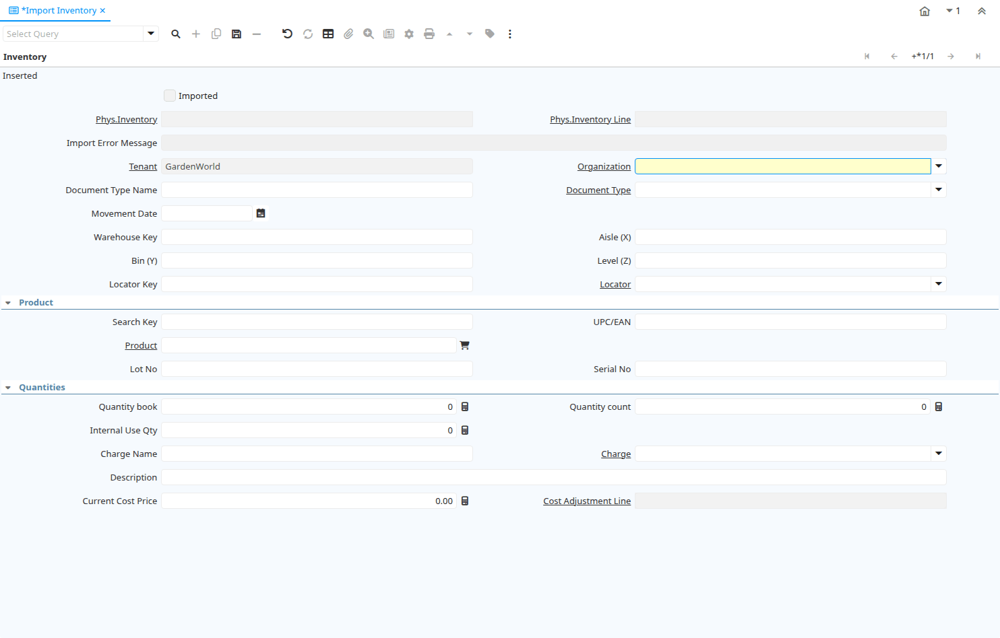

# Import Inventory

Window ID 267

*28/05/2003 → 02/01/2000*

**Description:** Import Inventory Transactions

**Comment/Help:** Validate and Import Inventory Transactions

## Tab: Inventory

*Tab Level 0 · Created 28/05/2003 · Updated 02/01/2000*

**Description:** Import Inventory

**Comment/Help:** Validate and Import Inventory Transactions. The Locator is primarily determined by the Locator Key, then the Warehouse and X,Y,Z fields.&lt;p&gt;
A Physical Inventory is created per Warehouse and Movement Date.

| **Name** | **Description** | **Comment/Help** | **Technical Data** |
|---|---|---|---|
| Import Inventory | Import Inventory Transactions |  | I_Inventory.I_Inventory_ID<small> numeric(10)   ID</small> |
| Imported | Has this import been processed | The Imported check box indicates if this import has been processed. | I_Inventory.I_IsImported<small> character(1)   Yes-No</small> |
| Phys.Inventory | Parameters for a Physical Inventory | The Physical Inventory indicates a unique parameters for a physical inventory. | I_Inventory.M_Inventory_ID<small> numeric(10)   Search</small> |
| Phys.Inventory Line | Unique line in an Inventory document | The Physical Inventory Line indicates the inventory document line (if applicable) for this transaction | I_Inventory.M_InventoryLine_ID<small> numeric(10)   Search</small> |
| Import Error Message | Messages generated from import process | The Import Error Message displays any error messages generated during the import process. | I_Inventory.I_ErrorMsg<small> character varying(2000)   String</small> |
| Tenant | Tenant for this installation. | A Tenant is a company or a legal entity. You cannot share data between Tenants. | I_Inventory.AD_Client_ID<small> numeric(10)   Table Direct</small> |
| Organization | Organizational entity within tenant | An organization is a unit of your tenant or legal entity - examples are store, department. You can share data between organizations. | I_Inventory.AD_Org_ID<small> numeric(10)   Table Direct</small> |
| Document Type Name | Name of the Document Type |  | I_Inventory.DocTypeName<small> character varying(60)   String</small> |
| Document Type | Document type or rules | The Document Type determines document sequence and processing rules | I_Inventory.C_DocType_ID<small> numeric(10)   Table Direct</small> |
| Movement Date | Date a product was moved in or out of inventory | The Movement Date indicates the date that a product moved in or out of inventory.  This is the result of a shipment, receipt or inventory movement. | I_Inventory.MovementDate<small> timestamp without time zone   Date</small> |
| Warehouse Key | Key of the Warehouse | Key to identify the Warehouse | I_Inventory.WarehouseValue<small> character varying(40)   String</small> |
| Aisle (X) | X dimension, e.g., Aisle | The X dimension indicates the Aisle a product is located in. | I_Inventory.X<small> character varying(60)   String</small> |
| Bin (Y) | Y dimension, e.g., Bin | The Y dimension indicates the Bin a product is located in | I_Inventory.Y<small> character varying(60)   String</small> |
| Level (Z) | Z dimension, e.g., Level | The Z dimension indicates the Level a product is located in. | I_Inventory.Z<small> character varying(60)   String</small> |
| Locator Key | Key of the Warehouse Locator |  | I_Inventory.LocatorValue<small> character varying(40)   String</small> |
| Locator | Warehouse Locator | The Locator indicates where in a Warehouse a product is located. | I_Inventory.M_Locator_ID<small> numeric(10)   Table Direct</small> |
| Search Key | Search key for the record in the format required - must be unique | A search key allows you a fast method of finding a particular record. If you leave the search key empty, the system automatically creates a numeric number.  The document sequence used for this fallback number is defined in the "Maintain Sequence" window with the name "DocumentNo_&lt;TableName&gt;", where TableName is the actual name of the table (e.g. C_Order). | I_Inventory.Value<small> character varying(40)   String</small> |
| UPC/EAN | Bar Code (Universal Product Code or its superset European Article Number) | Use this field to enter the bar code for the product in any of the bar code symbologies (Codabar, Code 25, Code 39, Code 93, Code 128, UPC (A), UPC (E), EAN-13, EAN-8, ITF, ITF-14, ISBN, ISSN, JAN-13, JAN-8, POSTNET and FIM, MSI/Plessey, and Pharmacode)  | I_Inventory.UPC<small> character varying(30)   String</small> |
| Product | Product, Service, Item | Identifies an item which is either purchased or sold in this organization. | I_Inventory.M_Product_ID<small> numeric(10)   Search</small> |
| Lot No | Lot number (alphanumeric) | The Lot Number indicates the specific lot that a product was part of. | I_Inventory.Lot<small> character varying(20)   String</small> |
| Serial No | Product Serial Number  | The Serial Number identifies a tracked, warranted product.  It can only be used when the quantity is 1. | I_Inventory.SerNo<small> character varying(20)   String</small> |
| Quantity book | Book Quantity | The Quantity Book indicates the line count stored in the system for a product in inventory | I_Inventory.QtyBook<small> numeric   Quantity</small> |
| Quantity count | Counted Quantity | The Quantity Count indicates the actual inventory count taken for a product in inventory | I_Inventory.QtyCount<small> numeric   Quantity</small> |
| Internal Use Qty | Internal Use Quantity removed from Inventory | Quantity of product inventory used internally (positive if taken out - negative if returned) | I_Inventory.QtyInternalUse<small> numeric   Quantity</small> |
| Charge Name | Name of the Charge |  | I_Inventory.ChargeName<small> character varying(60)   String</small> |
| Charge | Additional document charges | The Charge indicates a type of Charge (Handling, Shipping, Restocking) | I_Inventory.C_Charge_ID<small> numeric(10)   Table Direct</small> |
| Description | Optional short description of the record | A description is limited to 255 characters. | I_Inventory.Description<small> character varying(255)   String</small> |
| Current Cost Price | The currently used cost price |  | I_Inventory.CurrentCostPrice<small> numeric   Amount</small> |
| Cost Adjustment Line | Unique line in an Inventory cost adjustment document | The Cost Adjustment Line indicates the inventory cost adjustment document line (if applicable) for this transaction | I_Inventory.M_CostingLine_ID<small> numeric(10)   Search</small> |
| Import Inventory | Import Physical Inventory | The Parameters are default values for null import record values, they do not overwrite any data. | I_Inventory.Processing<small> character(1)   Button</small> |

