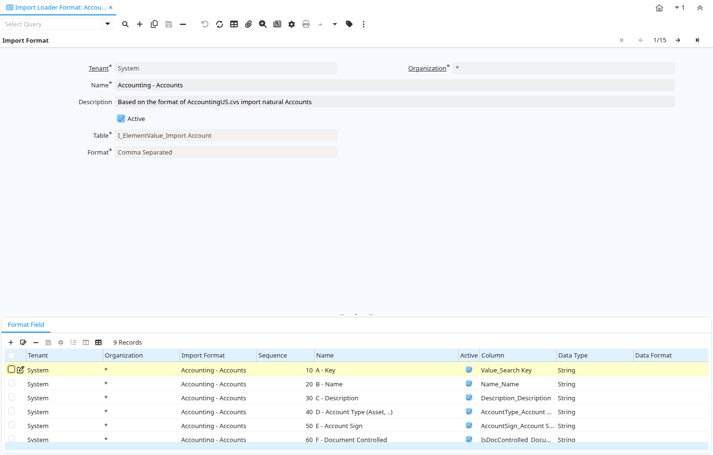

# Import Loader Format

Window ID 189

*15/09/2000 → 02/01/2000*

**Description:** Maintain Import Loader Formats

**Comment/Help:** The Import Loader Format Window is used for defining the file layout for product information which will be imported.

## Tab: Import Format

*Tab Level 0 · Created 15/09/2000 · Updated 02/01/2000*

| **Name** | **Description** | **Comment/Help** | **Technical Data** |
|---|---|---|---|
| Tenant | Tenant for this installation. | A Tenant is a company or a legal entity. You cannot share data between Tenants. | AD_ImpFormat.AD_Client_ID<small> numeric(10)   Table Direct</small> |
| Organization | Organizational entity within tenant | An organization is a unit of your tenant or legal entity - examples are store, department. You can share data between organizations. | AD_ImpFormat.AD_Org_ID<small> numeric(10)   Table Direct</small> |
| Name | Alphanumeric identifier of the entity | The name of an entity (record) is used as an default search option in addition to the search key. The name is up to 60 characters in length. | AD_ImpFormat.Name<small> character varying(60)   String</small> |
| Description | Optional short description of the record | A description is limited to 255 characters. | AD_ImpFormat.Description<small> character varying(255)   String</small> |
| Active | The record is active in the system | There are two methods of making records unavailable in the system: One is to delete the record, the other is to de-activate the record. A de-activated record is not available for selection, but available for reports. There are two reasons for de-activating and not deleting records: (1) The system requires the record for audit purposes. (2) The record is referenced by other records. E.g., you cannot delete a Business Partner, if there are invoices for this partner record existing. You de-activate the Business Partner and prevent that this record is used for future entries. | AD_ImpFormat.IsActive<small> character(1)   Yes-No</small> |
| Table | Database Table information | The Database Table provides the information of the table definition | AD_ImpFormat.AD_Table_ID<small> numeric(10)   Table Direct</small> |
| Format | Format of the data | The Format is a drop down list box for selecting the format type (text, tab delimited, XML, etc) of the file to be imported | AD_ImpFormat.FormatType<small> character(1)   List</small> |
| Separator Character |  |  | AD_ImpFormat.SeparatorChar<small> character varying(1)   String</small> |
| Copy Lines | Copy Lines from other Import Format |  | AD_ImpFormat.Processing<small> character(1)   Button</small> |

## Tab: › Format Field

*Tab Level 1 · Created 15/09/2000 · Updated 02/01/2000*

**Description:** Maintain Format Fields

**Comment/Help:** Define the individual field based on the table definition.  Please note that you have to make sure that a Constant has the correct  SQL data type (i.e. if it is a 'string', you need to enclose it like 'this').
&lt;p&gt;Product mapping (for details see documentation):
&lt;pre&gt;
H_Item =&gt; Value
H_ItemDesc =&gt; Name / Description
H_ItemDefn =&gt; Help
H_ItemType =&gt; ProductCategory
H_PartnrID =&gt; Value of Business Partner
H_Commodity1 =&gt; Vendor Product No
H_Commodity2 =&gt; SKU
H_ItemClass =&gt; Classification (A,B,C..)
V_OperAmt_T_Cur =&gt; Currency
V_OperAmt_T =&gt; Price 
&lt;/pre&gt;

| **Name** | **Description** | **Comment/Help** | **Technical Data** |
|---|---|---|---|
| Tenant | Tenant for this installation. | A Tenant is a company or a legal entity. You cannot share data between Tenants. | AD_ImpFormat_Row.AD_Client_ID<small> numeric(10)   Table Direct</small> |
| Organization | Organizational entity within tenant | An organization is a unit of your tenant or legal entity - examples are store, department. You can share data between organizations. | AD_ImpFormat_Row.AD_Org_ID<small> numeric(10)   Table Direct</small> |
| Import Format |  |  | AD_ImpFormat_Row.AD_ImpFormat_ID<small> numeric(10)   Table Direct</small> |
| Sequence | Method of ordering records; lowest number comes first | The Sequence indicates the order of records | AD_ImpFormat_Row.SeqNo<small> numeric(10)   Integer</small> |
| Name | Alphanumeric identifier of the entity | The name of an entity (record) is used as an default search option in addition to the search key. The name is up to 60 characters in length. | AD_ImpFormat_Row.Name<small> character varying(60)   String</small> |
| Active | The record is active in the system | There are two methods of making records unavailable in the system: One is to delete the record, the other is to de-activate the record. A de-activated record is not available for selection, but available for reports. There are two reasons for de-activating and not deleting records: (1) The system requires the record for audit purposes. (2) The record is referenced by other records. E.g., you cannot delete a Business Partner, if there are invoices for this partner record existing. You de-activate the Business Partner and prevent that this record is used for future entries. | AD_ImpFormat_Row.IsActive<small> character(1)   Yes-No</small> |
| Column | Column in the table | Link to the database column of the table | AD_ImpFormat_Row.AD_Column_ID<small> numeric(10)   Table Direct</small> |
| Data Type | Type of data |  | AD_ImpFormat_Row.DataType<small> character(1)   List</small> |
| Data Format | Format String in Java Notation, e.g. ddMMyy | The Date Format indicates how dates are defined on the record to be imported.  It must be in Java Notation | AD_ImpFormat_Row.DataFormat<small> character varying(20)   String</small> |
| Start No | Starting number/position | The Start Number indicates the starting position in the line or field number in the line | AD_ImpFormat_Row.StartNo<small> numeric(10)   Integer</small> |
| End No |  |  | AD_ImpFormat_Row.EndNo<small> numeric(10)   Integer</small> |
| Import prefix | This prefix will be added in front of import string if they are not empty | Use it e.g. when concatening input fields into one import field to add a blank | AD_ImpFormat_Row.ImportPrefix<small> character varying(20)   String</small> |
| Decimal Point | Decimal Point in the data file - if any |  | AD_ImpFormat_Row.DecimalPoint<small> character(1)   String</small> |
| Divide by 100 | Divide number by 100 to get correct amount |  | AD_ImpFormat_Row.DivideBy100<small> character(1)   Yes-No</small> |
| Constant Value | Constant value |  | AD_ImpFormat_Row.ConstantValue<small> character varying(60)   String</small> |
| Callout | Fully qualified class names and method - separated by semicolons | A Callout allow you to create Java extensions to perform certain tasks always after a value changed. Callouts should not be used for validation but consequences of a user selecting a certain value. The callout is a Java class implementing org.compiere.model.Callout and a method name to call.  Example: "org.compiere.model.CalloutRequest.copyText" instantiates the class "CalloutRequest" and calls the method "copyText". You can have multiple callouts by separating them via a semicolon | AD_ImpFormat_Row.Callout<small> character varying(4000)   String</small> |
| Script | Dynamic Java Language Script to calculate result | Use Java language constructs to define the result of the calculation | AD_ImpFormat_Row.Script<small> character varying(2000)   Text</small> |

