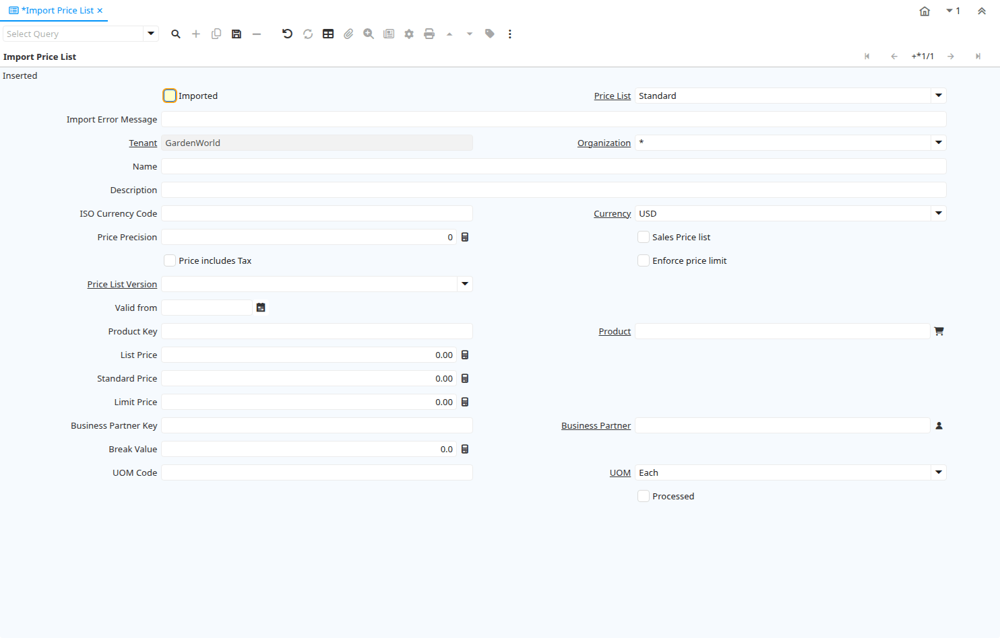

# Import Price List

Window ID 53071

*17/03/2009 → 03/06/2021*

**Description:** Import Price Lists

**Comment/Help:** The Import Price List Window is an interim table which is used when importing external data into the system.  Selecting the 'Process' button will either add or modify the appropriate records.

## Tab: Import Price List

*Tab Level 0 · Created 17/03/2009 · Updated 17/03/2009*

**Description:** Import Price Lists

| **Name** | **Description** | **Comment/Help** | **Technical Data** |
|---|---|---|---|
| Import Price List |  |  | I_PriceList.I_PriceList_ID<small> numeric(10)   ID</small> |
| Imported | Has this import been processed | The Imported check box indicates if this import has been processed. | I_PriceList.I_IsImported<small> character(1)   Yes-No</small> |
| Price List | Unique identifier of a Price List | Price Lists are used to determine the pricing, margin and cost of items purchased or sold. | I_PriceList.M_PriceList_ID<small> numeric(10)   Table Direct</small> |
| Import Error Message | Messages generated from import process | The Import Error Message displays any error messages generated during the import process. | I_PriceList.I_ErrorMsg<small> character varying(2000)   String</small> |
| Tenant | Tenant for this installation. | A Tenant is a company or a legal entity. You cannot share data between Tenants. | I_PriceList.AD_Client_ID<small> numeric(10)   Table Direct</small> |
| Organization | Organizational entity within tenant | An organization is a unit of your tenant or legal entity - examples are store, department. You can share data between organizations. | I_PriceList.AD_Org_ID<small> numeric(10)   Table Direct</small> |
| Name | Alphanumeric identifier of the entity | The name of an entity (record) is used as an default search option in addition to the search key. The name is up to 60 characters in length. | I_PriceList.Name<small> character varying(60)   String</small> |
| Description | Optional short description of the record | A description is limited to 255 characters. | I_PriceList.Description<small> character varying(255)   String</small> |
| ISO Currency Code | Three letter ISO 4217 Code of the Currency | For details - http://www.unece.org/trade/rec/rec09en.htm | I_PriceList.ISO_Code<small> character varying(3)   String</small> |
| Currency | The Currency for this record | Indicates the Currency to be used when processing or reporting on this record | I_PriceList.C_Currency_ID<small> numeric(10)   Table Direct</small> |
| Price Precision | Precision (number of decimals) for the Price | The prices of the price list are rounded to the precision entered.  This allows to have prices with below currency precision, e.g. $0.005. Enter the number of decimals or -1 for no rounding. | I_PriceList.PricePrecision<small> numeric   Integer</small> |
| Sales Price list | This is a Sales Price List | The Sales Price List check box indicates if this price list is used for sales transactions. | I_PriceList.IsSOPriceList<small> character(1)   Yes-No</small> |
| Price includes Tax | Tax is included in the price  | The Tax Included checkbox indicates if the prices include tax.  This is also known as the gross price. | I_PriceList.IsTaxIncluded<small> character(1)   Yes-No</small> |
| Enforce price limit | Do not allow prices below the limit price | The Enforce Price Limit check box indicates that prices cannot be below the limit price in Orders and Invoices.  This can be overwritten, if the role allows this. | I_PriceList.EnforcePriceLimit<small> character(1)   Yes-No</small> |
| Price List Version | Identifies a unique instance of a Price List | Each Price List can have multiple versions.  The most common use is to indicate the dates that a Price List is valid for. | I_PriceList.M_PriceList_Version_ID<small> numeric(10)   Table Direct</small> |
| Valid from | Valid from including this date (first day) | The Valid From date indicates the first day of a date range | I_PriceList.ValidFrom<small> timestamp without time zone   Date</small> |
| Product Key | Key of the Product |  | I_PriceList.ProductValue<small> character varying(40)   String</small> |
| Product | Product, Service, Item | Identifies an item which is either purchased or sold in this organization. | I_PriceList.M_Product_ID<small> numeric(10)   Search</small> |
| List Price | List Price | The List Price is the official List Price in the document currency. | I_PriceList.PriceList<small> numeric   Costs+Prices</small> |
| Standard Price | Standard Price | The Standard Price indicates the standard or normal price for a product on this price list | I_PriceList.PriceStd<small> numeric   Costs+Prices</small> |
| Limit Price | Lowest price for a product | The Price Limit indicates the lowest price for a product stated in the Price List Currency. | I_PriceList.PriceLimit<small> numeric   Costs+Prices</small> |
| Business Partner Key | The Key of the Business Partner |  | I_PriceList.BPartner_Value<small> character varying(40)   String</small> |
| Business Partner | Identifies a Business Partner | A Business Partner is anyone with whom you transact.  This can include Vendor, Customer, Employee or Salesperson | I_PriceList.C_BPartner_ID<small> numeric(10)   Search</small> |
| Break Value | Low Value of trade discount break level | Starting Quantity or Amount Value for break level | I_PriceList.BreakValue<small> numeric   Number</small> |
| UOM Code | UOM EDI X12 Code | The Unit of Measure Code indicates the EDI X12 Code Data Element 355 (Unit or Basis for Measurement) | I_PriceList.X12DE355<small> character varying(4)   String</small> |
| UOM | Unit of Measure | The UOM defines a unique non monetary Unit of Measure | I_PriceList.C_UOM_ID<small> numeric(10)   Table Direct</small> |
| Import Price Lists | Imports price lists from a file into the application |  | I_PriceList.Processing<small> character(1)   Button</small> |
| Processed | The document has been processed | The Processed checkbox indicates that a document has been processed. | I_PriceList.Processed<small> character(1)   Yes-No</small> |

