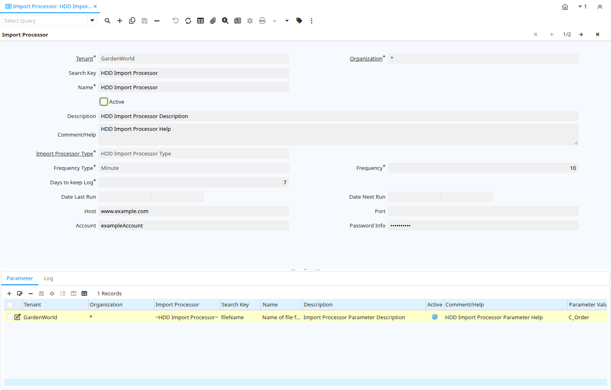

# Import Processor

Window ID 53028

*05/03/2008 → 17/02/2022*

## Tab: Import Processor

*Tab Level 0 · Created 05/03/2008 · Updated 05/03/2008*

| **Name** | **Description** | **Comment/Help** | **Technical Data** |
|---|---|---|---|
| Tenant | Tenant for this installation. | A Tenant is a company or a legal entity. You cannot share data between Tenants. | IMP_Processor.AD_Client_ID<small> numeric(10)   Table Direct</small> |
| Organization | Organizational entity within tenant | An organization is a unit of your tenant or legal entity - examples are store, department. You can share data between organizations. | IMP_Processor.AD_Org_ID<small> numeric(10)   Table Direct</small> |
| Search Key | Search key for the record in the format required - must be unique | A search key allows you a fast method of finding a particular record. If you leave the search key empty, the system automatically creates a numeric number.  The document sequence used for this fallback number is defined in the "Maintain Sequence" window with the name "DocumentNo_&lt;TableName&gt;", where TableName is the actual name of the table (e.g. C_Order). | IMP_Processor.Value<small> character varying(40)   String</small> |
| Name | Alphanumeric identifier of the entity | The name of an entity (record) is used as an default search option in addition to the search key. The name is up to 60 characters in length. | IMP_Processor.Name<small> character varying(60)   String</small> |
| Active | The record is active in the system | There are two methods of making records unavailable in the system: One is to delete the record, the other is to de-activate the record. A de-activated record is not available for selection, but available for reports. There are two reasons for de-activating and not deleting records: (1) The system requires the record for audit purposes. (2) The record is referenced by other records. E.g., you cannot delete a Business Partner, if there are invoices for this partner record existing. You de-activate the Business Partner and prevent that this record is used for future entries. | IMP_Processor.IsActive<small> character(1)   Yes-No</small> |
| Description | Optional short description of the record | A description is limited to 255 characters. | IMP_Processor.Description<small> character varying(255)   String</small> |
| Comment/Help | Comment or Hint | The Help field contains a hint, comment or help about the use of this item. | IMP_Processor.Help<small> character varying(2000)   Text</small> |
| Import Processor Type |  |  | IMP_Processor.IMP_Processor_Type_ID<small> numeric(10)   Table Direct</small> |
| Frequency Type | Frequency of event | The frequency type is used for calculating the date of the next event. | IMP_Processor.FrequencyType<small> character(1)   List</small> |
| Frequency | Frequency of events | The frequency is used in conjunction with the frequency type in determining an event. Example: If the Frequency Type is Week and the Frequency is 2 - it is every two weeks. | IMP_Processor.Frequency<small> numeric(10)   Integer</small> |
| Days to keep Log | Number of days to keep the log entries | Older Log entries may be deleted | IMP_Processor.KeepLogDays<small> numeric(10)   Integer</small> |
| Date Last Run | Date the process was last run. | The Date Last Run indicates the last time that a process was run. | IMP_Processor.DateLastRun<small> timestamp without time zone   Date+Time</small> |
| Date Next Run | Date the process will run next | The Date Next Run indicates the next time this process will run. | IMP_Processor.DateNextRun<small> timestamp without time zone   Date+Time</small> |
| Host |  |  | IMP_Processor.Host<small> character varying(255)   String</small> |
| Port |  |  | IMP_Processor.Port<small> numeric(10)   Integer</small> |
| Account |  |  | IMP_Processor.Account<small> character varying(255)   String</small> |
| Password Info |  |  | IMP_Processor.PasswordInfo<small> character varying(255)   String</small> |

## Tab: › Parameter

*Tab Level 1 · Created 05/03/2008 · Updated 05/03/2008*

| **Name** | **Description** | **Comment/Help** | **Technical Data** |
|---|---|---|---|
| Tenant | Tenant for this installation. | A Tenant is a company or a legal entity. You cannot share data between Tenants. | IMP_ProcessorParameter.AD_Client_ID<small> numeric(10)   Table Direct</small> |
| Organization | Organizational entity within tenant | An organization is a unit of your tenant or legal entity - examples are store, department. You can share data between organizations. | IMP_ProcessorParameter.AD_Org_ID<small> numeric(10)   Table Direct</small> |
| Import Processor |  |  | IMP_ProcessorParameter.IMP_Processor_ID<small> numeric(10)   Table Direct</small> |
| Search Key | Search key for the record in the format required - must be unique | A search key allows you a fast method of finding a particular record. If you leave the search key empty, the system automatically creates a numeric number.  The document sequence used for this fallback number is defined in the "Maintain Sequence" window with the name "DocumentNo_&lt;TableName&gt;", where TableName is the actual name of the table (e.g. C_Order). | IMP_ProcessorParameter.Value<small> character varying(40)   String</small> |
| Name | Alphanumeric identifier of the entity | The name of an entity (record) is used as an default search option in addition to the search key. The name is up to 60 characters in length. | IMP_ProcessorParameter.Name<small> character varying(60)   String</small> |
| Description | Optional short description of the record | A description is limited to 255 characters. | IMP_ProcessorParameter.Description<small> character varying(255)   String</small> |
| Active | The record is active in the system | There are two methods of making records unavailable in the system: One is to delete the record, the other is to de-activate the record. A de-activated record is not available for selection, but available for reports. There are two reasons for de-activating and not deleting records: (1) The system requires the record for audit purposes. (2) The record is referenced by other records. E.g., you cannot delete a Business Partner, if there are invoices for this partner record existing. You de-activate the Business Partner and prevent that this record is used for future entries. | IMP_ProcessorParameter.IsActive<small> character(1)   Yes-No</small> |
| Comment/Help | Comment or Hint | The Help field contains a hint, comment or help about the use of this item. | IMP_ProcessorParameter.Help<small> character varying(2000)   Text</small> |
| Parameter Value |  |  | IMP_ProcessorParameter.ParameterValue<small> character varying(60)   String</small> |

## Tab: › Log

*Tab Level 1 · Created 05/03/2008 · Updated 05/03/2008*

| **Name** | **Description** | **Comment/Help** | **Technical Data** |
|---|---|---|---|
| Tenant | Tenant for this installation. | A Tenant is a company or a legal entity. You cannot share data between Tenants. | IMP_ProcessorLog.AD_Client_ID<small> numeric(10)   Table Direct</small> |
| Organization | Organizational entity within tenant | An organization is a unit of your tenant or legal entity - examples are store, department. You can share data between organizations. | IMP_ProcessorLog.AD_Org_ID<small> numeric(10)   Table Direct</small> |
| Import Processor |  |  | IMP_ProcessorLog.IMP_Processor_ID<small> numeric(10)   Table Direct</small> |
| Active | The record is active in the system | There are two methods of making records unavailable in the system: One is to delete the record, the other is to de-activate the record. A de-activated record is not available for selection, but available for reports. There are two reasons for de-activating and not deleting records: (1) The system requires the record for audit purposes. (2) The record is referenced by other records. E.g., you cannot delete a Business Partner, if there are invoices for this partner record existing. You de-activate the Business Partner and prevent that this record is used for future entries. | IMP_ProcessorLog.IsActive<small> character(1)   Yes-No</small> |
| Description | Optional short description of the record | A description is limited to 255 characters. | IMP_ProcessorLog.Description<small> character varying(255)   String</small> |
| Comment/Help | Comment or Hint | The Help field contains a hint, comment or help about the use of this item. | IMP_ProcessorLog.Help<small> character varying(2000)   Text</small> |
| Binary Data | Binary Data | The Binary field stores binary data. | IMP_ProcessorLog.BinaryData<small> bytea   Binary</small> |
| Error | An Error occurred in the execution |  | IMP_ProcessorLog.IsError<small> character(1)   Yes-No</small> |
| Reference | Reference for this record | The Reference displays the source document number. | IMP_ProcessorLog.Reference<small> character varying(60)   String</small> |
| Summary | Textual summary of this request | The Summary allows free form text entry of a recap of this request. | IMP_ProcessorLog.Summary<small> character varying(2000)   Text</small> |
| Text Message | Text Message |  | IMP_ProcessorLog.TextMsg<small> character varying(2000)   Text</small> |

