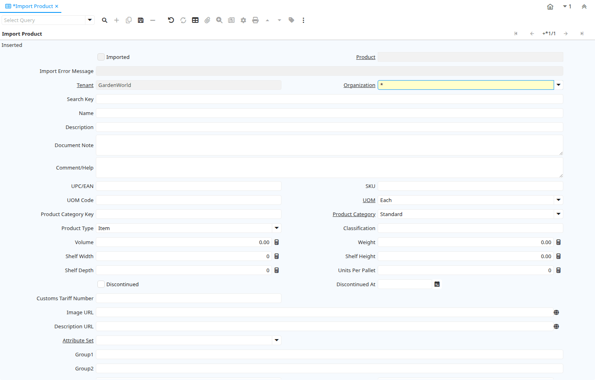

# Import Product

Window ID 247

*11/01/2003 → 24/07/2005*

**Description:** Import Products

**Comment/Help:** The Import Products Window is an interim table which is used when importing external data into the system.  Selecting the 'Process' button will either add or modify the appropriate records.

## Tab: Import Product

*Tab Level 0 · Created 11/01/2003 · Updated 02/01/2000*

**Description:** Import Products

**Comment/Help:** Before importing, iDempiere checks the Unit of Measure (default if not set), the Product Category (default if not set), the Business Partner, the Currency (defaults to accounting currency if not set), the Product Type (only Items and Services), the uniqueness of UPC, Key and uniqueness and existence of the Vendor Product No.&lt;br&gt;
iDempiere tries to map to existing products, if the UPC, the Key and the Vendor Product No matches (in this sequence). If the imported record could be matched, product field values will only be overwritten, if the corresponding  Import field is explicitly defined.  Example: the Product Category will only be overwritten if explicitly set in the Import.

| **Name** | **Description** | **Comment/Help** | **Technical Data** |
|---|---|---|---|
| Import Product | Import Item or Service |  | I_Product.I_Product_ID<small> numeric(10)   ID</small> |
| Imported | Has this import been processed | The Imported check box indicates if this import has been processed. | I_Product.I_IsImported<small> character(1)   Yes-No</small> |
| Product | Product, Service, Item | Identifies an item which is either purchased or sold in this organization. | I_Product.M_Product_ID<small> numeric(10)   Search</small> |
| Import Error Message | Messages generated from import process | The Import Error Message displays any error messages generated during the import process. | I_Product.I_ErrorMsg<small> character varying(2000)   String</small> |
| Tenant | Tenant for this installation. | A Tenant is a company or a legal entity. You cannot share data between Tenants. | I_Product.AD_Client_ID<small> numeric(10)   Table Direct</small> |
| Organization | Organizational entity within tenant | An organization is a unit of your tenant or legal entity - examples are store, department. You can share data between organizations. | I_Product.AD_Org_ID<small> numeric(10)   Table Direct</small> |
| Search Key | Search key for the record in the format required - must be unique | A search key allows you a fast method of finding a particular record. If you leave the search key empty, the system automatically creates a numeric number.  The document sequence used for this fallback number is defined in the "Maintain Sequence" window with the name "DocumentNo_&lt;TableName&gt;", where TableName is the actual name of the table (e.g. C_Order). | I_Product.Value<small> character varying(40)   String</small> |
| Name | Alphanumeric identifier of the entity | The name of an entity (record) is used as an default search option in addition to the search key. The name is up to 60 characters in length. | I_Product.Name<small> character varying(255)   String</small> |
| Description | Optional short description of the record | A description is limited to 255 characters. | I_Product.Description<small> character varying(255)   String</small> |
| Document Note | Additional information for a Document | The Document Note is used for recording any additional information regarding this product. | I_Product.DocumentNote<small> character varying(2000)   Text</small> |
| Comment/Help | Comment or Hint | The Help field contains a hint, comment or help about the use of this item. | I_Product.Help<small> character varying(2000)   Text</small> |
| UPC/EAN | Bar Code (Universal Product Code or its superset European Article Number) | Use this field to enter the bar code for the product in any of the bar code symbologies (Codabar, Code 25, Code 39, Code 93, Code 128, UPC (A), UPC (E), EAN-13, EAN-8, ITF, ITF-14, ISBN, ISSN, JAN-13, JAN-8, POSTNET and FIM, MSI/Plessey, and Pharmacode)  | I_Product.UPC<small> character varying(30)   String</small> |
| SKU | Stock Keeping Unit | The SKU indicates a user defined stock keeping unit.  It may be used for an additional bar code symbols or your own schema. | I_Product.SKU<small> character varying(30)   String</small> |
| UOM Code | UOM EDI X12 Code | The Unit of Measure Code indicates the EDI X12 Code Data Element 355 (Unit or Basis for Measurement) | I_Product.X12DE355<small> character varying(4)   String</small> |
| UOM | Unit of Measure | The UOM defines a unique non monetary Unit of Measure | I_Product.C_UOM_ID<small> numeric(10)   Table Direct</small> |
| Product Category Key |  |  | I_Product.ProductCategory_Value<small> character varying(40)   String</small> |
| Product Category | Category of a Product | Identifies the category which this product belongs to.  Product categories are used for pricing and selection. | I_Product.M_Product_Category_ID<small> numeric(10)   Table Direct</small> |
| Product Type | Type of product | The type of product also determines accounting consequences. | I_Product.ProductType<small> character(1)   List</small> |
| Classification | Classification for grouping | The Classification can be used to optionally group products. | I_Product.Classification<small> character(1)   String</small> |
| Volume | Volume of a product | The Volume indicates the volume of the product in the Volume UOM of the Tenant | I_Product.Volume<small> numeric   Amount</small> |
| Weight | Weight of a product | The Weight indicates the weight  of the product in the Weight UOM of the Tenant | I_Product.Weight<small> numeric   Amount</small> |
| Shelf Width | Shelf width required | The Shelf Width indicates the width dimension required on a shelf for a product | I_Product.ShelfWidth<small> numeric(10)   Integer</small> |
| Shelf Height | Shelf height required | The Shelf Height indicates the height dimension required on a shelf for a product | I_Product.ShelfHeight<small> numeric   Amount</small> |
| Shelf Depth | Shelf depth required | The Shelf Depth indicates the depth dimension required on a shelf for a product  | I_Product.ShelfDepth<small> numeric(10)   Integer</small> |
| Units Per Pallet | Units Per Pallet | The Units per Pallet indicates the number of units of this product which fit on a pallet. | I_Product.UnitsPerPallet<small> numeric(10)   Integer</small> |
| Discontinued | This product is no longer available | The Discontinued check box indicates a product that has been discontinued. | I_Product.Discontinued<small> character(1)   Yes-No</small> |
| Discontinued At | Discontinued At indicates Date when product was discontinued |  | I_Product.DiscontinuedAt<small> timestamp without time zone   Date</small> |
| Customs Tariff Number | Customs Tariff Number, usually the HS-Code |  | I_Product.CustomsTariffNumber<small> character varying(20)   String</small> |
| Image URL | URL of  image | URL of image; The image is not stored in the database, but retrieved at runtime. The image can be a gif, jpeg or png. | I_Product.ImageURL<small> character varying(120)   URL</small> |
| Description URL | URL for the description |  | I_Product.DescriptionURL<small> character varying(120)   URL</small> |
| Attribute Set | Product Attribute Set | Define Product Attribute Sets to add additional attributes and values to the product. You need to define a Attribute Set if you want to enable Serial and Lot Number tracking. | I_Product.M_AttributeSet_ID<small> numeric(10)   Table Direct</small> |
| Group1 |  |  | I_Product.Group1<small> character varying(255)   String</small> |
| Group2 |  |  | I_Product.Group2<small> character varying(255)   String</small> |
| Business Partner Key | The Key of the Business Partner |  | I_Product.BPartner_Value<small> character varying(40)   String</small> |
| Business Partner | Identifies a Business Partner | A Business Partner is anyone with whom you transact.  This can include Vendor, Customer, Employee or Salesperson | I_Product.C_BPartner_ID<small> numeric(10)   Search</small> |
| ISO Currency Code | Three letter ISO 4217 Code of the Currency | For details - http://www.unece.org/trade/rec/rec09en.htm | I_Product.ISO_Code<small> character(3)   String</small> |
| Currency | The Currency for this record | Indicates the Currency to be used when processing or reporting on this record | I_Product.C_Currency_ID<small> numeric(10)   Table Direct</small> |
| List Price | List Price | The List Price is the official List Price in the document currency. | I_Product.PriceList<small> numeric   Costs+Prices</small> |
| PO Price | Price based on a purchase order | The PO Price indicates the price for a product per the purchase order. | I_Product.PricePO<small> numeric   Costs+Prices</small> |
| Standard Price | Standard Price | The Standard Price indicates the standard or normal price for a product on this price list | I_Product.PriceStd<small> numeric   Costs+Prices</small> |
| Limit Price | Lowest price for a product | The Price Limit indicates the lowest price for a product stated in the Price List Currency. | I_Product.PriceLimit<small> numeric   Costs+Prices</small> |
| Royalty Amount | (Included) Amount for copyright, etc. |  | I_Product.RoyaltyAmt<small> numeric   Amount</small> |
| Price effective | Effective Date of Price | The Price Effective indicates the date this price is for. This allows you to enter future prices for products which will become effective when appropriate. | I_Product.PriceEffective<small> timestamp without time zone   Date</small> |
| Partner Product Key | Product Key of the Business Partner | The Business Partner Product Key identifies the number used by the Business Partner for this product. It can be printed on orders and invoices when you include the Product Key in the print format. | I_Product.VendorProductNo<small> character varying(40)   String</small> |
| Partner Category | Product Category of the Business Partner | The Business Partner Category identifies the category used by the Business Partner for this product. | I_Product.VendorCategory<small> character varying(30)   String</small> |
| Manufacturer | Manufacturer of the Product | The manufacturer of the Product (used if different from the Business Partner / Vendor) | I_Product.Manufacturer<small> character varying(30)   String</small> |
| Minimum Order Qty | Minimum order quantity in UOM | The Minimum Order Quantity indicates the smallest quantity of this product which can be ordered. | I_Product.Order_Min<small> numeric   Integer</small> |
| Order Pack Qty | Package order size in UOM (e.g. order set of 5 units) | The Order Pack Quantity indicates the number of units in each pack of this product. | I_Product.Order_Pack<small> numeric   Integer</small> |
| Cost per Order | Fixed Cost Per Order | The Cost Per Order indicates the fixed charge levied when an order for this product is placed. | I_Product.CostPerOrder<small> numeric   Costs+Prices</small> |
| Promised Delivery Time | Promised days between order and delivery | The Promised Delivery Time indicates the number of days between the order date and the date that delivery was promised. | I_Product.DeliveryTime_Promised<small> numeric(10)   Integer</small> |
| Import Products  | Imports products from a file into the application | Import Products will bring a file of products, in a predefined format into the application.&lt;p&gt; The Parameters are default values for null import record values, they do not overwrite any data.&lt;p&gt; If you select an existing price list and you have List, Standard, and Limit Price defined, they are directly created/updated. | I_Product.Processing<small> character(1)   Button</small> |
| Processed | The document has been processed | The Processed checkbox indicates that a document has been processed. | I_Product.Processed<small> character(1)   Yes-No</small> |

