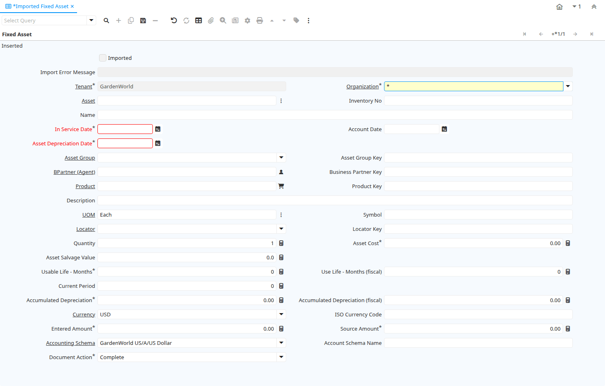

# Imported Fixed Asset

Window ID 53120

*20/06/2010 → 20/06/2010*

## Tab: Fixed Asset

*Tab Level 0 · Created 20/06/2010 · Updated 12/03/2013*

| **Name** | **Description** | **Comment/Help** | **Technical Data** |
|---|---|---|---|
| Imported | Has this import been processed | The Imported check box indicates if this import has been processed. | I_FixedAsset.I_IsImported<small> character(1)   Yes-No</small> |
| Import Error Message | Messages generated from import process | The Import Error Message displays any error messages generated during the import process. | I_FixedAsset.I_ErrorMsg<small> character varying(2000)   String</small> |
| Tenant | Tenant for this installation. | A Tenant is a company or a legal entity. You cannot share data between Tenants. | I_FixedAsset.AD_Client_ID<small> numeric(10)   Table Direct</small> |
| Organization | Organizational entity within tenant | An organization is a unit of your tenant or legal entity - examples are store, department. You can share data between organizations. | I_FixedAsset.AD_Org_ID<small> numeric(10)   Table Direct</small> |
| Asset | Asset used internally or by customers | An asset is either created by purchasing or by delivering a product.  An asset can be used internally or be a customer asset. | I_FixedAsset.A_Asset_ID<small> numeric(10)   Search</small> |
| Inventory No |  |  | I_FixedAsset.InventoryNo<small> character varying(30)   String</small> |
| Name | Alphanumeric identifier of the entity | The name of an entity (record) is used as an default search option in addition to the search key. The name is up to 60 characters in length. | I_FixedAsset.Name<small> character varying(120)   String</small> |
| In Service Date | Date when Asset was put into service | The date when the asset was put into service - usually used as start date for depreciation. | I_FixedAsset.AssetServiceDate<small> timestamp without time zone   Date</small> |
| Account Date | Accounting Date | The Accounting Date indicates the date to be used on the General Ledger account entries generated from this document. It is also used for any currency conversion. | I_FixedAsset.DateAcct<small> timestamp without time zone   Date</small> |
| Asset Depreciation Date | Date of last depreciation | Date of the last deprecation, if the asset is used internally and depreciated. | I_FixedAsset.AssetDepreciationDate<small> timestamp without time zone   Date</small> |
| Asset Group | Group of Assets | The group of assets determines default accounts.  If an asset group is selected in the product category, assets are created when delivering the asset. | I_FixedAsset.A_Asset_Group_ID<small> numeric(10)   Table Direct</small> |
| Asset Group Key |  |  | I_FixedAsset.A_Asset_Group_Value<small> character varying(40)   String</small> |
| BPartner (Agent) | Business Partner (Agent or Sales Rep) |  | I_FixedAsset.C_BPartnerSR_ID<small> numeric(10)   Search</small> |
| Business Partner Key | The Key of the Business Partner |  | I_FixedAsset.BPartner_Value<small> character varying(40)   String</small> |
| Product | Product, Service, Item | Identifies an item which is either purchased or sold in this organization. | I_FixedAsset.M_Product_ID<small> numeric(10)   Search</small> |
| Product Key | Key of the Product |  | I_FixedAsset.ProductValue<small> character varying(40)   String</small> |
| Description | Optional short description of the record | A description is limited to 255 characters. | I_FixedAsset.Description<small> character varying(255)   String</small> |
| UOM | Unit of Measure | The UOM defines a unique non monetary Unit of Measure | I_FixedAsset.C_UOM_ID<small> numeric(10)   Search</small> |
| Symbol | Symbol for a Unit of Measure | The Symbol identifies the Symbol to be displayed and printed for a Unit of Measure | I_FixedAsset.UOMSymbol<small> character varying(10)   String</small> |
| Locator | Warehouse Locator | The Locator indicates where in a Warehouse a product is located. | I_FixedAsset.M_Locator_ID<small> numeric(10)   Table Direct</small> |
| Locator Key | Key of the Warehouse Locator |  | I_FixedAsset.LocatorValue<small> character varying(40)   String</small> |
| Quantity | Quantity | The Quantity indicates the number of a specific product or item for this document. | I_FixedAsset.Qty<small> numeric   Quantity</small> |
| Asset Cost |  |  | I_FixedAsset.A_Asset_Cost<small> numeric   Amount</small> |
| Asset Salvage Value |  |  | I_FixedAsset.A_Salvage_Value<small> numeric   Number</small> |
| Usable Life - Months | Months of the usable life of the asset |  | I_FixedAsset.UseLifeMonths<small> numeric(10)   Integer</small> |
| Use Life - Months (fiscal) |  |  | I_FixedAsset.UseLifeMonths_F<small> numeric(10)   Integer</small> |
| Current Period |  |  | I_FixedAsset.A_Current_Period<small> numeric(10)   Integer</small> |
| Accumulated Depreciation |  |  | I_FixedAsset.A_Accumulated_Depr<small> numeric   Amount</small> |
| Accumulated Depreciation (fiscal) |  |  | I_FixedAsset.A_Accumulated_Depr_F<small> numeric   Amount</small> |
| Currency | The Currency for this record | Indicates the Currency to be used when processing or reporting on this record | I_FixedAsset.C_Currency_ID<small> numeric(10)   Table Direct</small> |
| ISO Currency Code | Three letter ISO 4217 Code of the Currency | For details - http://www.unece.org/trade/rec/rec09en.htm | I_FixedAsset.ISO_Code<small> character varying(3)   String</small> |
| Entered Amount |  |  | I_FixedAsset.AssetAmtEntered<small> numeric   Amount</small> |
| Source Amount |  |  | I_FixedAsset.AssetSourceAmt<small> numeric   Amount</small> |
| Accounting Schema | Rules for accounting | An Accounting Schema defines the rules used in accounting such as costing method, currency and calendar | I_FixedAsset.C_AcctSchema_ID<small> numeric(10)   Table Direct</small> |
| Account Schema Name | Name of the Accounting Schema |  | I_FixedAsset.AcctSchemaName<small> character varying(120)   String</small> |
| Document Action | The targeted status of the document | You find the current status in the Document Status field. The options are listed in a popup | I_FixedAsset.DocAction<small> character varying(2)   List</small> |
| Import Fixed Asset |  |  | I_FixedAsset.Processing<small> character(1)   Button</small> |

