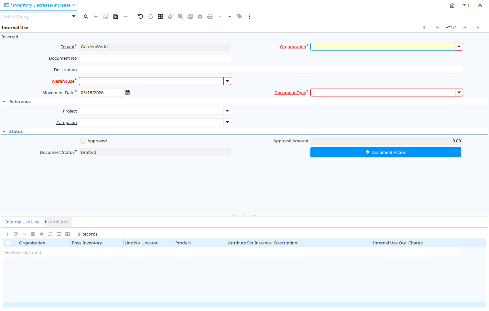

# Inventory Decrease/Increase

Window ID 341

*26/11/2004 → 08/12/2023*

**Description:** Enter Inventory Decrease/Increase (for example Internal Use of Inventory)

**Comment/Help:** The Internal Use of Inventory Window allows enter the quantity of used products.

## Tab: Internal Use

*Tab Level 0 · Created 26/11/2004 · Updated 03/04/2013*

**Description:** Define Internal Use Inventory

| **Name** | **Description** | **Comment/Help** | **Technical Data** |
|---|---|---|---|
| Tenant | Tenant for this installation. | A Tenant is a company or a legal entity. You cannot share data between Tenants. | M_Inventory.AD_Client_ID<small> numeric(10)   Table Direct</small> |
| Organization | Organizational entity within tenant | An organization is a unit of your tenant or legal entity - examples are store, department. You can share data between organizations. | M_Inventory.AD_Org_ID<small> numeric(10)   Table Direct</small> |
| Document No | Document sequence number of the document | The document number is usually automatically generated by the system and determined by the document type of the document. If the document is not saved, the preliminary number is displayed in "&lt;&gt;".  If the document type of your document has no automatic document sequence defined, the field is empty if you create a new document. This is for documents which usually have an external number (like vendor invoice).  If you leave the field empty, the system will generate a document number for you. The document sequence used for this fallback number is defined in the "Maintain Sequence" window with the name "DocumentNo_&lt;TableName&gt;", where TableName is the actual name of the table (e.g. C_Order). | M_Inventory.DocumentNo<small> character varying(30)   String</small> |
| Description | Optional short description of the record | A description is limited to 255 characters. | M_Inventory.Description<small> character varying(255)   String</small> |
| Warehouse | Storage Warehouse and Service Point | The Warehouse identifies a unique Warehouse where products are stored or Services are provided. | M_Inventory.M_Warehouse_ID<small> numeric(10)   Table Direct</small> |
| Movement Date | Date a product was moved in or out of inventory | The Movement Date indicates the date that a product moved in or out of inventory.  This is the result of a shipment, receipt or inventory movement. | M_Inventory.MovementDate<small> timestamp without time zone   Date</small> |
| Document Type | Document type or rules | The Document Type determines document sequence and processing rules | M_Inventory.C_DocType_ID<small> numeric(10)   Table Direct</small> |
| Project | Financial Project | A Project allows you to track and control internal or external activities. | M_Inventory.C_Project_ID<small> numeric(10)   Table Direct</small> |
| Activity | Business Activity | Activities indicate tasks that are performed and used to utilize Activity based Costing | M_Inventory.C_Activity_ID<small> numeric(10)   Table Direct</small> |
| Campaign | Marketing Campaign | The Campaign defines a unique marketing program.  Projects can be associated with a pre defined Marketing Campaign.  You can then report based on a specific Campaign. | M_Inventory.C_Campaign_ID<small> numeric(10)   Table Direct</small> |
| Trx Organization | Performing or initiating organization | The organization which performs or initiates this transaction (for another organization).  The owning Organization may not be the transaction organization in a service bureau environment, with centralized services, and inter-organization transactions. | M_Inventory.AD_OrgTrx_ID<small> numeric(10)   Table</small> |
| User Element List 1 | User defined list element #1 | The user defined element displays the optional elements that have been defined for this account combination. | M_Inventory.User1_ID<small> numeric(10)   Search</small> |
| User Element List 2 | User defined list element #2 | The user defined element displays the optional elements that have been defined for this account combination. | M_Inventory.User2_ID<small> numeric(10)   Search</small> |
| Approved | Indicates if this document requires approval | The Approved checkbox indicates if this document requires approval before it can be processed. | M_Inventory.IsApproved<small> character(1)   Yes-No</small> |
| Approval Amount | Document Approval Amount | Approval Amount for Workflow | M_Inventory.ApprovalAmt<small> numeric   Amount</small> |
| Document Status | The current status of the document | The Document Status indicates the status of a document at this time.  If you want to change the document status, use the Document Action field | M_Inventory.DocStatus<small> character(2)   List</small> |
| Process Inventory Count  | Process Inventory count and update Inventory |  | M_Inventory.DocAction<small> character(2)   Button</small> |
| Posted | Posting status | The Posted field indicates the status of the Generation of General Ledger Accounting Lines  | M_Inventory.Posted<small> character(1)   Button</small> |

## Tab: › Internal Use Line

*Tab Level 1 · Created 26/11/2004 · Updated 16/03/2021*

**Description:** Internal Use Inventory Line

**Comment/Help:** The Inventory Count Line defines the counts of the individual products in inventory.

| **Name** | **Description** | **Comment/Help** | **Technical Data** |
|---|---|---|---|
| Tenant | Tenant for this installation. | A Tenant is a company or a legal entity. You cannot share data between Tenants. | M_InventoryLine.AD_Client_ID<small> numeric(10)   Table Direct</small> |
| Organization | Organizational entity within tenant | An organization is a unit of your tenant or legal entity - examples are store, department. You can share data between organizations. | M_InventoryLine.AD_Org_ID<small> numeric(10)   Table Direct</small> |
| Phys.Inventory | Parameters for a Physical Inventory | The Physical Inventory indicates a unique parameters for a physical inventory. | M_InventoryLine.M_Inventory_ID<small> numeric(10)   Search</small> |
| Line No | Unique line for this document | Indicates the unique line for a document.  It will also control the display order of the lines within a document. | M_InventoryLine.Line<small> numeric(10)   Integer</small> |
| Locator | Warehouse Locator | The Locator indicates where in a Warehouse a product is located. | M_InventoryLine.M_Locator_ID<small> numeric(10)   Locator (WH)</small> |
| Product | Product, Service, Item | Identifies an item which is either purchased or sold in this organization. | M_InventoryLine.M_Product_ID<small> numeric(10)   Search</small> |
| Attribute Set Instance | Product Attribute Set Instance | The values of the actual Product Attribute Instances.  The product level attributes are defined on Product level. | M_InventoryLine.M_AttributeSetInstance_ID<small> numeric(10)   Product Attribute</small> |
| Description | Optional short description of the record | A description is limited to 255 characters. | M_InventoryLine.Description<small> character varying(255)   String</small> |
| Internal Use Qty | Internal Use Quantity removed from Inventory | Quantity of product inventory used internally (positive if taken out - negative if returned) | M_InventoryLine.QtyInternalUse<small> numeric   Quantity</small> |
| Charge | Additional document charges | The Charge indicates a type of Charge (Handling, Shipping, Restocking) | M_InventoryLine.C_Charge_ID<small> numeric(10)   Table Direct</small> |

## Tab: › › Attributes

*Tab Level 2 · Created 13/04/2008 · Updated 16/03/2021*

| **Name** | **Description** | **Comment/Help** | **Technical Data** |
|---|---|---|---|
| Tenant | Tenant for this installation. | A Tenant is a company or a legal entity. You cannot share data between Tenants. | M_InventoryLineMA.AD_Client_ID<small> numeric(10)   Table Direct</small> |
| Organization | Organizational entity within tenant | An organization is a unit of your tenant or legal entity - examples are store, department. You can share data between organizations. | M_InventoryLineMA.AD_Org_ID<small> numeric(10)   Table Direct</small> |
| Phys.Inventory Line | Unique line in an Inventory document | The Physical Inventory Line indicates the inventory document line (if applicable) for this transaction | M_InventoryLineMA.M_InventoryLine_ID<small> numeric(10)   Search</small> |
| Attribute Set Instance | Product Attribute Set Instance | The values of the actual Product Attribute Instances.  The product level attributes are defined on Product level. | M_InventoryLineMA.M_AttributeSetInstance_ID<small> numeric(10)   Product Attribute</small> |
| Movement Quantity | Quantity of a product moved. | The Movement Quantity indicates the quantity of a product that has been moved. | M_InventoryLineMA.MovementQty<small> numeric   Quantity</small> |
| Date  Material Policy | Time used for LIFO and FIFO Material Policy | This field is used to record time used for LIFO and FIFO material policy | M_InventoryLineMA.DateMaterialPolicy<small> timestamp without time zone   Date</small> |
| Auto Generated |  | Record is Auto Generated by System. | M_InventoryLineMA.IsAutoGenerated<small> character(1)   Yes-No</small> |

