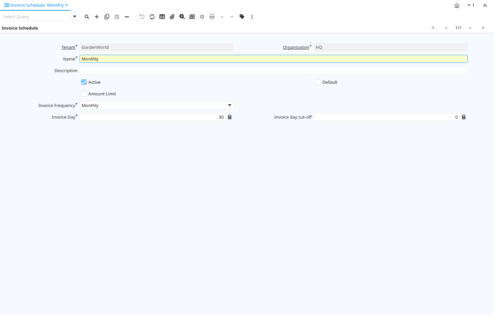

# Invoice Schedule

Window ID 147

*09/08/1999 → 02/01/2000*

**Description:** Maintain Invoicing Schedule

**Comment/Help:** The Invoice Schedule Window defines the frequency and cut off dates for generating summary invoices.  If a customer requires a single invoice for multiple shipments you would define the appropriate invoice schedule and associate it with the Customer.

## Tab: Invoice Schedule

*Tab Level 0 · Created 09/08/1999 · Updated 02/01/2000*

**Description:** Define Invoice Schedule

**Comment/Help:** The Invoice Schedule Tab defines the frequency for which batch invoices will be generated for a Business Partner.

| **Name** | **Description** | **Comment/Help** | **Technical Data** |
|---|---|---|---|
| Tenant | Tenant for this installation. | A Tenant is a company or a legal entity. You cannot share data between Tenants. | C_InvoiceSchedule.AD_Client_ID<small> numeric(10)   Table Direct</small> |
| Organization | Organizational entity within tenant | An organization is a unit of your tenant or legal entity - examples are store, department. You can share data between organizations. | C_InvoiceSchedule.AD_Org_ID<small> numeric(10)   Table Direct</small> |
| Name | Alphanumeric identifier of the entity | The name of an entity (record) is used as an default search option in addition to the search key. The name is up to 60 characters in length. | C_InvoiceSchedule.Name<small> character varying(60)   String</small> |
| Description | Optional short description of the record | A description is limited to 255 characters. | C_InvoiceSchedule.Description<small> character varying(255)   String</small> |
| Active | The record is active in the system | There are two methods of making records unavailable in the system: One is to delete the record, the other is to de-activate the record. A de-activated record is not available for selection, but available for reports. There are two reasons for de-activating and not deleting records: (1) The system requires the record for audit purposes. (2) The record is referenced by other records. E.g., you cannot delete a Business Partner, if there are invoices for this partner record existing. You de-activate the Business Partner and prevent that this record is used for future entries. | C_InvoiceSchedule.IsActive<small> character(1)   Yes-No</small> |
| Default | Default value | The Default Checkbox indicates if this record will be used as a default value. | C_InvoiceSchedule.IsDefault<small> character(1)   Yes-No</small> |
| Amount Limit | Send invoices only if the amount exceeds the limit | The Amount Limit checkbox indicates if invoices will be sent out if they are below the entered limit.   	 | C_InvoiceSchedule.IsAmount<small> character(1)   Yes-No</small> |
| Amount | Amount | Amount | C_InvoiceSchedule.Amt<small> numeric   Amount</small> |
| Invoice Frequency | How often invoices will be generated | The Invoice Frequency indicates the frequency of invoice generation for a Business Partner. | C_InvoiceSchedule.InvoiceFrequency<small> character(1)   List</small> |
| Invoice on even weeks | Send invoices on even weeks | The Invoice on Even Weeks checkbox indicates if biweekly invoices should be sent on even week numbers. | C_InvoiceSchedule.EvenInvoiceWeek<small> character(1)   Yes-No</small> |
| Invoice Week Day | Day to generate invoices | The Invoice Week Day indicates the day of the week to generate invoices. | C_InvoiceSchedule.InvoiceWeekDay<small> character(1)   List</small> |
| Invoice weekday cutoff | Last day in the week for shipments to be included | The Invoice Week Day Cutoff indicates the last day of the week a shipment must be made to be included in the invoice schedule. | C_InvoiceSchedule.InvoiceWeekDayCutoff<small> character(1)   List</small> |
| Invoice Day | Day of Invoice Generation | The Invoice Day indicates the day of invoice generation.  If twice monthly, the second time is 15 days after this day. | C_InvoiceSchedule.InvoiceDay<small> numeric(10)   Integer</small> |
| Invoice day cut-off | Last day for including shipments | The Invoice Day Cut Off indicates the last day for shipments to be included in the current invoice schedule.  For example, if the invoice schedule is defined for the first day of the month, the cut off day may be the 25th of the month.  An shipment on the 24th of May would be included in the invoices sent on June 1st but a shipment on the 26th would be included in the invoices sent on July 1st. | C_InvoiceSchedule.InvoiceDayCutoff<small> numeric(10)   Integer</small> |

