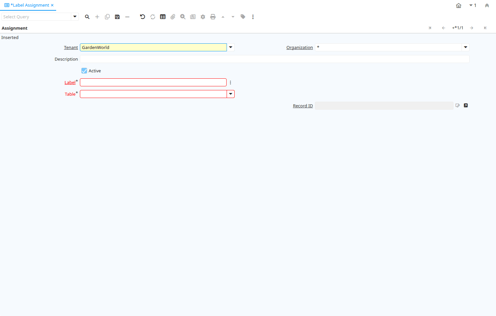

# Label Assignment

Window ID 200130

*24/06/2022 → 24/06/2022*

## Tab: Assignment

*Tab Level 0 · Created 24/06/2022 · Updated 24/06/2022*

| **Name** | **Description** | **Comment/Help** | **Technical Data** |
|---|---|---|---|
| Tenant | Tenant for this installation. | A Tenant is a company or a legal entity. You cannot share data between Tenants. | AD_LabelAssignment.AD_Client_ID<small> numeric(10)   Table Direct</small> |
| Organization | Organizational entity within tenant | An organization is a unit of your tenant or legal entity - examples are store, department. You can share data between organizations. | AD_LabelAssignment.AD_Org_ID<small> numeric(10)   Table Direct</small> |
| Description | Optional short description of the record | A description is limited to 255 characters. | AD_LabelAssignment.Description<small> character varying(255)   String</small> |
| Active | The record is active in the system | There are two methods of making records unavailable in the system: One is to delete the record, the other is to de-activate the record. A de-activated record is not available for selection, but available for reports. There are two reasons for de-activating and not deleting records: (1) The system requires the record for audit purposes. (2) The record is referenced by other records. E.g., you cannot delete a Business Partner, if there are invoices for this partner record existing. You de-activate the Business Partner and prevent that this record is used for future entries. | AD_LabelAssignment.IsActive<small> character(1)   Yes-No</small> |
| Label | Record Label |  | AD_LabelAssignment.AD_Label_ID<small> numeric(10)   Search</small> |
| Table | Database Table information | The Database Table provides the information of the table definition | AD_LabelAssignment.AD_Table_ID<small> numeric(10)   Table Direct</small> |
| Record UUID |  |  | AD_LabelAssignment.Record_UU<small> uuid   Record UUID</small> |
| Record ID | Direct internal record ID | The Record ID is the internal unique identifier of a record. Please note that zooming to the record may not be successful for Orders, Invoices and Shipment/Receipts as sometimes the Sales Order type is not known. | AD_LabelAssignment.Record_ID<small> numeric(10)   Record ID</small> |

