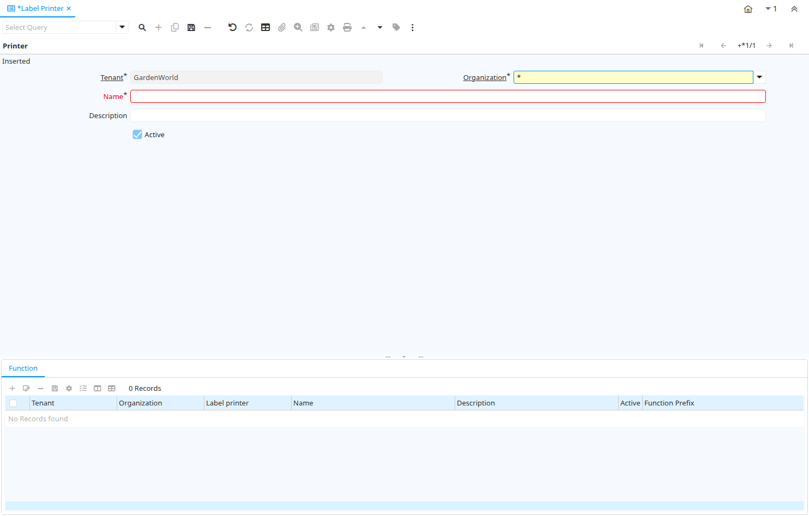

# Label Printer

Window ID 292

*07/10/2003 → 17/02/2022*

**Description:** Maintain Label Printer Definition

## Tab: Printer

*Tab Level 0 · Created 07/10/2003 · Updated 02/01/2000*

**Description:** Define Label Printer

| **Name** | **Description** | **Comment/Help** | **Technical Data** |
|---|---|---|---|
| Tenant | Tenant for this installation. | A Tenant is a company or a legal entity. You cannot share data between Tenants. | AD_LabelPrinter.AD_Client_ID<small> numeric(10)   Table Direct</small> |
| Organization | Organizational entity within tenant | An organization is a unit of your tenant or legal entity - examples are store, department. You can share data between organizations. | AD_LabelPrinter.AD_Org_ID<small> numeric(10)   Table Direct</small> |
| Name | Alphanumeric identifier of the entity | The name of an entity (record) is used as an default search option in addition to the search key. The name is up to 60 characters in length. | AD_LabelPrinter.Name<small> character varying(60)   String</small> |
| Description | Optional short description of the record | A description is limited to 255 characters. | AD_LabelPrinter.Description<small> character varying(255)   String</small> |
| Active | The record is active in the system | There are two methods of making records unavailable in the system: One is to delete the record, the other is to de-activate the record. A de-activated record is not available for selection, but available for reports. There are two reasons for de-activating and not deleting records: (1) The system requires the record for audit purposes. (2) The record is referenced by other records. E.g., you cannot delete a Business Partner, if there are invoices for this partner record existing. You de-activate the Business Partner and prevent that this record is used for future entries. | AD_LabelPrinter.IsActive<small> character(1)   Yes-No</small> |

## Tab: › Function

*Tab Level 1 · Created 07/10/2003 · Updated 02/01/2000*

**Description:** Label Printer Function

| **Name** | **Description** | **Comment/Help** | **Technical Data** |
|---|---|---|---|
| Tenant | Tenant for this installation. | A Tenant is a company or a legal entity. You cannot share data between Tenants. | AD_LabelPrinterFunction.AD_Client_ID<small> numeric(10)   Table Direct</small> |
| Organization | Organizational entity within tenant | An organization is a unit of your tenant or legal entity - examples are store, department. You can share data between organizations. | AD_LabelPrinterFunction.AD_Org_ID<small> numeric(10)   Table Direct</small> |
| Label printer | Label Printer Definition |  | AD_LabelPrinterFunction.AD_LabelPrinter_ID<small> numeric(10)   Table Direct</small> |
| Name | Alphanumeric identifier of the entity | The name of an entity (record) is used as an default search option in addition to the search key. The name is up to 60 characters in length. | AD_LabelPrinterFunction.Name<small> character varying(60)   String</small> |
| Description | Optional short description of the record | A description is limited to 255 characters. | AD_LabelPrinterFunction.Description<small> character varying(255)   String</small> |
| Active | The record is active in the system | There are two methods of making records unavailable in the system: One is to delete the record, the other is to de-activate the record. A de-activated record is not available for selection, but available for reports. There are two reasons for de-activating and not deleting records: (1) The system requires the record for audit purposes. (2) The record is referenced by other records. E.g., you cannot delete a Business Partner, if there are invoices for this partner record existing. You de-activate the Business Partner and prevent that this record is used for future entries. | AD_LabelPrinterFunction.IsActive<small> character(1)   Yes-No</small> |
| Function Prefix | Data sent before the function |  | AD_LabelPrinterFunction.FunctionPrefix<small> character varying(40)   String</small> |
| XY Position | The Function is XY position | This function positions for the next print operation | AD_LabelPrinterFunction.IsXYPosition<small> character(1)   Yes-No</small> |
| XY Separator | The separator between the X and Y function. |  | AD_LabelPrinterFunction.XYSeparator<small> character varying(20)   String</small> |
| Function Suffix | Data sent after the function |  | AD_LabelPrinterFunction.FunctionSuffix<small> character varying(40)   String</small> |

