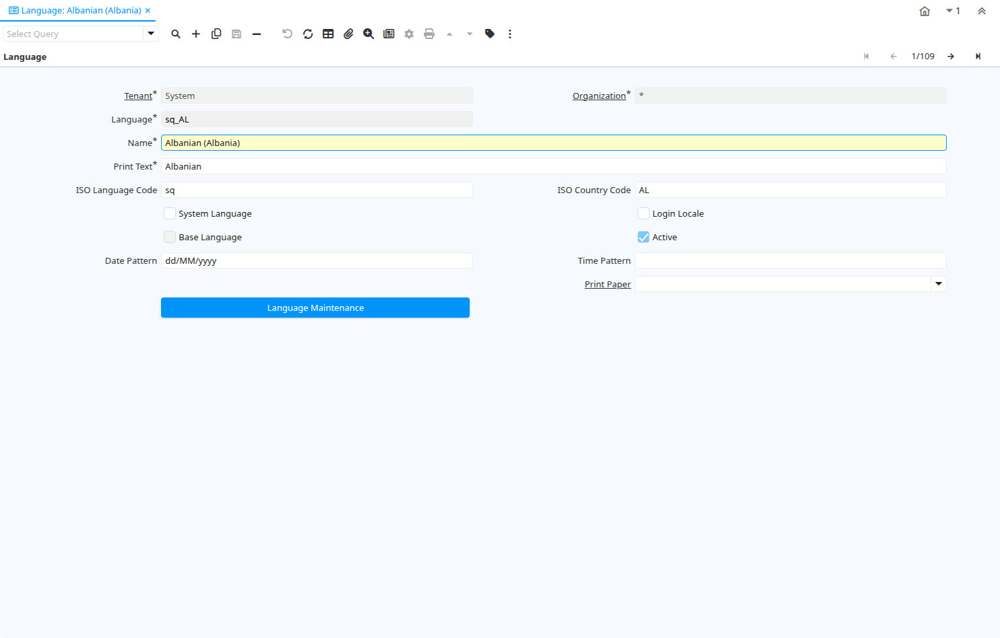

# Language

Window ID 106

*21/05/1999 → 02/01/2000*

**Description:** Maintain Languages

**Comment/Help:** The Language Window allows you to define multiple parallel language for users. This allows users to access the same data but have the windows, tabs and fields appear in different languages.
If a language is a System Language, you can change the User Interface to this language (after translation).  Otherwise the language is only used for printing documents.

For the language code, we suggest using the Java convention of country and language (e.g. fr_CN - Canadian French).

Verify the translation creates missing translation records. Start this process after creating a new language.

## Tab: Language

*Tab Level 0 · Created 21/05/1999 · Updated 02/01/2000*

**Description:** System and User Languages

**Comment/Help:** If you want to add an additional User Interface language, select "System Language". Otherwise, the system allows you to just translate elements for printing documents.

| **Name** | **Description** | **Comment/Help** | **Technical Data** |
|---|---|---|---|
| Tenant | Tenant for this installation. | A Tenant is a company or a legal entity. You cannot share data between Tenants. | AD_Language.AD_Client_ID<small> numeric(10)   Table Direct</small> |
| Organization | Organizational entity within tenant | An organization is a unit of your tenant or legal entity - examples are store, department. You can share data between organizations. | AD_Language.AD_Org_ID<small> numeric(10)   Table Direct</small> |
| Language | Language for this entity | The Language identifies the language to use for display and formatting | AD_Language.AD_Language<small> character varying(6)   String</small> |
| Name | Alphanumeric identifier of the entity | The name of an entity (record) is used as an default search option in addition to the search key. The name is up to 60 characters in length. | AD_Language.Name<small> character varying(60)   String</small> |
| Print Text | The label text to be printed on a document or correspondence. | The Label to be printed indicates the name that will be printed on a document or correspondence. The max length is 2000 characters. | AD_Language.PrintName<small> character varying(60)   String</small> |
| ISO Language Code | Lower-case two-letter ISO-3166 code - http://www.ics.uci.edu/pub/ietf/http/related/iso639.txt  | The ISO Language Code indicates the standard ISO code for a language in lower case.  Information can be found at http://www.ics.uci.edu/pub/ietf/http/related/iso639.txt  | AD_Language.LanguageISO<small> character(2)   String</small> |
| ISO Country Code | Upper-case two-letter alphanumeric ISO Country code according to ISO 3166-1 | The official list can be found at https://www.iso.org/obp/ui/#search | AD_Language.CountryCode<small> character(2)   String</small> |
| System Language | The screens, etc. are maintained in this Language | Select, if you want to have translated screens available in this language.  Please notify your system administrator to run the language maintenance scripts to enable the use of this language.  If the language is not supplied, you can translate the terms yourself. | AD_Language.IsSystemLanguage<small> character(1)   Yes-No</small> |
| Login Locale |  |  | AD_Language.IsLoginLocale<small> character(1)   Yes-No</small> |
| Base Language | The system information is maintained in this language |  | AD_Language.IsBaseLanguage<small> character(1)   Yes-No</small> |
| Active | The record is active in the system | There are two methods of making records unavailable in the system: One is to delete the record, the other is to de-activate the record. A de-activated record is not available for selection, but available for reports. There are two reasons for de-activating and not deleting records: (1) The system requires the record for audit purposes. (2) The record is referenced by other records. E.g., you cannot delete a Business Partner, if there are invoices for this partner record existing. You de-activate the Business Partner and prevent that this record is used for future entries. | AD_Language.IsActive<small> character(1)   Yes-No</small> |
| Date Pattern | Java Date Pattern | Option Date pattern in Java notation. Examples: dd.MM.yyyy - dd/MM/yyyy If the pattern for your language is not correct, please create a iDempiere support request with the correct information | AD_Language.DatePattern<small> character varying(20)   String</small> |
| Time Pattern | Java Time Pattern | Option Time pattern in Java notation. Examples: "hh:mm:ss aaa z" - "HH:mm:ss" If the pattern for your language is not correct, please create a iDempiere support request with the correct information | AD_Language.TimePattern<small> character varying(20)   String</small> |
| Print Paper | Printer paper definition | Printer Paper Size, Orientation and Margins | AD_Language.AD_PrintPaper_ID<small> numeric(10)   Table Direct</small> |
| Language Maintenance | Maintain language translation in system | You can Add Missing Translation entries (required after activating an additional System Language) - Delete Translation Records - or Re-Create the translation Records (first delete and add missing entries). Note that Adding the Missing Translation records creates them by copying the System Language (English).  You would apply the Language Pack after that process.  Run Synchronize Terminology after importing the translation. | AD_Language.Processing<small> character(1)   Button</small> |

