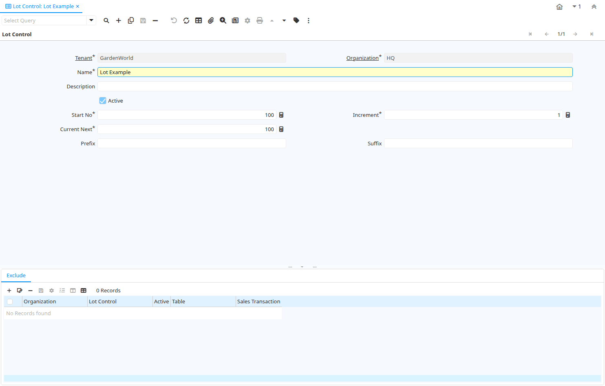

# Lot Control

Window ID 258

*05/05/2003 → 02/01/2000*

**Description:** Product Lot Control

**Comment/Help:** Definition to create Lot numbers for Products

## Tab: Lot Control

*Tab Level 0 · Created 05/05/2003 · Updated 02/01/2000*

**Description:** Product Lot Control

**Comment/Help:** Definition to create Lot numbers for Products

| **Name** | **Description** | **Comment/Help** | **Technical Data** |
|---|---|---|---|
| Tenant | Tenant for this installation. | A Tenant is a company or a legal entity. You cannot share data between Tenants. | M_LotCtl.AD_Client_ID<small> numeric(10)   Table Direct</small> |
| Organization | Organizational entity within tenant | An organization is a unit of your tenant or legal entity - examples are store, department. You can share data between organizations. | M_LotCtl.AD_Org_ID<small> numeric(10)   Table Direct</small> |
| Name | Alphanumeric identifier of the entity | The name of an entity (record) is used as an default search option in addition to the search key. The name is up to 60 characters in length. | M_LotCtl.Name<small> character varying(60)   String</small> |
| Description | Optional short description of the record | A description is limited to 255 characters. | M_LotCtl.Description<small> character varying(255)   String</small> |
| Active | The record is active in the system | There are two methods of making records unavailable in the system: One is to delete the record, the other is to de-activate the record. A de-activated record is not available for selection, but available for reports. There are two reasons for de-activating and not deleting records: (1) The system requires the record for audit purposes. (2) The record is referenced by other records. E.g., you cannot delete a Business Partner, if there are invoices for this partner record existing. You de-activate the Business Partner and prevent that this record is used for future entries. | M_LotCtl.IsActive<small> character(1)   Yes-No</small> |
| Start No | Starting number/position | The Start Number indicates the starting position in the line or field number in the line | M_LotCtl.StartNo<small> numeric(10)   Integer</small> |
| Increment | The number to increment the last document number by | The Increment indicates the number to increment the last document number by to arrive at the next sequence number | M_LotCtl.IncrementNo<small> numeric(10)   Integer</small> |
| Current Next | The next number to be used | The Current Next indicates the next number to use for this document | M_LotCtl.CurrentNext<small> numeric(10)   Integer</small> |
| Prefix | Prefix before the sequence number | The Prefix indicates the characters to print in front of the document number. | M_LotCtl.Prefix<small> character varying(10)   String</small> |
| Suffix | Suffix after the number | The Suffix indicates the characters to append to the document number. | M_LotCtl.Suffix<small> character varying(10)   String</small> |

## Tab: › Exclude

*Tab Level 1 · Created 01/09/2005 · Updated 02/09/2005*

**Description:** Exclude the ability to create Lots in Attribute Sets

**Comment/Help:** Create a record, if you want to exclude the ability to create Lots in Product Attribute Set information.
Note that the information is cached. To have effect you may have to re-login or reset cache.

| **Name** | **Description** | **Comment/Help** | **Technical Data** |
|---|---|---|---|
| Tenant | Tenant for this installation. | A Tenant is a company or a legal entity. You cannot share data between Tenants. | M_LotCtlExclude.AD_Client_ID<small> numeric(10)   Table Direct</small> |
| Organization | Organizational entity within tenant | An organization is a unit of your tenant or legal entity - examples are store, department. You can share data between organizations. | M_LotCtlExclude.AD_Org_ID<small> numeric(10)   Table Direct</small> |
| Lot Control | Product Lot Control | Definition to create Lot numbers for Products | M_LotCtlExclude.M_LotCtl_ID<small> numeric(10)   Table Direct</small> |
| Active | The record is active in the system | There are two methods of making records unavailable in the system: One is to delete the record, the other is to de-activate the record. A de-activated record is not available for selection, but available for reports. There are two reasons for de-activating and not deleting records: (1) The system requires the record for audit purposes. (2) The record is referenced by other records. E.g., you cannot delete a Business Partner, if there are invoices for this partner record existing. You de-activate the Business Partner and prevent that this record is used for future entries. | M_LotCtlExclude.IsActive<small> character(1)   Yes-No</small> |
| Table | Database Table information | The Database Table provides the information of the table definition | M_LotCtlExclude.AD_Table_ID<small> numeric(10)   Table Direct</small> |
| Sales Transaction | This is a Sales Transaction | The Sales Transaction checkbox indicates if this item is a Sales Transaction. | M_LotCtlExclude.IsSOTrx<small> character(1)   Yes-No</small> |

