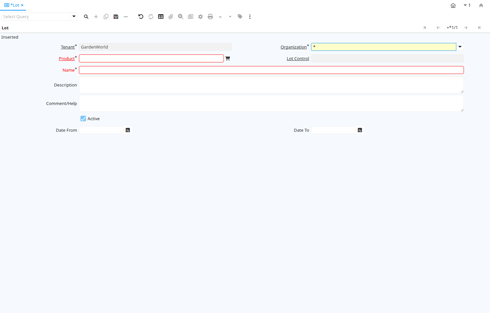

# Lot

Window ID 257

*05/05/2003 → 02/01/2000*

**Description:** Product Lot Definition

**Comment/Help:** Maintain the individual Lot of a Product

## Tab: Lot

*Tab Level 0 · Created 05/05/2003 · Updated 02/01/2000*

**Description:** Product Lot Definition

**Comment/Help:** Maintain the individual Lot of a Product

| **Name** | **Description** | **Comment/Help** | **Technical Data** |
|---|---|---|---|
| Tenant | Tenant for this installation. | A Tenant is a company or a legal entity. You cannot share data between Tenants. | M_Lot.AD_Client_ID<small> numeric(10)   Table Direct</small> |
| Organization | Organizational entity within tenant | An organization is a unit of your tenant or legal entity - examples are store, department. You can share data between organizations. | M_Lot.AD_Org_ID<small> numeric(10)   Table Direct</small> |
| Product | Product, Service, Item | Identifies an item which is either purchased or sold in this organization. | M_Lot.M_Product_ID<small> numeric(10)   Search</small> |
| Lot Control | Product Lot Control | Definition to create Lot numbers for Products | M_Lot.M_LotCtl_ID<small> numeric(10)   Table Direct</small> |
| Name | Alphanumeric identifier of the entity | The name of an entity (record) is used as an default search option in addition to the search key. The name is up to 60 characters in length. | M_Lot.Name<small> character varying(60)   String</small> |
| Description | Optional short description of the record | A description is limited to 255 characters. | M_Lot.Description<small> character varying(255)   Text</small> |
| Comment/Help | Comment or Hint | The Help field contains a hint, comment or help about the use of this item. | M_Lot.Help<small> character varying(2000)   Text</small> |
| Active | The record is active in the system | There are two methods of making records unavailable in the system: One is to delete the record, the other is to de-activate the record. A de-activated record is not available for selection, but available for reports. There are two reasons for de-activating and not deleting records: (1) The system requires the record for audit purposes. (2) The record is referenced by other records. E.g., you cannot delete a Business Partner, if there are invoices for this partner record existing. You de-activate the Business Partner and prevent that this record is used for future entries. | M_Lot.IsActive<small> character(1)   Yes-No</small> |
| Date From | Starting date for a range | The Date From indicates the starting date of a range. | M_Lot.DateFrom<small> timestamp without time zone   Date</small> |
| Date To | End date of a date range | The Date To indicates the end date of a range (inclusive) | M_Lot.DateTo<small> timestamp without time zone   Date</small> |

