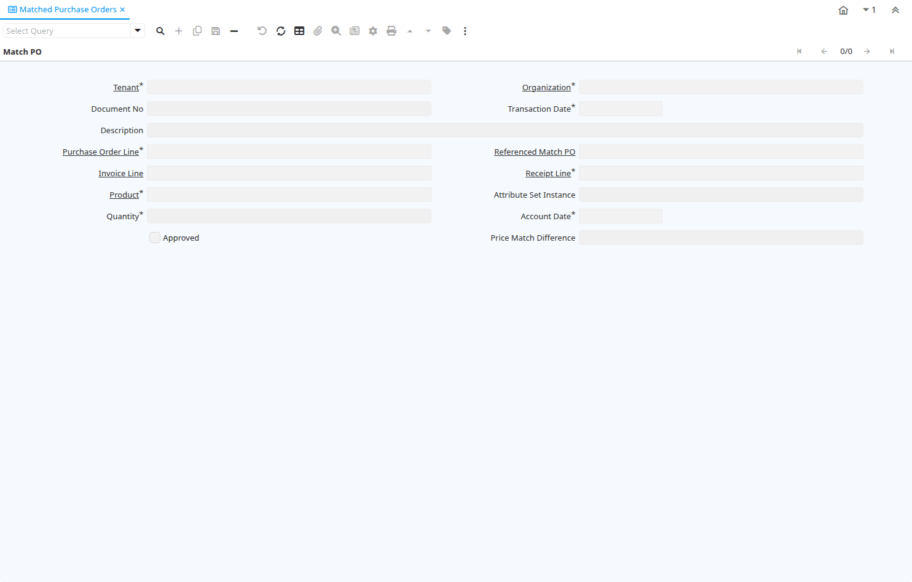

# Matched Purchase Orders

Window ID 228

*05/09/2001 → 25/11/2005*

**Description:** View Matched Purchase Orders

**Comment/Help:** View detals of matched purchase order lines to invoice lines and material receipt lines

## Tab: Match PO

*Tab Level 0 · Created 23/02/2002 · Updated 25/11/2005*

**Description:** View matched Purchase Orders

**Comment/Help:** View detals of matched purchase order lines to invoice lines and material receipt lines

| **Name** | **Description** | **Comment/Help** | **Technical Data** |
|---|---|---|---|
| Tenant | Tenant for this installation. | A Tenant is a company or a legal entity. You cannot share data between Tenants. | M_MatchPO.AD_Client_ID<small> numeric(10)   Table Direct</small> |
| Organization | Organizational entity within tenant | An organization is a unit of your tenant or legal entity - examples are store, department. You can share data between organizations. | M_MatchPO.AD_Org_ID<small> numeric(10)   Table Direct</small> |
| Document No | Document sequence number of the document | The document number is usually automatically generated by the system and determined by the document type of the document. If the document is not saved, the preliminary number is displayed in "&lt;&gt;".  If the document type of your document has no automatic document sequence defined, the field is empty if you create a new document. This is for documents which usually have an external number (like vendor invoice).  If you leave the field empty, the system will generate a document number for you. The document sequence used for this fallback number is defined in the "Maintain Sequence" window with the name "DocumentNo_&lt;TableName&gt;", where TableName is the actual name of the table (e.g. C_Order). | M_MatchPO.DocumentNo<small> character varying(30)   String</small> |
| Transaction Date | Transaction Date | The Transaction Date indicates the date of the transaction. | M_MatchPO.DateTrx<small> timestamp without time zone   Date</small> |
| Description | Optional short description of the record | A description is limited to 255 characters. | M_MatchPO.Description<small> character varying(255)   String</small> |
| Purchase Order Line | Purchase Order Line | The Purchase Order Line is a unique identifier for a line in an order. | M_MatchPO.C_OrderLine_ID<small> numeric(10)   Search</small> |
| Referenced Match PO |  |  | M_MatchPO.Ref_MatchPO_ID<small> numeric(10)   Search</small> |
| Invoice Line | Invoice Detail Line | The Invoice Line uniquely identifies a single line of an Invoice. | M_MatchPO.C_InvoiceLine_ID<small> numeric(10)   Search</small> |
| Receipt Line | Line on Receipt document |  | M_MatchPO.M_InOutLine_ID<small> numeric(10)   Search</small> |
| Product | Product, Service, Item | Identifies an item which is either purchased or sold in this organization. | M_MatchPO.M_Product_ID<small> numeric(10)   Search</small> |
| Attribute Set Instance | Product Attribute Set Instance | The values of the actual Product Attribute Instances.  The product level attributes are defined on Product level. | M_MatchPO.M_AttributeSetInstance_ID<small> numeric(10)   Product Attribute</small> |
| Quantity | Quantity | The Quantity indicates the number of a specific product or item for this document. | M_MatchPO.Qty<small> numeric   Quantity</small> |
| Account Date | Accounting Date | The Accounting Date indicates the date to be used on the General Ledger account entries generated from this document. It is also used for any currency conversion. | M_MatchPO.DateAcct<small> timestamp without time zone   Date</small> |
| Approved | Indicates if this document requires approval | The Approved checkbox indicates if this document requires approval before it can be processed. | M_MatchPO.IsApproved<small> character(1)   Yes-No</small> |
| Price Match Difference | Difference between Purchase and Invoice Price per matched line | The difference between purchase and invoice price may be used for requiring explicit approval if a Price Match Tolerance is defined on Business Partner Group level. | M_MatchPO.PriceMatchDifference<small> numeric   Amount</small> |
| Processed | The document has been processed | The Processed checkbox indicates that a document has been processed. | M_MatchPO.Processed<small> character(1)   Yes-No</small> |
| Posted | Posting status | The Posted field indicates the status of the Generation of General Ledger Accounting Lines  | M_MatchPO.Posted<small> character(1)   Button</small> |
| Delete | Delete PO Matching Record |  | M_MatchPO.Processing<small> character(1)   Button</small> |

