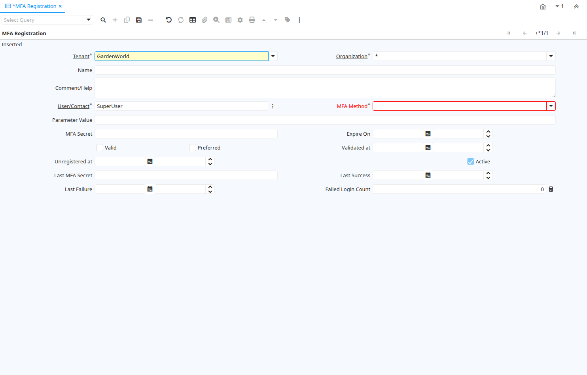

# MFA Registration

Window ID 200116

*30/05/2021 → 30/05/2021*

## Tab: MFA Registration

*Tab Level 0 · Created 30/05/2021 · Updated 30/05/2021*

| **Name** | **Description** | **Comment/Help** | **Technical Data** |
|---|---|---|---|
| Tenant | Tenant for this installation. | A Tenant is a company or a legal entity. You cannot share data between Tenants. | MFA_Registration.AD_Client_ID<small> numeric(10)   Table Direct</small> |
| Organization | Organizational entity within tenant | An organization is a unit of your tenant or legal entity - examples are store, department. You can share data between organizations. | MFA_Registration.AD_Org_ID<small> numeric(10)   Table Direct</small> |
| Name | Alphanumeric identifier of the entity | The name of an entity (record) is used as an default search option in addition to the search key. The name is up to 60 characters in length. | MFA_Registration.Name<small> character varying(1000)   String</small> |
| Comment/Help | Comment or Hint | The Help field contains a hint, comment or help about the use of this item. | MFA_Registration.Help<small> character varying(2000)   Text</small> |
| User/Contact | User within the system - Internal or Business Partner Contact | The User identifies a unique user in the system. This could be an internal user or a business partner contact | MFA_Registration.AD_User_ID<small> numeric(10)   Search</small> |
| MFA Method | Multi-factor Authentication Method |  | MFA_Registration.MFA_Method_ID<small> numeric(10)   Table Direct</small> |
| Parameter Value |  |  | MFA_Registration.ParameterValue<small> character varying(2000)   String</small> |
| MFA Secret | Multi-factor Authentication Secret |  | MFA_Registration.MFASecret<small> character varying(2000)   String</small> |
| Expire On | Expire On |  | MFA_Registration.Expiration<small> timestamp without time zone   Date+Time</small> |
| Valid | Element is valid | The element passed the validation check | MFA_Registration.IsValid<small> character(1)   Yes-No</small> |
| Preferred |  |  | MFA_Registration.IsUserMFAPreferred<small> character(1)   Yes-No</small> |
| Validated at |  |  | MFA_Registration.MFAValidatedAt<small> timestamp without time zone   Date+Time</small> |
| Unregistered at |  |  | MFA_Registration.MFAUnregisteredAt<small> timestamp without time zone   Date+Time</small> |
| Active | The record is active in the system | There are two methods of making records unavailable in the system: One is to delete the record, the other is to de-activate the record. A de-activated record is not available for selection, but available for reports. There are two reasons for de-activating and not deleting records: (1) The system requires the record for audit purposes. (2) The record is referenced by other records. E.g., you cannot delete a Business Partner, if there are invoices for this partner record existing. You de-activate the Business Partner and prevent that this record is used for future entries. | MFA_Registration.IsActive<small> character(1)   Yes-No</small> |
| Last MFA Secret |  |  | MFA_Registration.MFALastSecret<small> character varying(2000)   String</small> |
| Last Success |  |  | MFA_Registration.LastSuccess<small> timestamp without time zone   Date+Time</small> |
| Last Failure |  |  | MFA_Registration.LastFailure<small> timestamp without time zone   Date+Time</small> |
| Failed Login Count |  |  | MFA_Registration.FailedLoginCount<small> numeric(10)   Integer</small> |

