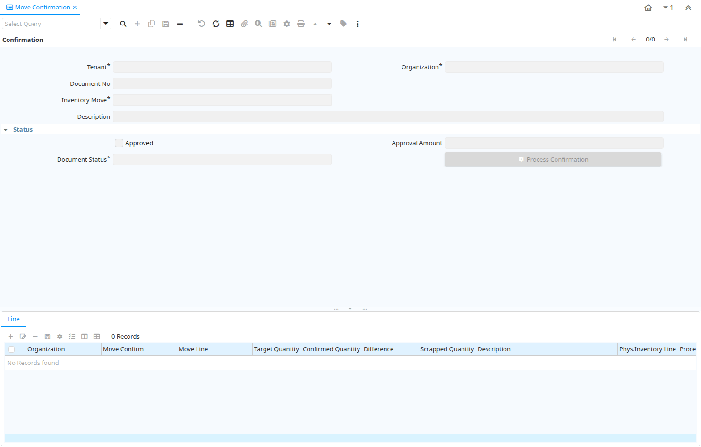

# Move Confirmation

Window ID 333

*17/06/2004 → 02/01/2000*

**Description:** Confirm Inventory Moves

**Comment/Help:** The document is automatically created when the document type of the movement indicates In Transit.. If there is a difference quantity, a Physical Inventory is created for the source (from) warehouse. If there is a scrapped quantity, a Physical Inventory is created for the target (to) warehouse.

## Tab: Confirmation

*Tab Level 0 · Created 17/06/2004 · Updated 11/09/2013*

**Description:** Confirm Inventory Moves

**Comment/Help:** The document is automatically created when the document type of the movement indicates In Transit.

| **Name** | **Description** | **Comment/Help** | **Technical Data** |
|---|---|---|---|
| Tenant | Tenant for this installation. | A Tenant is a company or a legal entity. You cannot share data between Tenants. | M_MovementConfirm.AD_Client_ID<small> numeric(10)   Table Direct</small> |
| Organization | Organizational entity within tenant | An organization is a unit of your tenant or legal entity - examples are store, department. You can share data between organizations. | M_MovementConfirm.AD_Org_ID<small> numeric(10)   Table Direct</small> |
| Document No | Document sequence number of the document | The document number is usually automatically generated by the system and determined by the document type of the document. If the document is not saved, the preliminary number is displayed in "&lt;&gt;".  If the document type of your document has no automatic document sequence defined, the field is empty if you create a new document. This is for documents which usually have an external number (like vendor invoice).  If you leave the field empty, the system will generate a document number for you. The document sequence used for this fallback number is defined in the "Maintain Sequence" window with the name "DocumentNo_&lt;TableName&gt;", where TableName is the actual name of the table (e.g. C_Order). | M_MovementConfirm.DocumentNo<small> character varying(30)   String</small> |
| Inventory Move | Movement of Inventory | The Inventory Movement uniquely identifies a group of movement lines. | M_MovementConfirm.M_Movement_ID<small> numeric(10)   Search</small> |
| Description | Optional short description of the record | A description is limited to 255 characters. | M_MovementConfirm.Description<small> character varying(255)   String</small> |
| Approved | Indicates if this document requires approval | The Approved checkbox indicates if this document requires approval before it can be processed. | M_MovementConfirm.IsApproved<small> character(1)   Yes-No</small> |
| Approval Amount | Document Approval Amount | Approval Amount for Workflow | M_MovementConfirm.ApprovalAmt<small> numeric   Amount</small> |
| Document Status | The current status of the document | The Document Status indicates the status of a document at this time.  If you want to change the document status, use the Document Action field | M_MovementConfirm.DocStatus<small> character(2)   List</small> |
| Process Confirmation | Process Inventory Movement Confirmation |  | M_MovementConfirm.DocAction<small> character(2)   Button</small> |
| Phys.Inventory | Parameters for a Physical Inventory | The Physical Inventory indicates a unique parameters for a physical inventory. | M_MovementConfirm.M_Inventory_ID<small> numeric(10)   Search</small> |

## Tab: › Line

*Tab Level 1 · Created 17/06/2004 · Updated 16/03/2021*

**Description:** Confirm Inventory Move Lines

**Comment/Help:** The quantities are in the storage Unit of Measure!

| **Name** | **Description** | **Comment/Help** | **Technical Data** |
|---|---|---|---|
| Tenant | Tenant for this installation. | A Tenant is a company or a legal entity. You cannot share data between Tenants. | M_MovementLineConfirm.AD_Client_ID<small> numeric(10)   Table Direct</small> |
| Organization | Organizational entity within tenant | An organization is a unit of your tenant or legal entity - examples are store, department. You can share data between organizations. | M_MovementLineConfirm.AD_Org_ID<small> numeric(10)   Table Direct</small> |
| Move Confirm | Inventory Move Confirmation | The document is automatically created when the document type of the movement indicates In Transit. | M_MovementLineConfirm.M_MovementConfirm_ID<small> numeric(10)   Search</small> |
| Move Line | Inventory Move document Line | The Movement Line indicates the inventory movement document line (if applicable) for this transaction | M_MovementLineConfirm.M_MovementLine_ID<small> numeric(10)   Search</small> |
| Target Quantity | Target Movement Quantity | The Quantity which should have been received | M_MovementLineConfirm.TargetQty<small> numeric   Quantity</small> |
| Confirmed Quantity | Confirmation of a received quantity | Confirmation of a received quantity | M_MovementLineConfirm.ConfirmedQty<small> numeric   Quantity</small> |
| Difference | Difference Quantity |  | M_MovementLineConfirm.DifferenceQty<small> numeric   Quantity</small> |
| Scrapped Quantity | The Quantity scrapped due to QA issues |  | M_MovementLineConfirm.ScrappedQty<small> numeric   Quantity</small> |
| Description | Optional short description of the record | A description is limited to 255 characters. | M_MovementLineConfirm.Description<small> character varying(255)   String</small> |
| Phys.Inventory Line | Unique line in an Inventory document | The Physical Inventory Line indicates the inventory document line (if applicable) for this transaction | M_MovementLineConfirm.M_InventoryLine_ID<small> numeric(10)   Search</small> |
| Processed | The document has been processed | The Processed checkbox indicates that a document has been processed. | M_MovementLineConfirm.Processed<small> character(1)   Yes-No</small> |

