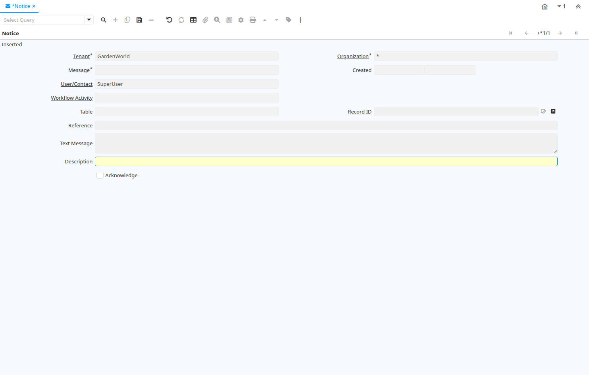

# Notice

Window ID 193

*18/12/2000 → 09/02/2005*

**Description:** View System Notices

**Comment/Help:** The system creates messages while performing processes. In this window you can view them.

## Tab: Notice

*Tab Level 0 · Created 18/12/2000 · Updated 24/11/2012*

**Description:** System Notice

**Comment/Help:** The Notice Tab provides a method of viewing messages that are generated by this system when performing processes.

| **Name** | **Description** | **Comment/Help** | **Technical Data** |
|---|---|---|---|
| Tenant | Tenant for this installation. | A Tenant is a company or a legal entity. You cannot share data between Tenants. | AD_Note.AD_Client_ID<small> numeric(10)   Table Direct</small> |
| Organization | Organizational entity within tenant | An organization is a unit of your tenant or legal entity - examples are store, department. You can share data between organizations. | AD_Note.AD_Org_ID<small> numeric(10)   Table Direct</small> |
| Message | System Message | Information and Error messages | AD_Note.AD_Message_ID<small> numeric(10)   Search</small> |
| Created | Date this record was created | The Created field indicates the date that this record was created. | AD_Note.Created<small> timestamp without time zone   Date+Time</small> |
| User/Contact | User within the system - Internal or Business Partner Contact | The User identifies a unique user in the system. This could be an internal user or a business partner contact | AD_Note.AD_User_ID<small> numeric(10)   Table Direct</small> |
| Workflow Activity | Workflow Activity | The Workflow Activity is the actual Workflow Node in a Workflow Process instance | AD_Note.AD_WF_Activity_ID<small> numeric(10)   Search</small> |
| Table | Database Table information | The Database Table provides the information of the table definition | AD_Note.AD_Table_ID<small> numeric(10)   Table Direct</small> |
| Record ID | Direct internal record ID | The Record ID is the internal unique identifier of a record. Please note that zooming to the record may not be successful for Orders, Invoices and Shipment/Receipts as sometimes the Sales Order type is not known. | AD_Note.Record_ID<small> numeric(10)   Record ID</small> |
| Reference | Reference for this record | The Reference displays the source document number. | AD_Note.Reference<small> character varying(255)   String</small> |
| Text Message | Text Message |  | AD_Note.TextMsg<small> character varying(2000)   Text</small> |
| Description | Optional short description of the record | A description is limited to 255 characters. | AD_Note.Description<small> character varying(255)   String</small> |
| Acknowledge | System Notice acknowledged | The Acknowledged checkbox indicates if this notice does not need to be retained. | AD_Note.Processed<small> character(1)   Yes-No</small> |
| Delete Notices | Delete all Notices |  | AD_Note.Processing<small> character(1)   Button</small> |

