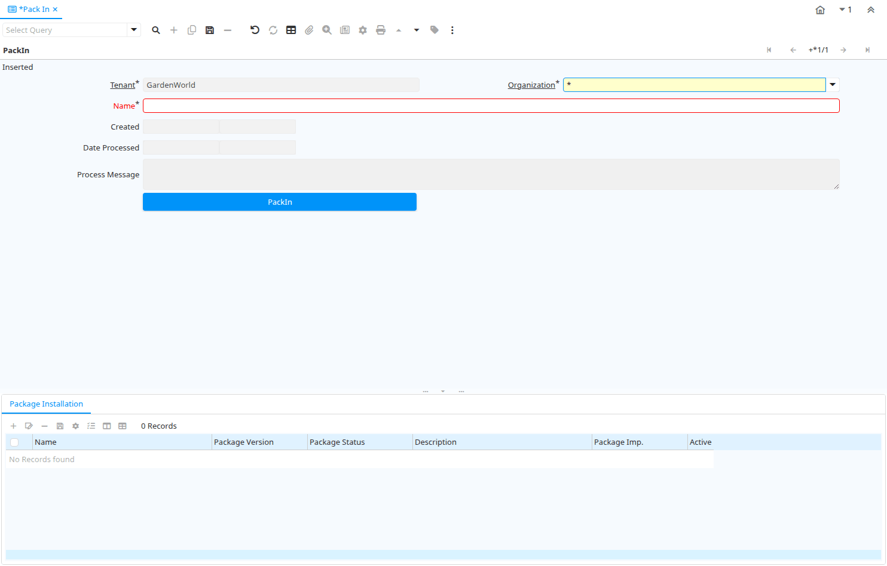

# Pack In

Window ID 50005

*11/12/2006 → 28/05/2012*

**Description:** Imports a package

**Comment/Help:** Imports a package previously created by PackOut

## Tab: PackIn

*Tab Level 0 · Created 11/12/2006 · Updated 14/08/2015*

**Description:** Import a package created by PackOut

| **Name** | **Description** | **Comment/Help** | **Technical Data** |
|---|---|---|---|
| Tenant | Tenant for this installation. | A Tenant is a company or a legal entity. You cannot share data between Tenants. | AD_Package_Imp_Proc.AD_Client_ID<small> numeric(10)   Table Direct</small> |
| Organization | Organizational entity within tenant | An organization is a unit of your tenant or legal entity - examples are store, department. You can share data between organizations. | AD_Package_Imp_Proc.AD_Org_ID<small> numeric(10)   Table Direct</small> |
| Name | Alphanumeric identifier of the entity | The name of an entity (record) is used as an default search option in addition to the search key. The name is up to 60 characters in length. | AD_Package_Imp_Proc.Name<small> character varying(500)   String</small> |
| Created | Date this record was created | The Created field indicates the date that this record was created. | AD_Package_Imp_Proc.Created<small> timestamp without time zone   Date+Time</small> |
| Date Processed |  |  | AD_Package_Imp_Proc.DateProcessed<small> timestamp without time zone   Date+Time</small> |
| Process Message |  |  | AD_Package_Imp_Proc.P_Msg<small> character varying(2000)   Text</small> |
| PackIn | Import Package | Import a package | AD_Package_Imp_Proc.Processing<small> character(1)   Button</small> |

## Tab: › Package Installation

*Tab Level 1 · Created 13/08/2015 · Updated 12/11/2020*

| **Name** | **Description** | **Comment/Help** | **Technical Data** |
|---|---|---|---|
| Tenant | Tenant for this installation. | A Tenant is a company or a legal entity. You cannot share data between Tenants. | AD_Package_Imp.AD_Client_ID<small> numeric(10)   Table Direct</small> |
| Organization | Organizational entity within tenant | An organization is a unit of your tenant or legal entity - examples are store, department. You can share data between organizations. | AD_Package_Imp.AD_Org_ID<small> numeric(10)   Table Direct</small> |
| Package Imp. Proc. |  |  | AD_Package_Imp.AD_Package_Imp_Proc_ID<small> numeric(10)   Table Direct</small> |
| Package Imp. |  |  | AD_Package_Imp.AD_Package_Imp_ID<small> numeric(10)   ID</small> |
| Name | Alphanumeric identifier of the entity | The name of an entity (record) is used as an default search option in addition to the search key. The name is up to 60 characters in length. | AD_Package_Imp.Name<small> character varying(500)   String</small> |
| Package Version |  |  | AD_Package_Imp.PK_Version<small> character varying(20)   String</small> |
| Package Status |  |  | AD_Package_Imp.PK_Status<small> character varying(22)   String</small> |
| Description | Optional short description of the record | A description is limited to 255 characters. | AD_Package_Imp.Description<small> character varying(1000)   Memo</small> |
| PackRoll |  |  | AD_Package_Imp.Processing<small> character(1)   Button</small> |
| Processed | The document has been processed | The Processed checkbox indicates that a document has been processed. | AD_Package_Imp.Processed<small> character(1)   Yes-No</small> |
| Active | The record is active in the system | There are two methods of making records unavailable in the system: One is to delete the record, the other is to de-activate the record. A de-activated record is not available for selection, but available for reports. There are two reasons for de-activating and not deleting records: (1) The system requires the record for audit purposes. (2) The record is referenced by other records. E.g., you cannot delete a Business Partner, if there are invoices for this partner record existing. You de-activate the Business Partner and prevent that this record is used for future entries. | AD_Package_Imp.IsActive<small> character(1)   Yes-No</small> |

