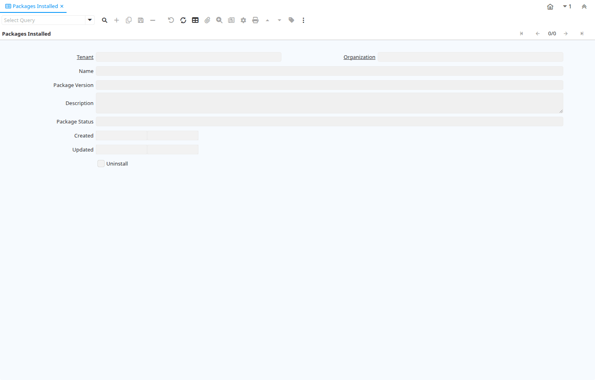

# Packages Installed

Window ID 50001

*11/12/2006 → 12/12/2006*

**Description:** List of packages installed

## Tab: Packages Installed

*Tab Level 0 · Created 11/12/2006 · Updated 06/08/2013*

**Description:** Packages Installed

| **Name** | **Description** | **Comment/Help** | **Technical Data** |
|---|---|---|---|
| Tenant | Tenant for this installation. | A Tenant is a company or a legal entity. You cannot share data between Tenants. | AD_Package_Imp_Inst.AD_Client_ID<small> numeric(10)   Table Direct</small> |
| Organization | Organizational entity within tenant | An organization is a unit of your tenant or legal entity - examples are store, department. You can share data between organizations. | AD_Package_Imp_Inst.AD_Org_ID<small> numeric(10)   Table Direct</small> |
| Name | Alphanumeric identifier of the entity | The name of an entity (record) is used as an default search option in addition to the search key. The name is up to 60 characters in length. | AD_Package_Imp_Inst.Name<small> character varying(240)   String</small> |
| Package Version |  |  | AD_Package_Imp_Inst.PK_Version<small> character varying(40)   String</small> |
| Description | Optional short description of the record | A description is limited to 255 characters. | AD_Package_Imp_Inst.Description<small> character varying(2000)   Text</small> |
| Package Status |  |  | AD_Package_Imp_Inst.PK_Status<small> character varying(44)   String</small> |
| Created | Date this record was created | The Created field indicates the date that this record was created. | AD_Package_Imp_Inst.Created<small> timestamp without time zone   Date+Time</small> |
| Updated | Date this record was updated | The Updated field indicates the date that this record was updated. | AD_Package_Imp_Inst.Updated<small> timestamp without time zone   Date+Time</small> |
| Uninstall |  |  | AD_Package_Imp_Inst.Uninstall<small> character(1)   Yes-No</small> |

