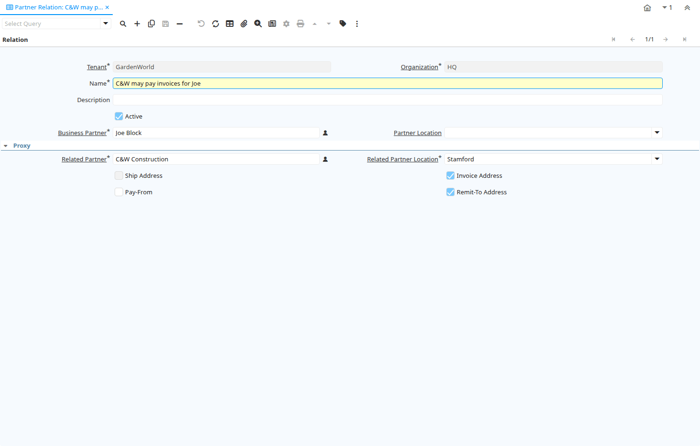

# Partner Relation

Window ID 313

*19/02/2004 → 02/01/2000*

**Description:** Maintain Business Partner Relations

**Comment/Help:** Business Partner Relation allow to maintain Third Party Relationship rules: who receives invoices for shipments or pays for invoices.

## Tab: Relation

*Tab Level 0 · Created 19/02/2004 · Updated 02/01/2000*

**Description:** Business Partner Relation

**Comment/Help:** Business Partner Relation allow to maintain Third Party Relationship rules: who receives invoices for shipments or pays for invoices.  If the Location of the Business partner is not defined, the rule applies to all location of that Business Partner

| **Name** | **Description** | **Comment/Help** | **Technical Data** |
|---|---|---|---|
| Tenant | Tenant for this installation. | A Tenant is a company or a legal entity. You cannot share data between Tenants. | C_BP_Relation.AD_Client_ID<small> numeric(10)   Table Direct</small> |
| Organization | Organizational entity within tenant | An organization is a unit of your tenant or legal entity - examples are store, department. You can share data between organizations. | C_BP_Relation.AD_Org_ID<small> numeric(10)   Table Direct</small> |
| Name | Alphanumeric identifier of the entity | The name of an entity (record) is used as an default search option in addition to the search key. The name is up to 60 characters in length. | C_BP_Relation.Name<small> character varying(60)   String</small> |
| Description | Optional short description of the record | A description is limited to 255 characters. | C_BP_Relation.Description<small> character varying(255)   String</small> |
| Active | The record is active in the system | There are two methods of making records unavailable in the system: One is to delete the record, the other is to de-activate the record. A de-activated record is not available for selection, but available for reports. There are two reasons for de-activating and not deleting records: (1) The system requires the record for audit purposes. (2) The record is referenced by other records. E.g., you cannot delete a Business Partner, if there are invoices for this partner record existing. You de-activate the Business Partner and prevent that this record is used for future entries. | C_BP_Relation.IsActive<small> character(1)   Yes-No</small> |
| Business Partner | Identifies a Business Partner | A Business Partner is anyone with whom you transact.  This can include Vendor, Customer, Employee or Salesperson | C_BP_Relation.C_BPartner_ID<small> numeric(10)   Search</small> |
| Partner Location | Identifies the (ship to) address for this Business Partner | The Partner address indicates the location of a Business Partner | C_BP_Relation.C_BPartner_Location_ID<small> numeric(10)   Table Direct</small> |
| Related Partner | Related Business Partner | The related Business Partner Acts on behalf of the Business Partner - example the Related Partner pays invoices of the Business Partner - or we pay to the Related Partner for invoices received from the Business Partner | C_BP_Relation.C_BPartnerRelation_ID<small> numeric(10)   Search</small> |
| Related Partner Location | Location of the related Business Partner |  | C_BP_Relation.C_BPartnerRelation_Location_ID<small> numeric(10)   Table</small> |
| Ship Address | Business Partner Shipment Address | If the Ship Address is selected, the location is used to ship goods to a customer or receive goods from a vendor. | C_BP_Relation.IsShipTo<small> character(1)   Yes-No</small> |
| Invoice Address | Business Partner Invoice/Bill Address | If the Invoice Address is selected, the location is used to send invoices to a customer or receive invoices from a vendor. | C_BP_Relation.IsBillTo<small> character(1)   Yes-No</small> |
| Pay-From | Business Partner can pay invoices from the related Business Partner | Proxy business partner is allowed to pay and allocate payments from the related Business Partner | C_BP_Relation.IsPayFrom<small> character(1)   Yes-No</small> |
| Remit-To Address | Business Partner payment address | If the Remit-To Address is selected, the location is used to send payments to the vendor. | C_BP_Relation.IsRemitTo<small> character(1)   Yes-No</small> |

