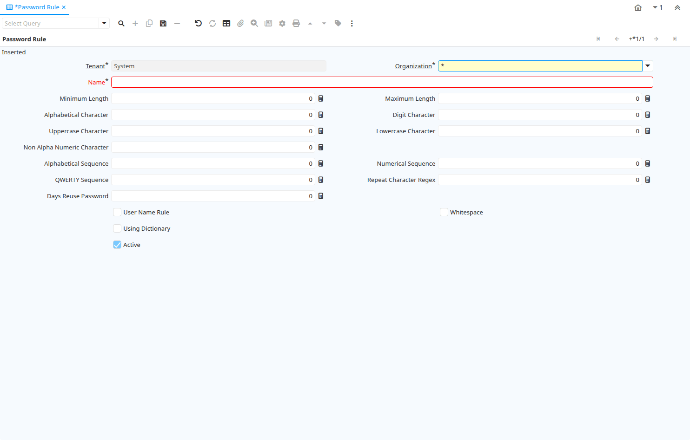

# Password Rule

Window ID 200002

*19/04/2012 → 19/04/2012*

## Tab: Password Rule

*Tab Level 0 · Created 19/04/2012 · Updated 19/04/2012*

| **Name** | **Description** | **Comment/Help** | **Technical Data** |
|---|---|---|---|
| Tenant | Tenant for this installation. | A Tenant is a company or a legal entity. You cannot share data between Tenants. | AD_PasswordRule.AD_Client_ID<small> numeric(10)   Table Direct</small> |
| Organization | Organizational entity within tenant | An organization is a unit of your tenant or legal entity - examples are store, department. You can share data between organizations. | AD_PasswordRule.AD_Org_ID<small> numeric(10)   Table Direct</small> |
| Name | Alphanumeric identifier of the entity | The name of an entity (record) is used as an default search option in addition to the search key. The name is up to 60 characters in length. | AD_PasswordRule.Name<small> character varying(60)   String</small> |
| Minimum Length |  |  | AD_PasswordRule.MinLength<small> numeric(10)   Integer</small> |
| Maximum Length | Maximum Length of Data |  | AD_PasswordRule.MaxLength<small> numeric(10)   Integer</small> |
| Alphabetical Character | Require at least # alphabetical in passwords |  | AD_PasswordRule.AlphabeticalCharacter<small> numeric(10)   Integer</small> |
| Digit Character | Require at least # digit in passwords |  | AD_PasswordRule.DigitCharacter<small> numeric(10)   Integer</small> |
| Uppercase Character | Require at least # upper case char |  | AD_PasswordRule.UppercaseCharacter<small> numeric(10)   Integer</small> |
| Lowercase Character | Require at least # lower case char |  | AD_PasswordRule.LowercaseCharacter<small> numeric(10)   Integer</small> |
| Non Alpha Numeric Character | Require at least # non-alphanumeric char |  | AD_PasswordRule.NonAlphaNumericCharacter<small> numeric(10)   Integer</small> |
| Alphabetical Sequence | Length of alphabetical sequence to validate |  | AD_PasswordRule.AlphabeticalSequence<small> numeric(10)   Integer</small> |
| Numerical Sequence | Length of numerical sequence to validate |  | AD_PasswordRule.NumericalSequence<small> numeric(10)   Integer</small> |
| QWERTY Sequence | Length of QWERTY sequences to validate |  | AD_PasswordRule.QWERTYSequence<small> numeric(10)   Integer</small> |
| Repeat Character Regex | Length of repeated characters to validate |  | AD_PasswordRule.RepeatCharacterRegex<small> numeric(10)   Integer</small> |
| Days Reuse Password | Define number of day can reuse password | Each time change password, old password keep in history Example this value = 60. user can't reuse password in history has age &lt; 60  | AD_PasswordRule.Days_Reuse_Password<small> numeric(10)   Integer</small> |
| User Name Rule | Validate the password doesn't contain user name (ignore case and match backwards) |  | AD_PasswordRule.IsUserNameRule<small> character(1)   Yes-No</small> |
| Whitespace | Whitespace validation |  | AD_PasswordRule.IsWhitespace<small> character(1)   Yes-No</small> |
| Using Dictionary |  |  | AD_PasswordRule.IsUsingDictionary<small> character(1)   Yes-No</small> |
| Match Backwards of Dictionary | Match dictionary words backwards |  | AD_PasswordRule.IsDictMatchBackwards<small> character(1)   Yes-No</small> |
| Path Dictionary |  |  | AD_PasswordRule.PathDictionary<small> character varying(255)   FileName</small> |
| Active | The record is active in the system | There are two methods of making records unavailable in the system: One is to delete the record, the other is to de-activate the record. A de-activated record is not available for selection, but available for reports. There are two reasons for de-activating and not deleting records: (1) The system requires the record for audit purposes. (2) The record is referenced by other records. E.g., you cannot delete a Business Partner, if there are invoices for this partner record existing. You de-activate the Business Partner and prevent that this record is used for future entries. | AD_PasswordRule.IsActive<small> character(1)   Yes-No</small> |

