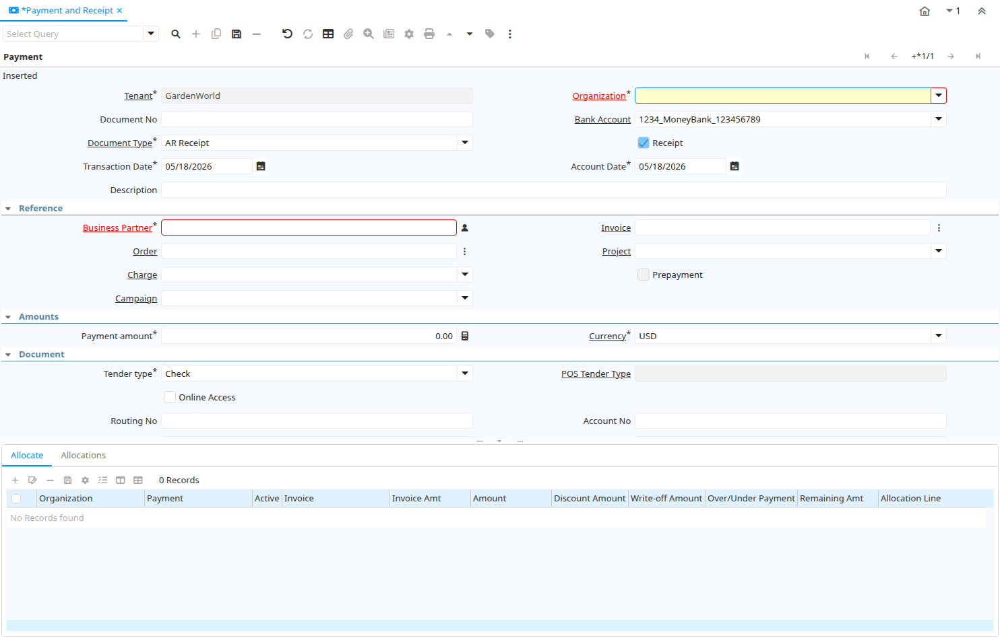

# Payment and Receipt

Window ID 195

*18/12/2000 → 08/12/2023*

**Description:** Process Payments and Receipts

**Comment/Help:** The Process Payments Window allows you to enter payments and reaipts for invoices.  If the payment is for a single invoice then it can be processed here.  If it is for multiple invoices or is a partial payment then it should be processed in the Payment Allocation Window.

## Tab: Payment

*Tab Level 0 · Created 18/12/2000 · Updated 30/09/2009*

**Description:** Payment or Receipt

**Comment/Help:** Enter payment or receipt for a Business Partner.  If it is for a single invoice it can be allocated directly to that invoice using this screen. You can also apply over/under payments:&lt;br&gt;
You have an over-payment, if you received more money than due for a single invoice. Instead of writing the difference off (i.e. would be a gain), you can leave the amount unallocated and use it for later invoices or credit memos. Please note that the Amount is the payment amount, so you need to enter the over-payment as a negative amount.&lt;br&gt;
You can also receive a partial payment (under-payment). If you decide not to write off the remaining invoice amount, enter the under-payment as a positive amount.&lt;br&gt;
Note that printed payments are archived in Payment Selection (Prepared Payment).
&lt;br&gt;For Posting, the bank account organization is used, if it is not a charge.

| **Name** | **Description** | **Comment/Help** | **Technical Data** |
|---|---|---|---|
| Tenant | Tenant for this installation. | A Tenant is a company or a legal entity. You cannot share data between Tenants. | C_Payment.AD_Client_ID<small> numeric(10)   Table Direct</small> |
| Organization | Organizational entity within tenant | An organization is a unit of your tenant or legal entity - examples are store, department. You can share data between organizations. | C_Payment.AD_Org_ID<small> numeric(10)   Table Direct</small> |
| Document No | Document sequence number of the document | The document number is usually automatically generated by the system and determined by the document type of the document. If the document is not saved, the preliminary number is displayed in "&lt;&gt;".  If the document type of your document has no automatic document sequence defined, the field is empty if you create a new document. This is for documents which usually have an external number (like vendor invoice).  If you leave the field empty, the system will generate a document number for you. The document sequence used for this fallback number is defined in the "Maintain Sequence" window with the name "DocumentNo_&lt;TableName&gt;", where TableName is the actual name of the table (e.g. C_Order). | C_Payment.DocumentNo<small> character varying(30)   String</small> |
| Bank Account | Account at the Bank | The Bank Account identifies an account at this Bank. | C_Payment.C_BankAccount_ID<small> numeric(10)   Table Direct</small> |
| Document Type | Document type or rules | The Document Type determines document sequence and processing rules | C_Payment.C_DocType_ID<small> numeric(10)   Table Direct</small> |
| Receipt | This is a sales transaction (receipt) |  | C_Payment.IsReceipt<small> character(1)   Yes-No</small> |
| Transaction Date | Transaction Date | The Transaction Date indicates the date of the transaction. | C_Payment.DateTrx<small> timestamp without time zone   Date</small> |
| Account Date | Accounting Date | The Accounting Date indicates the date to be used on the General Ledger account entries generated from this document. It is also used for any currency conversion. | C_Payment.DateAcct<small> timestamp without time zone   Date</small> |
| Description | Optional short description of the record | A description is limited to 255 characters. | C_Payment.Description<small> character varying(255)   String</small> |
| Business Partner | Identifies a Business Partner | A Business Partner is anyone with whom you transact.  This can include Vendor, Customer, Employee or Salesperson | C_Payment.C_BPartner_ID<small> numeric(10)   Search</small> |
| Invoice | Invoice Identifier | The Invoice Document. | C_Payment.C_Invoice_ID<small> numeric(10)   Search</small> |
| Order | Order | The Order is a control document.  The  Order is complete when the quantity ordered is the same as the quantity shipped and invoiced.  When you close an order, unshipped (backordered) quantities are cancelled. | C_Payment.C_Order_ID<small> numeric(10)   Search</small> |
| Project | Financial Project | A Project allows you to track and control internal or external activities. | C_Payment.C_Project_ID<small> numeric(10)   Table Direct</small> |
| Charge | Additional document charges | The Charge indicates a type of Charge (Handling, Shipping, Restocking) | C_Payment.C_Charge_ID<small> numeric(10)   Table Direct</small> |
| Prepayment | The Payment/Receipt is a Prepayment | Payments not allocated to an invoice with a charge are posted to Unallocated Payments. When setting this flag, the payment is posted to the Customer or Vendor Prepayment account. | C_Payment.IsPrepayment<small> character(1)   Yes-No</small> |
| Activity | Business Activity | Activities indicate tasks that are performed and used to utilize Activity based Costing | C_Payment.C_Activity_ID<small> numeric(10)   Table Direct</small> |
| Campaign | Marketing Campaign | The Campaign defines a unique marketing program.  Projects can be associated with a pre defined Marketing Campaign.  You can then report based on a specific Campaign. | C_Payment.C_Campaign_ID<small> numeric(10)   Table Direct</small> |
| Trx Organization | Performing or initiating organization | The organization which performs or initiates this transaction (for another organization).  The owning Organization may not be the transaction organization in a service bureau environment, with centralized services, and inter-organization transactions. | C_Payment.AD_OrgTrx_ID<small> numeric(10)   Table</small> |
| User Element List 1 | User defined list element #1 | The user defined element displays the optional elements that have been defined for this account combination. | C_Payment.User1_ID<small> numeric(10)   Search</small> |
| User Element List 2 | User defined list element #2 | The user defined element displays the optional elements that have been defined for this account combination. | C_Payment.User2_ID<small> numeric(10)   Search</small> |
| Payment amount | Amount being paid | Indicates the amount this payment is for.  The payment amount can be for single or multiple invoices or a partial payment for an invoice. | C_Payment.PayAmt<small> numeric   Amount</small> |
| Currency | The Currency for this record | Indicates the Currency to be used when processing or reporting on this record | C_Payment.C_Currency_ID<small> numeric(10)   Table Direct</small> |
| Currency Type | Currency Conversion Rate Type | The Currency Conversion Rate Type lets you define different type of rates, e.g. Spot, Corporate and/or Sell/Buy rates. | C_Payment.C_ConversionType_ID<small> numeric(10)   Table Direct</small> |
| Override Currency Conversion Rate | Override Currency Conversion Rate |  | C_Payment.IsOverrideCurrencyRate<small> character(1)   Yes-No</small> |
| Rate | Currency Conversion Rate | The Currency Conversion Rate indicates the rate to use when converting the source currency to the accounting currency | C_Payment.CurrencyRate<small> numeric   Number</small> |
| Converted Amount | Converted Amount | The Converted Amount is the result of multiplying the Source Amount by the Conversion Rate for this target currency. | C_Payment.ConvertedAmt<small> numeric   Amount</small> |
| Discount Amount | Calculated amount of discount | The Discount Amount indicates the discount amount for a document or line. | C_Payment.DiscountAmt<small> numeric   Amount</small> |
| Write-off Amount | Amount to write-off | The Write Off Amount indicates the amount to be written off as uncollectible. | C_Payment.WriteOffAmt<small> numeric   Amount</small> |
| Over/Under Payment | Over-Payment (unallocated) or Under-Payment (partial payment) | Overpayments (negative) are unallocated amounts and allow you to receive money for more than the particular invoice.  Underpayments (positive) is a partial payment for the invoice. You do not write off the unpaid amount. | C_Payment.IsOverUnderPayment<small> character(1)   Yes-No</small> |
| Over/Under Payment | Over-Payment (unallocated) or Under-Payment (partial payment) Amount | Overpayments (negative) are unallocated amounts and allow you to receive money for more than the particular invoice.  Underpayments (positive) is a partial payment for the invoice. You do not write off the unpaid amount. | C_Payment.OverUnderAmt<small> numeric   Amount</small> |
| Tender type | Method of Payment | The Tender Type indicates the method of payment (ACH or Direct Deposit, Credit Card, Check, Direct Debit) | C_Payment.TenderType<small> character(1)   List</small> |
| POS Tender Type |  |  | C_Payment.C_POSTenderType_ID<small> numeric(10)   Table Direct</small> |
| Online Access | Can be accessed online  | The Online Access check box indicates if the application can be accessed via the web.  | C_Payment.IsOnline<small> character(1)   Yes-No</small> |
| Routing No | Bank Routing Number | The Bank Routing Number (ABA Number) identifies a legal Bank.  It is used in routing checks and electronic transactions. | C_Payment.RoutingNo<small> character varying(20)   String</small> |
| Account No | Account Number | The Account Number indicates the Number assigned to this bank account.  | C_Payment.AccountNo<small> character varying(20)   String</small> |
| IBAN | International Bank Account Number | If your bank provides an International Bank Account Number, enter it here Details ISO 13616 and http://www.ecbs.org. The account number has the maximum length of 22 characters (without spaces). The IBAN is often printed with a apace after 4 characters. Do not enter the spaces in iDempiere. | C_Payment.IBAN<small> character varying(40)   String</small> |
| Swift code | Swift Code or BIC | The Swift Code (Society of Worldwide Interbank Financial Telecommunications) or BIC (Bank Identifier Code) is an identifier of a Bank. The first 4 characters are the bank code, followed by the 2 character country code, the two character location code and optional 3 character branch code. For details see http://www.swift.com/biconline/index.cfm | C_Payment.SwiftCode<small> character varying(20)   String</small> |
| Check No | Check Number | The Check Number indicates the number on the check. | C_Payment.CheckNo<small> character varying(20)   String</small> |
| Micr | Combination of routing no, account and check no | The Micr number is the combination of the bank routing number, account number and check number | C_Payment.Micr<small> character varying(20)   String</small> |
| Credit Card | Credit Card (Visa, MC, AmEx) | The Credit Card drop down list box is used for selecting the type of Credit Card presented for payment. | C_Payment.CreditCardType<small> character(1)   List</small> |
| Transaction Type | Type of credit card transaction | The Transaction Type indicates the type of transaction to be submitted to the Credit Card Company. | C_Payment.TrxType<small> character(1)   List</small> |
| Number | Credit Card Number  | The Credit Card number indicates the number on the credit card, without blanks or spaces. | C_Payment.CreditCardNumber<small> character varying(20)   String</small> |
| Verification Code | Credit Card Verification code on credit card | The Credit Card Verification indicates the verification code on the credit card (AMEX 4 digits on front; MC,Visa 3 digits back) | C_Payment.CreditCardVV<small> character varying(4)   String</small> |
| Exp. Month | Expiry Month | The Expiry Month indicates the expiry month for this credit card. | C_Payment.CreditCardExpMM<small> numeric(10)   Integer</small> |
| Exp. Year | Expiry Year | The Expiry Year indicates the expiry year for this credit card. | C_Payment.CreditCardExpYY<small> numeric(10)   Integer</small> |
| Account Name | Name on Credit Card or Account holder | The Name of the Credit Card or Account holder. | C_Payment.A_Name<small> character varying(60)   String</small> |
| Account Street | Street address of the Credit Card or Account holder | The Street Address of the Credit Card or Account holder. | C_Payment.A_Street<small> character varying(60)   String</small> |
| Account City | City or the Credit Card or Account Holder | The Account City indicates the City of the Credit Card or Account holder | C_Payment.A_City<small> character varying(60)   String</small> |
| Account Zip/Postal | Zip Code of the Credit Card or Account Holder | The Zip Code of the Credit Card or Account Holder. | C_Payment.A_Zip<small> character varying(20)   String</small> |
| Account State | State of the Credit Card or Account holder | The State of the Credit Card or Account holder | C_Payment.A_State<small> character varying(40)   String</small> |
| Account Country | Country | Account Country Name | C_Payment.A_Country<small> character varying(40)   String</small> |
| Driver License | Payment Identification - Driver License | The Driver's License being used as identification. | C_Payment.A_Ident_DL<small> character varying(20)   String</small> |
| Social Security No | Payment Identification - Social Security No | The Social Security number being used as identification. | C_Payment.A_Ident_SSN<small> character varying(20)   String</small> |
| Account EMail | Email Address | The EMail Address indicates the EMail address off the Credit Card or Account holder. | C_Payment.A_EMail<small> character varying(60)   String</small> |
| Tax Amount | Tax Amount for Credit Card transaction | The Tax Amount displays the total tax amount. The tax amount is only used for credit card processing. | C_Payment.TaxAmt<small> numeric   Amount</small> |
| PO Number | Purchase Order Number | The PO Number indicates the number assigned to a purchase order | C_Payment.PONum<small> character varying(60)   String</small> |
| Voice authorization code | Voice Authorization Code from credit card company | The Voice Authorization Code indicates the code received from the Credit Card Company. | C_Payment.VoiceAuthCode<small> character varying(20)   String</small> |
| Original Transaction ID | Original Transaction ID | The Original Transaction ID is used for reversing transactions and indicates the transaction that has been reversed. | C_Payment.Orig_TrxID<small> character varying(20)   String</small> |
| Online Process |  |  | C_Payment.OProcessing<small> character(1)   Button</small> |
| Approved | Indicates if this document requires approval | The Approved checkbox indicates if this document requires approval before it can be processed. | C_Payment.IsApproved<small> character(1)   Yes-No</small> |
| Result | Result of transmission | The Response Result indicates the result of the transmission to the Credit Card Company. | C_Payment.R_Result<small> character varying(20)   String</small> |
| Response Message | Response message | The Response Message indicates the message returned from the Credit Card Company as the result of a transmission | C_Payment.R_RespMsg<small> character varying(60)   String</small> |
| Voided |  |  | C_Payment.IsVoided<small> character(1)   Yes-No</small> |
| Void Message |  |  | C_Payment.R_VoidMsg<small> character varying(255)   Text</small> |
| Reference | Payment reference | The Payment Reference indicates the reference returned from the Credit Card Company for a payment | C_Payment.R_PnRef<small> character varying(20)   String</small> |
| Authorization Code | Authorization Code returned | The Authorization Code indicates the code returned from the electronic transmission. | C_Payment.R_AuthCode<small> character varying(20)   String</small> |
| Zip verified | The Zip Code has been verified | The Zip Verified indicates if the zip code has been verified by the Credit Card Company. | C_Payment.R_AvsZip<small> character(1)   List</small> |
| Address verified | This address has been verified | The Address Verified indicates if the address has been verified by the Credit Card Company. | C_Payment.R_AvsAddr<small> character(1)   List</small> |
| Payment Processor | Payment processor for electronic payments | The Payment Processor indicates the processor to be used for electronic payments | C_Payment.C_PaymentProcessor_ID<small> numeric(10)   Table Direct</small> |
| Customer Payment Profile ID |  |  | C_Payment.CustomerPaymentProfileID<small> character varying(60)   String</small> |
| Customer Profile ID |  |  | C_Payment.CustomerProfileID<small> character varying(60)   String</small> |
| Customer Address ID |  |  | C_Payment.CustomerAddressID<small> character varying(60)   String</small> |
| Document Status | The current status of the document | The Document Status indicates the status of a document at this time.  If you want to change the document status, use the Document Action field | C_Payment.DocStatus<small> character(2)   List</small> |
| Process Payment |  |  | C_Payment.DocAction<small> character(2)   Button</small> |
| Self-Service | This is a Self-Service entry or this entry can be changed via Self-Service | Self-Service allows users to enter data or update their data.  The flag indicates, that this record was entered or created via Self-Service or that the user can change it via the Self-Service functionality. | C_Payment.IsSelfService<small> character(1)   Yes-No</small> |
| Posted | Posting status | The Posted field indicates the status of the Generation of General Ledger Accounting Lines  | C_Payment.Posted<small> character(1)   Button</small> |
| Allocated | Indicates if the payment has been allocated | The Allocated checkbox indicates if a payment has been allocated or associated with an invoice or invoices. | C_Payment.IsAllocated<small> character(1)   Yes-No</small> |
| Reconciled | Payment is reconciled with bank statement |  | C_Payment.IsReconciled<small> character(1)   Yes-No</small> |
| Department |  |  | C_Payment.C_Department_ID<small> numeric(10)   Table Direct</small> |
| Cost Center |  |  | C_Payment.C_CostCenter_ID<small> numeric(10)   Table Direct</small> |
| Employee | Identifies a Business Partner | A Business Partner is anyone with whom you transact.  This can include Vendor, Customer, Employee or Salesperson | C_Payment.C_Employee_ID<small> numeric(10)   Search</small> |

## Tab: › Allocate

*Tab Level 1 · Created 03/09/2005 · Updated 07/01/2006*

**Description:** Allocate Payments to Invoices

**Comment/Help:** You can directly allocate payments to invoices with the same currency when creating the Payment. 
Note that you can over- or under-allocate the payment.&lt;b&gt;
When processing the payment, the allocation is created.&lt;b&gt;
The Organization is set to the invoice organization

| **Name** | **Description** | **Comment/Help** | **Technical Data** |
|---|---|---|---|
| Tenant | Tenant for this installation. | A Tenant is a company or a legal entity. You cannot share data between Tenants. | C_PaymentAllocate.AD_Client_ID<small> numeric(10)   Table Direct</small> |
| Organization | Organizational entity within tenant | An organization is a unit of your tenant or legal entity - examples are store, department. You can share data between organizations. | C_PaymentAllocate.AD_Org_ID<small> numeric(10)   Table Direct</small> |
| Payment | Payment identifier | The Payment is a unique identifier of this payment. | C_PaymentAllocate.C_Payment_ID<small> numeric(10)   Search</small> |
| Active | The record is active in the system | There are two methods of making records unavailable in the system: One is to delete the record, the other is to de-activate the record. A de-activated record is not available for selection, but available for reports. There are two reasons for de-activating and not deleting records: (1) The system requires the record for audit purposes. (2) The record is referenced by other records. E.g., you cannot delete a Business Partner, if there are invoices for this partner record existing. You de-activate the Business Partner and prevent that this record is used for future entries. | C_PaymentAllocate.IsActive<small> character(1)   Yes-No</small> |
| Invoice | Invoice Identifier | The Invoice Document. | C_PaymentAllocate.C_Invoice_ID<small> numeric(10)   Search</small> |
| Invoice Amt |  |  | C_PaymentAllocate.InvoiceAmt<small> numeric   Amount</small> |
| Amount | Amount in a defined currency | The Amount indicates the amount for this document line. | C_PaymentAllocate.Amount<small> numeric   Amount</small> |
| Discount Amount | Calculated amount of discount | The Discount Amount indicates the discount amount for a document or line. | C_PaymentAllocate.DiscountAmt<small> numeric   Amount</small> |
| Write-off Amount | Amount to write-off | The Write Off Amount indicates the amount to be written off as uncollectible. | C_PaymentAllocate.WriteOffAmt<small> numeric   Amount</small> |
| Over/Under Payment | Over-Payment (unallocated) or Under-Payment (partial payment) Amount | Overpayments (negative) are unallocated amounts and allow you to receive money for more than the particular invoice.  Underpayments (positive) is a partial payment for the invoice. You do not write off the unpaid amount. | C_PaymentAllocate.OverUnderAmt<small> numeric   Amount</small> |
| Remaining Amt | Remaining Amount |  | C_PaymentAllocate.RemainingAmt<small>    Amount</small> |
| Allocation Line | Allocation Line | Allocation of Cash/Payment to Invoice | C_PaymentAllocate.C_AllocationLine_ID<small> numeric(10)   Table Direct</small> |

## Tab: › Allocations

*Tab Level 1 · Created 27/01/2005 · Updated 03/09/2005*

**Description:** Display Allocation of the Payment/Receipt to Invoices

| **Name** | **Description** | **Comment/Help** | **Technical Data** |
|---|---|---|---|
| Tenant | Tenant for this installation. | A Tenant is a company or a legal entity. You cannot share data between Tenants. | C_AllocationLine.AD_Client_ID<small> numeric(10)   Table Direct</small> |
| Organization | Organizational entity within tenant | An organization is a unit of your tenant or legal entity - examples are store, department. You can share data between organizations. | C_AllocationLine.AD_Org_ID<small> numeric(10)   Table Direct</small> |
| Payment | Payment identifier | The Payment is a unique identifier of this payment. | C_AllocationLine.C_Payment_ID<small> numeric(10)   Search</small> |
| Allocation | Payment allocation |  | C_AllocationLine.C_AllocationHdr_ID<small> numeric(10)   Search</small> |
| Transaction Date | Transaction Date | The Transaction Date indicates the date of the transaction. | C_AllocationLine.DateTrx<small> timestamp without time zone   Date</small> |
| Invoice | Invoice Identifier | The Invoice Document. | C_AllocationLine.C_Invoice_ID<small> numeric(10)   Search</small> |
| Order | Order | The Order is a control document.  The  Order is complete when the quantity ordered is the same as the quantity shipped and invoiced.  When you close an order, unshipped (backordered) quantities are cancelled. | C_AllocationLine.C_Order_ID<small> numeric(10)   Search</small> |
| Amount | Amount in a defined currency | The Amount indicates the amount for this document line. | C_AllocationLine.Amount<small> numeric   Amount</small> |
| Discount Amount | Calculated amount of discount | The Discount Amount indicates the discount amount for a document or line. | C_AllocationLine.DiscountAmt<small> numeric   Amount</small> |
| Write-off Amount | Amount to write-off | The Write Off Amount indicates the amount to be written off as uncollectible. | C_AllocationLine.WriteOffAmt<small> numeric   Amount</small> |
| Over/Under Payment | Over-Payment (unallocated) or Under-Payment (partial payment) Amount | Overpayments (negative) are unallocated amounts and allow you to receive money for more than the particular invoice.  Underpayments (positive) is a partial payment for the invoice. You do not write off the unpaid amount. | C_AllocationLine.OverUnderAmt<small> numeric   Amount</small> |

