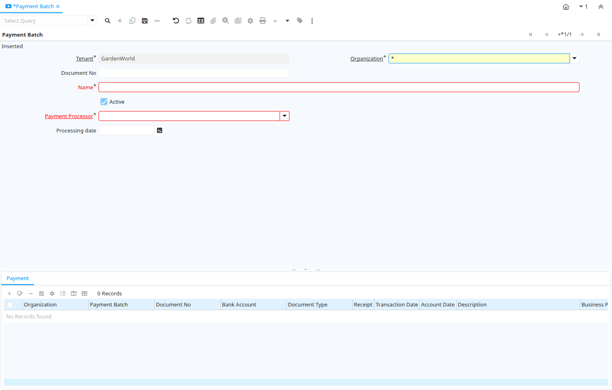

# Payment Batch

Window ID 303

*29/01/2004 → 09/02/2005*

**Description:** Process Payment Patches for EFT

**Comment/Help:** Electronic Fund Transfer Payment Batch.

## Tab: Payment Batch

*Tab Level 0 · Created 22/12/2000 · Updated 02/01/2000*

**Description:** Process Payment Batch

**Comment/Help:** Electronic Fund Transfer Payment Batch.

| **Name** | **Description** | **Comment/Help** | **Technical Data** |
|---|---|---|---|
| Tenant | Tenant for this installation. | A Tenant is a company or a legal entity. You cannot share data between Tenants. | C_PaymentBatch.AD_Client_ID<small> numeric(10)   Table Direct</small> |
| Organization | Organizational entity within tenant | An organization is a unit of your tenant or legal entity - examples are store, department. You can share data between organizations. | C_PaymentBatch.AD_Org_ID<small> numeric(10)   Table Direct</small> |
| Document No | Document sequence number of the document | The document number is usually automatically generated by the system and determined by the document type of the document. If the document is not saved, the preliminary number is displayed in "&lt;&gt;".  If the document type of your document has no automatic document sequence defined, the field is empty if you create a new document. This is for documents which usually have an external number (like vendor invoice).  If you leave the field empty, the system will generate a document number for you. The document sequence used for this fallback number is defined in the "Maintain Sequence" window with the name "DocumentNo_&lt;TableName&gt;", where TableName is the actual name of the table (e.g. C_Order). | C_PaymentBatch.DocumentNo<small> character varying(30)   String</small> |
| Name | Alphanumeric identifier of the entity | The name of an entity (record) is used as an default search option in addition to the search key. The name is up to 60 characters in length. | C_PaymentBatch.Name<small> character varying(60)   String</small> |
| Active | The record is active in the system | There are two methods of making records unavailable in the system: One is to delete the record, the other is to de-activate the record. A de-activated record is not available for selection, but available for reports. There are two reasons for de-activating and not deleting records: (1) The system requires the record for audit purposes. (2) The record is referenced by other records. E.g., you cannot delete a Business Partner, if there are invoices for this partner record existing. You de-activate the Business Partner and prevent that this record is used for future entries. | C_PaymentBatch.IsActive<small> character(1)   Yes-No</small> |
| Payment Processor | Payment processor for electronic payments | The Payment Processor indicates the processor to be used for electronic payments | C_PaymentBatch.C_PaymentProcessor_ID<small> numeric(10)   Table Direct</small> |
| Processing date |  |  | C_PaymentBatch.ProcessingDate<small> timestamp without time zone   Date</small> |
| Process Now |  |  | C_PaymentBatch.Processing<small> character(1)   Button</small> |

## Tab: › Payment

*Tab Level 1 · Created 29/01/2004 · Updated 02/01/2000*

**Description:** View Payment Information

| **Name** | **Description** | **Comment/Help** | **Technical Data** |
|---|---|---|---|
| Tenant | Tenant for this installation. | A Tenant is a company or a legal entity. You cannot share data between Tenants. | C_Payment.AD_Client_ID<small> numeric(10)   Table Direct</small> |
| Organization | Organizational entity within tenant | An organization is a unit of your tenant or legal entity - examples are store, department. You can share data between organizations. | C_Payment.AD_Org_ID<small> numeric(10)   Table Direct</small> |
| Payment Batch | Payment batch for EFT | Electronic Fund Transfer Payment Batch. | C_Payment.C_PaymentBatch_ID<small> numeric(10)   Search</small> |
| Document No | Document sequence number of the document | The document number is usually automatically generated by the system and determined by the document type of the document. If the document is not saved, the preliminary number is displayed in "&lt;&gt;".  If the document type of your document has no automatic document sequence defined, the field is empty if you create a new document. This is for documents which usually have an external number (like vendor invoice).  If you leave the field empty, the system will generate a document number for you. The document sequence used for this fallback number is defined in the "Maintain Sequence" window with the name "DocumentNo_&lt;TableName&gt;", where TableName is the actual name of the table (e.g. C_Order). | C_Payment.DocumentNo<small> character varying(30)   String</small> |
| Bank Account | Account at the Bank | The Bank Account identifies an account at this Bank. | C_Payment.C_BankAccount_ID<small> numeric(10)   Table Direct</small> |
| Document Type | Document type or rules | The Document Type determines document sequence and processing rules | C_Payment.C_DocType_ID<small> numeric(10)   Table Direct</small> |
| Receipt | This is a sales transaction (receipt) |  | C_Payment.IsReceipt<small> character(1)   Yes-No</small> |
| Transaction Date | Transaction Date | The Transaction Date indicates the date of the transaction. | C_Payment.DateTrx<small> timestamp without time zone   Date</small> |
| Account Date | Accounting Date | The Accounting Date indicates the date to be used on the General Ledger account entries generated from this document. It is also used for any currency conversion. | C_Payment.DateAcct<small> timestamp without time zone   Date</small> |
| Description | Optional short description of the record | A description is limited to 255 characters. | C_Payment.Description<small> character varying(255)   String</small> |
| Business Partner | Identifies a Business Partner | A Business Partner is anyone with whom you transact.  This can include Vendor, Customer, Employee or Salesperson | C_Payment.C_BPartner_ID<small> numeric(10)   Search</small> |
| Invoice | Invoice Identifier | The Invoice Document. | C_Payment.C_Invoice_ID<small> numeric(10)   Search</small> |
| Order | Order | The Order is a control document.  The  Order is complete when the quantity ordered is the same as the quantity shipped and invoiced.  When you close an order, unshipped (backordered) quantities are cancelled. | C_Payment.C_Order_ID<small> numeric(10)   Search</small> |
| Project | Financial Project | A Project allows you to track and control internal or external activities. | C_Payment.C_Project_ID<small> numeric(10)   Table Direct</small> |
| Charge | Additional document charges | The Charge indicates a type of Charge (Handling, Shipping, Restocking) | C_Payment.C_Charge_ID<small> numeric(10)   Table Direct</small> |
| Prepayment | The Payment/Receipt is a Prepayment | Payments not allocated to an invoice with a charge are posted to Unallocated Payments. When setting this flag, the payment is posted to the Customer or Vendor Prepayment account. | C_Payment.IsPrepayment<small> character(1)   Yes-No</small> |
| Currency | The Currency for this record | Indicates the Currency to be used when processing or reporting on this record | C_Payment.C_Currency_ID<small> numeric(10)   Table Direct</small> |
| Currency Type | Currency Conversion Rate Type | The Currency Conversion Rate Type lets you define different type of rates, e.g. Spot, Corporate and/or Sell/Buy rates. | C_Payment.C_ConversionType_ID<small> numeric(10)   Table Direct</small> |
| Payment amount | Amount being paid | Indicates the amount this payment is for.  The payment amount can be for single or multiple invoices or a partial payment for an invoice. | C_Payment.PayAmt<small> numeric   Amount</small> |
| Write-off Amount | Amount to write-off | The Write Off Amount indicates the amount to be written off as uncollectible. | C_Payment.WriteOffAmt<small> numeric   Amount</small> |
| Discount Amount | Calculated amount of discount | The Discount Amount indicates the discount amount for a document or line. | C_Payment.DiscountAmt<small> numeric   Amount</small> |
| Over/Under Payment | Over-Payment (unallocated) or Under-Payment (partial payment) Amount | Overpayments (negative) are unallocated amounts and allow you to receive money for more than the particular invoice.  Underpayments (positive) is a partial payment for the invoice. You do not write off the unpaid amount. | C_Payment.OverUnderAmt<small> numeric   Amount</small> |
| Tender type | Method of Payment | The Tender Type indicates the method of payment (ACH or Direct Deposit, Credit Card, Check, Direct Debit) | C_Payment.TenderType<small> character(1)   List</small> |
| Document Status | The current status of the document | The Document Status indicates the status of a document at this time.  If you want to change the document status, use the Document Action field | C_Payment.DocStatus<small> character(2)   List</small> |
| Posted | Posting status | The Posted field indicates the status of the Generation of General Ledger Accounting Lines  | C_Payment.Posted<small> character(1)   Button</small> |

