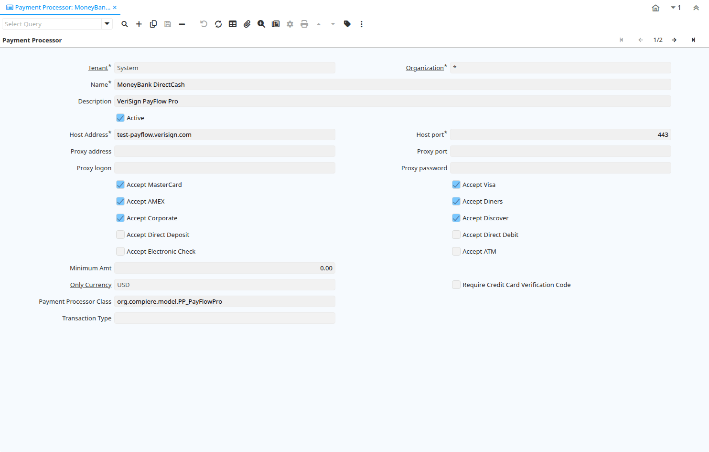

# Payment Processor

Window ID 200015

*03/10/2012 → 03/10/2012*

## Tab: Payment Processor

*Tab Level 0 · Created 03/10/2012 · Updated 03/10/2012*

| **Name** | **Description** | **Comment/Help** | **Technical Data** |
|---|---|---|---|
| Tenant | Tenant for this installation. | A Tenant is a company or a legal entity. You cannot share data between Tenants. | C_PaymentProcessor.AD_Client_ID<small> numeric(10)   Table Direct</small> |
| Organization | Organizational entity within tenant | An organization is a unit of your tenant or legal entity - examples are store, department. You can share data between organizations. | C_PaymentProcessor.AD_Org_ID<small> numeric(10)   Table Direct</small> |
| Name | Alphanumeric identifier of the entity | The name of an entity (record) is used as an default search option in addition to the search key. The name is up to 60 characters in length. | C_PaymentProcessor.Name<small> character varying(60)   String</small> |
| Description | Optional short description of the record | A description is limited to 255 characters. | C_PaymentProcessor.Description<small> character varying(255)   String</small> |
| Active | The record is active in the system | There are two methods of making records unavailable in the system: One is to delete the record, the other is to de-activate the record. A de-activated record is not available for selection, but available for reports. There are two reasons for de-activating and not deleting records: (1) The system requires the record for audit purposes. (2) The record is referenced by other records. E.g., you cannot delete a Business Partner, if there are invoices for this partner record existing. You de-activate the Business Partner and prevent that this record is used for future entries. | C_PaymentProcessor.IsActive<small> character(1)   Yes-No</small> |
| Host Address | Host Address URL or DNS | The Host Address identifies the URL or DNS of the target host | C_PaymentProcessor.HostAddress<small> character varying(60)   String</small> |
| Host port | Host Communication Port | The Host Port identifies the port to communicate with the host. | C_PaymentProcessor.HostPort<small> numeric(10)   Integer</small> |
| Proxy address |  Address of your proxy server | The Proxy Address must be defined if you must pass through a firewall to access your payment processor.  | C_PaymentProcessor.ProxyAddress<small> character varying(60)   String</small> |
| Proxy port | Port of your proxy server | The Proxy Port identifies the port of your proxy server. | C_PaymentProcessor.ProxyPort<small> numeric(10)   Integer</small> |
| Proxy logon | Logon of your proxy server | The Proxy Logon identifies the Logon ID for your proxy server. | C_PaymentProcessor.ProxyLogon<small> character varying(60)   String</small> |
| Proxy password | Password of your proxy server | The Proxy Password identifies the password for your proxy server. | C_PaymentProcessor.ProxyPassword<small> character varying(60)   String</small> |
| Accept MasterCard | Accept Master Card | Indicates if Master Cards are accepted  | C_PaymentProcessor.AcceptMC<small> character(1)   Yes-No</small> |
| Accept Visa | Accept Visa Cards | Indicates if Visa Cards are accepted  | C_PaymentProcessor.AcceptVisa<small> character(1)   Yes-No</small> |
| Accept AMEX | Accept American Express Card | Indicates if American Express Cards are accepted | C_PaymentProcessor.AcceptAMEX<small> character(1)   Yes-No</small> |
| Accept Diners | Accept Diner's Club | Indicates if Diner's Club Cards are accepted  | C_PaymentProcessor.AcceptDiners<small> character(1)   Yes-No</small> |
| Accept Corporate | Accept Corporate Purchase Cards | Indicates if Corporate Purchase Cards are accepted  | C_PaymentProcessor.AcceptCorporate<small> character(1)   Yes-No</small> |
| Accept Discover | Accept Discover Card | Indicates if Discover Cards are accepted | C_PaymentProcessor.AcceptDiscover<small> character(1)   Yes-No</small> |
| Accept Direct Deposit | Accept Direct Deposit (payee initiated) | Indicates if Direct Deposits (wire transfers, etc.) are accepted. Direct Deposits are initiated by the payee. | C_PaymentProcessor.AcceptDirectDeposit<small> character(1)   Yes-No</small> |
| Accept Direct Debit | Accept Direct Debits (vendor initiated) | Accept Direct Debit transactions. Direct Debits are initiated by the vendor who has permission to deduct amounts from the payee's account. | C_PaymentProcessor.AcceptDirectDebit<small> character(1)   Yes-No</small> |
| Accept Electronic Check | Accept ECheck (Electronic Checks) | Indicates if EChecks are accepted | C_PaymentProcessor.AcceptCheck<small> character(1)   Yes-No</small> |
| Accept ATM | Accept Bank ATM Card | Indicates if Bank ATM Cards are accepted | C_PaymentProcessor.AcceptATM<small> character(1)   Yes-No</small> |
| Minimum Amt | Minimum Amount in Document Currency |  | C_PaymentProcessor.MinimumAmt<small> numeric   Amount</small> |
| Only Currency | Restrict accepting only this currency | The Only Currency field indicates that this bank account accepts only the currency identified here. | C_PaymentProcessor.C_Currency_ID<small> numeric(10)   Table Direct</small> |
| Require Credit Card Verification Code | Require 3/4 digit Credit Verification Code | The Require CC Verification checkbox indicates if this bank accounts requires a verification number for credit card transactions. | C_PaymentProcessor.RequireVV<small> character(1)   Yes-No</small> |
| Payment Processor Class | Payment Processor Java Class | Payment Processor class identifies the Java class used to process payments extending the org.compiere.model.PaymentProcessor class. &lt;br&gt; Example implementations are Optimal Payments: org.compiere.model.PP_Optimal or Verisign: org.compiere.model.PP_PayFlowPro | C_PaymentProcessor.PayProcessorClass<small> character varying(60)   String</small> |
| Transaction Type | Type of credit card transaction | The Transaction Type indicates the type of transaction to be submitted to the Credit Card Company. | C_PaymentProcessor.TrxType<small> character(1)   List</small> |

