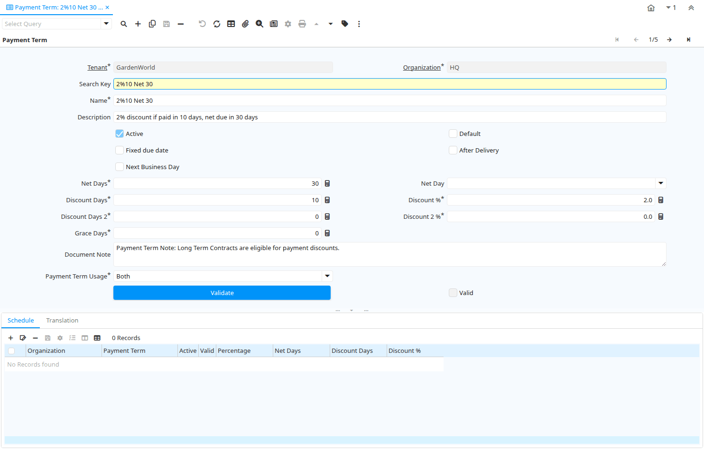

# Payment Term

Window ID 141

*09/08/1999 → 02/01/2000*

**Description:** Maintain Payment Terms

**Comment/Help:** The Payment Terms Window defines the different payment terms that you offer your customers and that are offered to you by your vendors.  Each invoice must contain a Payment Term.  On the standard invoice, the Name and the Document Note of the Payment Term is printed.

## Tab: Payment Term

*Tab Level 0 · Created 09/08/1999 · Updated 02/01/2000*

**Description:** Define Payment Terms

**Comment/Help:** The Payment Term Tab defines the different payments terms that you offer to your Business Partners when paying invoices and also those terms which your Vendors offer you for payment of your invoices. On the standard invoice, the Name and the Document Note of the Payment Term is printed.

| **Name** | **Description** | **Comment/Help** | **Technical Data** |
|---|---|---|---|
| Tenant | Tenant for this installation. | A Tenant is a company or a legal entity. You cannot share data between Tenants. | C_PaymentTerm.AD_Client_ID<small> numeric(10)   Table Direct</small> |
| Organization | Organizational entity within tenant | An organization is a unit of your tenant or legal entity - examples are store, department. You can share data between organizations. | C_PaymentTerm.AD_Org_ID<small> numeric(10)   Table Direct</small> |
| Search Key | Search key for the record in the format required - must be unique | A search key allows you a fast method of finding a particular record. If you leave the search key empty, the system automatically creates a numeric number.  The document sequence used for this fallback number is defined in the "Maintain Sequence" window with the name "DocumentNo_&lt;TableName&gt;", where TableName is the actual name of the table (e.g. C_Order). | C_PaymentTerm.Value<small> character varying(40)   String</small> |
| Name | Alphanumeric identifier of the entity | The name of an entity (record) is used as an default search option in addition to the search key. The name is up to 60 characters in length. | C_PaymentTerm.Name<small> character varying(60)   String</small> |
| Description | Optional short description of the record | A description is limited to 255 characters. | C_PaymentTerm.Description<small> character varying(255)   String</small> |
| Active | The record is active in the system | There are two methods of making records unavailable in the system: One is to delete the record, the other is to de-activate the record. A de-activated record is not available for selection, but available for reports. There are two reasons for de-activating and not deleting records: (1) The system requires the record for audit purposes. (2) The record is referenced by other records. E.g., you cannot delete a Business Partner, if there are invoices for this partner record existing. You de-activate the Business Partner and prevent that this record is used for future entries. | C_PaymentTerm.IsActive<small> character(1)   Yes-No</small> |
| Default | Default value | The Default Checkbox indicates if this record will be used as a default value. | C_PaymentTerm.IsDefault<small> character(1)   Yes-No</small> |
| Fixed due date | Payment is due on a fixed date | The Fixed Due Date checkbox indicates if invoices using this payment tern will be due on a fixed day of the month.   | C_PaymentTerm.IsDueFixed<small> character(1)   Yes-No</small> |
| After Delivery | Due after delivery rather than after invoicing | The After Delivery checkbox indicates that payment is due after delivery as opposed to after invoicing. | C_PaymentTerm.AfterDelivery<small> character(1)   Yes-No</small> |
| Next Business Day | Payment due on the next business day | The Next Business Day checkbox indicates that payment is due on the next business day after invoice or delivery. | C_PaymentTerm.IsNextBusinessDay<small> character(1)   Yes-No</small> |
| Fix month day | Day of the month of the due date | The Fix Month Day indicates the day of the month that invoices are due.  This field only displays if the fixed due date checkbox is selected. | C_PaymentTerm.FixMonthDay<small> numeric(10)   Integer</small> |
| Fix month cutoff | Last day to include for next due date | The Fix Month Cutoff indicates the last day invoices can have to be included in the current due date.  This field only displays when the fixed due date checkbox has been selected. | C_PaymentTerm.FixMonthCutoff<small> numeric(10)   Integer</small> |
| Fix month offset | Number of months (0=same, 1=following) | The Fixed Month Offset indicates the number of months from the current month to indicate an invoice is due.  A 0 indicates the same month, a 1 the following month.  This field will only display if the fixed due date checkbox is selected. | C_PaymentTerm.FixMonthOffset<small> numeric(10)   Integer</small> |
| Net Days | Net Days in which payment is due | Indicates the number of days after invoice date that payment is due. | C_PaymentTerm.NetDays<small> numeric(10)   Integer</small> |
| Net Day | Day when payment is due net | When defined, overwrites the number of net days with the relative number of days to the the day defined. | C_PaymentTerm.NetDay<small> character(1)   List</small> |
| Discount Days | Number of days from invoice date to be eligible for discount | The Discount Days indicates the number of days that payment must be received in to be eligible for the stated discount.   | C_PaymentTerm.DiscountDays<small> numeric(10)   Integer</small> |
| Discount % | Discount in percent | The Discount indicates the discount applied or taken as a percentage. | C_PaymentTerm.Discount<small> numeric   Number</small> |
| Discount Days 2 | Number of days from invoice date to be eligible for discount | The Discount Days indicates the number of days that payment must be received in to be eligible for the stated discount.   | C_PaymentTerm.DiscountDays2<small> numeric(10)   Integer</small> |
| Discount 2 % | Discount in percent | The Discount indicates the discount applied or taken as a percentage. | C_PaymentTerm.Discount2<small> numeric   Number</small> |
| Grace Days | Days after due date to send first dunning letter | The Grace Days indicates the number of days after the due date to send the first dunning letter.  This field displays only if the send dunning letters checkbox has been selected. | C_PaymentTerm.GraceDays<small> numeric(10)   Integer</small> |
| Document Note | Additional information for a Document | The Document Note is used for recording any additional information regarding this product. | C_PaymentTerm.DocumentNote<small> character varying(2000)   Text</small> |
| Payment Term Usage | Payment term usage indicates if this payment term is used for sales, purchases or both. |  | C_PaymentTerm.PaymentTermUsage<small> character(1)   List</small> |
| Validate | Validate Payment Terms and Schedule |  | C_PaymentTerm.Processing<small> character(1)   Button</small> |
| Valid | Element is valid | The element passed the validation check | C_PaymentTerm.IsValid<small> character(1)   Yes-No</small> |

## Tab: › Schedule

*Tab Level 1 · Created 04/06/2003 · Updated 16/11/2012*

**Description:** Payment Schedule

| **Name** | **Description** | **Comment/Help** | **Technical Data** |
|---|---|---|---|
| Tenant | Tenant for this installation. | A Tenant is a company or a legal entity. You cannot share data between Tenants. | C_PaySchedule.AD_Client_ID<small> numeric(10)   Table Direct</small> |
| Organization | Organizational entity within tenant | An organization is a unit of your tenant or legal entity - examples are store, department. You can share data between organizations. | C_PaySchedule.AD_Org_ID<small> numeric(10)   Table Direct</small> |
| Payment Term | The terms of Payment (timing, discount) | Payment Terms identify the method and timing of payment. | C_PaySchedule.C_PaymentTerm_ID<small> numeric(10)   Table Direct</small> |
| Active | The record is active in the system | There are two methods of making records unavailable in the system: One is to delete the record, the other is to de-activate the record. A de-activated record is not available for selection, but available for reports. There are two reasons for de-activating and not deleting records: (1) The system requires the record for audit purposes. (2) The record is referenced by other records. E.g., you cannot delete a Business Partner, if there are invoices for this partner record existing. You de-activate the Business Partner and prevent that this record is used for future entries. | C_PaySchedule.IsActive<small> character(1)   Yes-No</small> |
| Valid | Element is valid | The element passed the validation check | C_PaySchedule.IsValid<small> character(1)   Yes-No</small> |
| Percentage | Percent of the entire amount | Percentage of an amount (up to 100) | C_PaySchedule.Percentage<small> numeric   Number</small> |
| Net Days | Net Days in which payment is due | Indicates the number of days after invoice date that payment is due. | C_PaySchedule.NetDays<small> numeric(10)   Integer</small> |
| Discount Days | Number of days from invoice date to be eligible for discount | The Discount Days indicates the number of days that payment must be received in to be eligible for the stated discount.   | C_PaySchedule.DiscountDays<small> numeric(10)   Integer</small> |
| Discount % | Discount in percent | The Discount indicates the discount applied or taken as a percentage. | C_PaySchedule.Discount<small> numeric   Number</small> |

## Tab: › Translation

*Tab Level 1 · Created 04/12/1999 · Updated 27/10/2024*

| **Name** | **Description** | **Comment/Help** | **Technical Data** |
|---|---|---|---|
| Tenant | Tenant for this installation. | A Tenant is a company or a legal entity. You cannot share data between Tenants. | C_PaymentTerm_Trl.AD_Client_ID<small> numeric(10)   Table Direct</small> |
| Organization | Organizational entity within tenant | An organization is a unit of your tenant or legal entity - examples are store, department. You can share data between organizations. | C_PaymentTerm_Trl.AD_Org_ID<small> numeric(10)   Table Direct</small> |
| Payment Term | The terms of Payment (timing, discount) | Payment Terms identify the method and timing of payment. | C_PaymentTerm_Trl.C_PaymentTerm_ID<small> numeric(10)   Table Direct</small> |
| Language | Language for this entity | The Language identifies the language to use for display and formatting | C_PaymentTerm_Trl.AD_Language<small> character varying(6)   Table</small> |
| Name | Alphanumeric identifier of the entity | The name of an entity (record) is used as an default search option in addition to the search key. The name is up to 60 characters in length. | C_PaymentTerm_Trl.Name<small> character varying(60)   String</small> |
| Description | Optional short description of the record | A description is limited to 255 characters. | C_PaymentTerm_Trl.Description<small> character varying(255)   String</small> |
| Document Note | Additional information for a Document | The Document Note is used for recording any additional information regarding this product. | C_PaymentTerm_Trl.DocumentNote<small> character varying(2000)   Text</small> |
| Active | The record is active in the system | There are two methods of making records unavailable in the system: One is to delete the record, the other is to de-activate the record. A de-activated record is not available for selection, but available for reports. There are two reasons for de-activating and not deleting records: (1) The system requires the record for audit purposes. (2) The record is referenced by other records. E.g., you cannot delete a Business Partner, if there are invoices for this partner record existing. You de-activate the Business Partner and prevent that this record is used for future entries. | C_PaymentTerm_Trl.IsActive<small> character(1)   Yes-No</small> |
| Translated | This column is translated | The Translated checkbox indicates if this column is translated. | C_PaymentTerm_Trl.IsTranslated<small> character(1)   Yes-No</small> |

