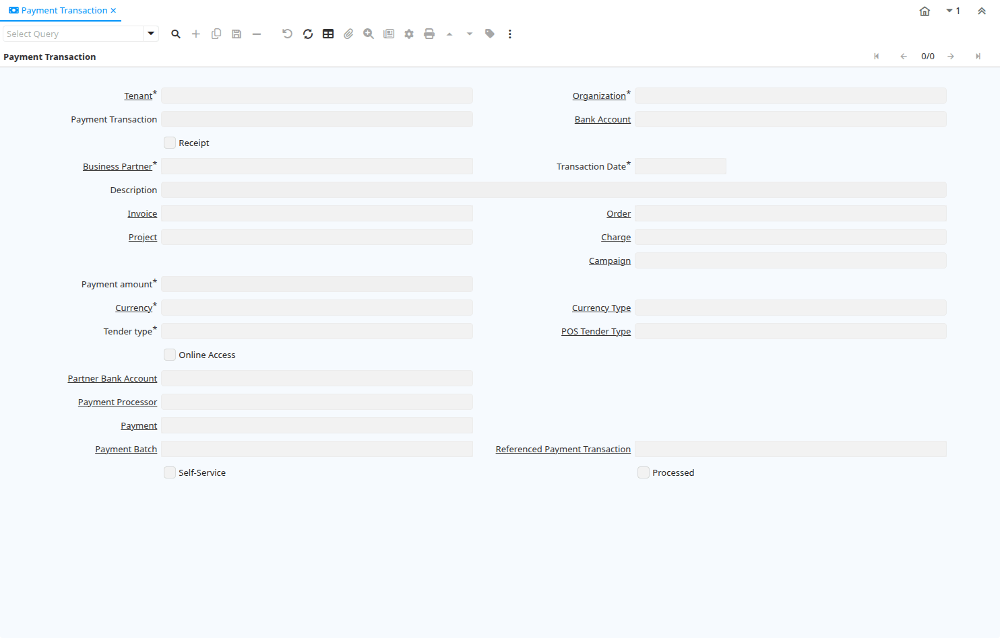

# Payment Transaction

Window ID 200017

*22/10/2012 → 22/10/2012*

**Description:** Payment Transactions

## Tab: Payment Transaction

*Tab Level 0 · Created 22/10/2012 · Updated 01/11/2012*

| **Name** | **Description** | **Comment/Help** | **Technical Data** |
|---|---|---|---|
| Tenant | Tenant for this installation. | A Tenant is a company or a legal entity. You cannot share data between Tenants. | C_PaymentTransaction.AD_Client_ID<small> numeric(10)   Table Direct</small> |
| Organization | Organizational entity within tenant | An organization is a unit of your tenant or legal entity - examples are store, department. You can share data between organizations. | C_PaymentTransaction.AD_Org_ID<small> numeric(10)   Table Direct</small> |
| Payment Transaction |  |  | C_PaymentTransaction.C_PaymentTransaction_ID<small> numeric(10)   ID</small> |
| Bank Account | Account at the Bank | The Bank Account identifies an account at this Bank. | C_PaymentTransaction.C_BankAccount_ID<small> numeric(10)   Table Direct</small> |
| Receipt | This is a sales transaction (receipt) |  | C_PaymentTransaction.IsReceipt<small> character(1)   Yes-No</small> |
| Business Partner | Identifies a Business Partner | A Business Partner is anyone with whom you transact.  This can include Vendor, Customer, Employee or Salesperson | C_PaymentTransaction.C_BPartner_ID<small> numeric(10)   Search</small> |
| Transaction Date | Transaction Date | The Transaction Date indicates the date of the transaction. | C_PaymentTransaction.DateTrx<small> timestamp without time zone   Date</small> |
| Description | Optional short description of the record | A description is limited to 255 characters. | C_PaymentTransaction.Description<small> character varying(255)   String</small> |
| Invoice | Invoice Identifier | The Invoice Document. | C_PaymentTransaction.C_Invoice_ID<small> numeric(10)   Search</small> |
| Order | Order | The Order is a control document.  The  Order is complete when the quantity ordered is the same as the quantity shipped and invoiced.  When you close an order, unshipped (backordered) quantities are cancelled. | C_PaymentTransaction.C_Order_ID<small> numeric(10)   Search</small> |
| Project | Financial Project | A Project allows you to track and control internal or external activities. | C_PaymentTransaction.C_Project_ID<small> numeric(10)   Table Direct</small> |
| Charge | Additional document charges | The Charge indicates a type of Charge (Handling, Shipping, Restocking) | C_PaymentTransaction.C_Charge_ID<small> numeric(10)   Table Direct</small> |
| Activity | Business Activity | Activities indicate tasks that are performed and used to utilize Activity based Costing | C_PaymentTransaction.C_Activity_ID<small> numeric(10)   Table Direct</small> |
| Campaign | Marketing Campaign | The Campaign defines a unique marketing program.  Projects can be associated with a pre defined Marketing Campaign.  You can then report based on a specific Campaign. | C_PaymentTransaction.C_Campaign_ID<small> numeric(10)   Table Direct</small> |
| Trx Organization | Performing or initiating organization | The organization which performs or initiates this transaction (for another organization).  The owning Organization may not be the transaction organization in a service bureau environment, with centralized services, and inter-organization transactions. | C_PaymentTransaction.AD_OrgTrx_ID<small> numeric(10)   Table</small> |
| User Element List 1 | User defined list element #1 | The user defined element displays the optional elements that have been defined for this account combination. | C_PaymentTransaction.User1_ID<small> numeric(10)   Search</small> |
| User Element List 2 | User defined list element #2 | The user defined element displays the optional elements that have been defined for this account combination. | C_PaymentTransaction.User2_ID<small> numeric(10)   Search</small> |
| Payment amount | Amount being paid | Indicates the amount this payment is for.  The payment amount can be for single or multiple invoices or a partial payment for an invoice. | C_PaymentTransaction.PayAmt<small> numeric   Amount</small> |
| Currency | The Currency for this record | Indicates the Currency to be used when processing or reporting on this record | C_PaymentTransaction.C_Currency_ID<small> numeric(10)   Table Direct</small> |
| Currency Type | Currency Conversion Rate Type | The Currency Conversion Rate Type lets you define different type of rates, e.g. Spot, Corporate and/or Sell/Buy rates. | C_PaymentTransaction.C_ConversionType_ID<small> numeric(10)   Table Direct</small> |
| Tender type | Method of Payment | The Tender Type indicates the method of payment (ACH or Direct Deposit, Credit Card, Check, Direct Debit) | C_PaymentTransaction.TenderType<small> character(1)   List</small> |
| POS Tender Type |  |  | C_PaymentTransaction.C_POSTenderType_ID<small> numeric(10)   Table Direct</small> |
| Online Access | Can be accessed online  | The Online Access check box indicates if the application can be accessed via the web.  | C_PaymentTransaction.IsOnline<small> character(1)   Yes-No</small> |
| Partner Bank Account | Bank Account of the Business Partner | The Partner Bank Account identifies the bank account to be used for this Business Partner | C_PaymentTransaction.C_BP_BankAccount_ID<small> numeric(10)   Table Direct</small> |
| Routing No | Bank Routing Number | The Bank Routing Number (ABA Number) identifies a legal Bank.  It is used in routing checks and electronic transactions. | C_PaymentTransaction.RoutingNo<small> character varying(20)   String</small> |
| Account No | Account Number | The Account Number indicates the Number assigned to this bank account.  | C_PaymentTransaction.AccountNo<small> character varying(20)   String</small> |
| IBAN | International Bank Account Number | If your bank provides an International Bank Account Number, enter it here Details ISO 13616 and http://www.ecbs.org. The account number has the maximum length of 22 characters (without spaces). The IBAN is often printed with a apace after 4 characters. Do not enter the spaces in iDempiere. | C_PaymentTransaction.IBAN<small> character varying(40)   String</small> |
| Swift code | Swift Code or BIC | The Swift Code (Society of Worldwide Interbank Financial Telecommunications) or BIC (Bank Identifier Code) is an identifier of a Bank. The first 4 characters are the bank code, followed by the 2 character country code, the two character location code and optional 3 character branch code. For details see http://www.swift.com/biconline/index.cfm | C_PaymentTransaction.SwiftCode<small> character varying(20)   String</small> |
| Check No | Check Number | The Check Number indicates the number on the check. | C_PaymentTransaction.CheckNo<small> character varying(20)   String</small> |
| Micr | Combination of routing no, account and check no | The Micr number is the combination of the bank routing number, account number and check number | C_PaymentTransaction.Micr<small> character varying(20)   String</small> |
| Credit Card | Credit Card (Visa, MC, AmEx) | The Credit Card drop down list box is used for selecting the type of Credit Card presented for payment. | C_PaymentTransaction.CreditCardType<small> character(1)   List</small> |
| Transaction Type | Type of credit card transaction | The Transaction Type indicates the type of transaction to be submitted to the Credit Card Company. | C_PaymentTransaction.TrxType<small> character(1)   List</small> |
| Number | Credit Card Number  | The Credit Card number indicates the number on the credit card, without blanks or spaces. | C_PaymentTransaction.CreditCardNumber<small> character varying(20)   String</small> |
| Verification Code | Credit Card Verification code on credit card | The Credit Card Verification indicates the verification code on the credit card (AMEX 4 digits on front; MC,Visa 3 digits back) | C_PaymentTransaction.CreditCardVV<small> character varying(4)   String</small> |
| Exp. Month | Expiry Month | The Expiry Month indicates the expiry month for this credit card. | C_PaymentTransaction.CreditCardExpMM<small> numeric(10)   Integer</small> |
| Exp. Year | Expiry Year | The Expiry Year indicates the expiry year for this credit card. | C_PaymentTransaction.CreditCardExpYY<small> numeric(10)   Integer</small> |
| Account Name | Name on Credit Card or Account holder | The Name of the Credit Card or Account holder. | C_PaymentTransaction.A_Name<small> character varying(60)   String</small> |
| Account Street | Street address of the Credit Card or Account holder | The Street Address of the Credit Card or Account holder. | C_PaymentTransaction.A_Street<small> character varying(60)   String</small> |
| Account City | City or the Credit Card or Account Holder | The Account City indicates the City of the Credit Card or Account holder | C_PaymentTransaction.A_City<small> character varying(60)   String</small> |
| Account Zip/Postal | Zip Code of the Credit Card or Account Holder | The Zip Code of the Credit Card or Account Holder. | C_PaymentTransaction.A_Zip<small> character varying(20)   String</small> |
| Account State | State of the Credit Card or Account holder | The State of the Credit Card or Account holder | C_PaymentTransaction.A_State<small> character varying(40)   String</small> |
| Account Country | Country | Account Country Name | C_PaymentTransaction.A_Country<small> character varying(40)   String</small> |
| Driver License | Payment Identification - Driver License | The Driver's License being used as identification. | C_PaymentTransaction.A_Ident_DL<small> character varying(20)   String</small> |
| Social Security No | Payment Identification - Social Security No | The Social Security number being used as identification. | C_PaymentTransaction.A_Ident_SSN<small> character varying(20)   String</small> |
| Account EMail | Email Address | The EMail Address indicates the EMail address off the Credit Card or Account holder. | C_PaymentTransaction.A_EMail<small> character varying(60)   String</small> |
| Tax Amount | Tax Amount for a document | The Tax Amount displays the total tax amount for a document. | C_PaymentTransaction.TaxAmt<small> numeric   Amount</small> |
| PO Number | Purchase Order Number | The PO Number indicates the number assigned to a purchase order | C_PaymentTransaction.PONum<small> character varying(60)   String</small> |
| Voice authorization code | Voice Authorization Code from credit card company | The Voice Authorization Code indicates the code received from the Credit Card Company. | C_PaymentTransaction.VoiceAuthCode<small> character varying(20)   String</small> |
| Original Transaction ID | Original Transaction ID | The Original Transaction ID is used for reversing transactions and indicates the transaction that has been reversed. | C_PaymentTransaction.Orig_TrxID<small> character varying(20)   String</small> |
| Void It |  |  | C_PaymentTransaction.VoidIt<small> character(1)   Button</small> |
| Approved | Indicates if this document requires approval | The Approved checkbox indicates if this document requires approval before it can be processed. | C_PaymentTransaction.IsApproved<small> character(1)   Yes-No</small> |
| Delayed Capture | Charge after Shipment | Delayed Capture is required, if you ship products.  The first credit card transaction is the Authorization, the second is the actual transaction after the shipment of the product. | C_PaymentTransaction.IsDelayedCapture<small> character(1)   Yes-No</small> |
| Result | Result of transmission | The Response Result indicates the result of the transmission to the Credit Card Company. | C_PaymentTransaction.R_Result<small> character varying(20)   String</small> |
| Response Message | Response message | The Response Message indicates the message returned from the Credit Card Company as the result of a transmission | C_PaymentTransaction.R_RespMsg<small> character varying(60)   String</small> |
| Info | Response info | The Info indicates any response information returned from the Credit Card Company. | C_PaymentTransaction.R_Info<small> character varying(2000)   String</small> |
| Voided |  |  | C_PaymentTransaction.IsVoided<small> character(1)   Yes-No</small> |
| Void Message |  |  | C_PaymentTransaction.R_VoidMsg<small> character varying(255)   Text</small> |
| Reference | Payment reference | The Payment Reference indicates the reference returned from the Credit Card Company for a payment | C_PaymentTransaction.R_PnRef<small> character varying(20)   String</small> |
| Authorization Code | Authorization Code returned | The Authorization Code indicates the code returned from the electronic transmission. | C_PaymentTransaction.R_AuthCode<small> character varying(20)   String</small> |
| Zip verified | The Zip Code has been verified | The Zip Verified indicates if the zip code has been verified by the Credit Card Company. | C_PaymentTransaction.R_AvsZip<small> character(1)   List</small> |
| Address verified | This address has been verified | The Address Verified indicates if the address has been verified by the Credit Card Company. | C_PaymentTransaction.R_AvsAddr<small> character(1)   List</small> |
| CVV Match | Credit Card Verification Code Match | The Credit Card Verification Code was matched | C_PaymentTransaction.R_CVV2Match<small> character(1)   Yes-No</small> |
| Payment Processor | Payment processor for electronic payments | The Payment Processor indicates the processor to be used for electronic payments | C_PaymentTransaction.C_PaymentProcessor_ID<small> numeric(10)   Table Direct</small> |
| Customer Payment Profile ID |  |  | C_PaymentTransaction.CustomerPaymentProfileID<small> character varying(60)   String</small> |
| Customer Profile ID |  |  | C_PaymentTransaction.CustomerProfileID<small> character varying(60)   String</small> |
| Customer Address ID |  |  | C_PaymentTransaction.CustomerAddressID<small> character varying(60)   String</small> |
| Payment | Payment identifier | The Payment is a unique identifier of this payment. | C_PaymentTransaction.C_Payment_ID<small> numeric(10)   Search</small> |
| Cash Book | Cash Book for recording petty cash transactions | The Cash Book identifies a unique cash book.  The cash book is used to record cash transactions. | C_PaymentTransaction.C_CashBook_ID<small> numeric(10)   Table Direct</small> |
| Payment Batch | Payment batch for EFT | Electronic Fund Transfer Payment Batch. | C_PaymentTransaction.C_PaymentBatch_ID<small> numeric(10)   Search</small> |
| Referenced Payment Transaction |  |  | C_PaymentTransaction.Ref_PaymentTransaction_ID<small> numeric(10)   Search</small> |
| Self-Service | This is a Self-Service entry or this entry can be changed via Self-Service | Self-Service allows users to enter data or update their data.  The flag indicates, that this record was entered or created via Self-Service or that the user can change it via the Self-Service functionality. | C_PaymentTransaction.IsSelfService<small> character(1)   Yes-No</small> |
| Processed | The document has been processed | The Processed checkbox indicates that a document has been processed. | C_PaymentTransaction.Processed<small> character(1)   Yes-No</small> |
| Department |  |  | C_PaymentTransaction.C_Department_ID<small> numeric(10)   Table Direct</small> |
| Cost Center |  |  | C_PaymentTransaction.C_CostCenter_ID<small> numeric(10)   Table Direct</small> |

