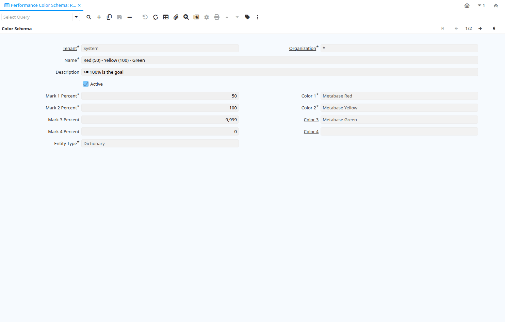

# Performance Color Schema

Window ID 364

*23/12/2005 → 15/01/2024*

**Description:** Maintain Performance Color Schema

**Comment/Help:** Visual representation of performance by color.  The Schema has often three levels (e.g. red-yellow-green).  iDempiere supports two levels (e.g. red-green) or four levels (e.g. gray-bronce-silver-gold).  Note that Measures without a goal are represented white.  The percentages could be between 0 and unlimited (i.e. above 100%).

## Tab: Color Schema

*Tab Level 0 · Created 23/12/2005 · Updated 15/01/2024*

**Description:** Performance Color Schema

**Comment/Help:** Visual representation of performance by color.  The Schema has often three levels (e.g. red-yellow-green).  iDempiere supports two levels (e.g. red-green) or four levels (e.g. gray-bronce-silver-gold).  Note that Measures without a goal are represented white.  The percentages could be between 0 and unlimited (i.e. above 100%).

| **Name** | **Description** | **Comment/Help** | **Technical Data** |
|---|---|---|---|
| Tenant | Tenant for this installation. | A Tenant is a company or a legal entity. You cannot share data between Tenants. | PA_ColorSchema.AD_Client_ID<small> numeric(10)   Table Direct</small> |
| Organization | Organizational entity within tenant | An organization is a unit of your tenant or legal entity - examples are store, department. You can share data between organizations. | PA_ColorSchema.AD_Org_ID<small> numeric(10)   Table Direct</small> |
| Name | Alphanumeric identifier of the entity | The name of an entity (record) is used as an default search option in addition to the search key. The name is up to 60 characters in length. | PA_ColorSchema.Name<small> character varying(60)   String</small> |
| Description | Optional short description of the record | A description is limited to 255 characters. | PA_ColorSchema.Description<small> character varying(255)   String</small> |
| Active | The record is active in the system | There are two methods of making records unavailable in the system: One is to delete the record, the other is to de-activate the record. A de-activated record is not available for selection, but available for reports. There are two reasons for de-activating and not deleting records: (1) The system requires the record for audit purposes. (2) The record is referenced by other records. E.g., you cannot delete a Business Partner, if there are invoices for this partner record existing. You de-activate the Business Partner and prevent that this record is used for future entries. | PA_ColorSchema.IsActive<small> character(1)   Yes-No</small> |
| Mark 1 Percent | Percentage up to this color is used | Example 50 - i.e. below 50% this color is used | PA_ColorSchema.Mark1Percent<small> numeric(10)   Integer</small> |
| Color 1 | First color used |  | PA_ColorSchema.AD_PrintColor1_ID<small> numeric(10)   Table</small> |
| Mark 2 Percent | Percentage up to this color is used | Example 80 - e.g., if Mark 1 is 50 - this color is used between 50% and 80% | PA_ColorSchema.Mark2Percent<small> numeric(10)   Integer</small> |
| Color 2 | Second color used |  | PA_ColorSchema.AD_PrintColor2_ID<small> numeric(10)   Table</small> |
| Mark 3 Percent | Percentage up to this color is used | Example 100 - e.g., if Mark 2 is 80 - this color is used between 80% and 100% | PA_ColorSchema.Mark3Percent<small> numeric(10)   Integer</small> |
| Color 3 | Third color used |  | PA_ColorSchema.AD_PrintColor3_ID<small> numeric(10)   Table</small> |
| Mark 4 Percent | Percentage up to this color is used | Example 9999 - e.g., if Mark 3 is 100 - this color is used above 100% | PA_ColorSchema.Mark4Percent<small> numeric(10)   Integer</small> |
| Color 4 | Forth color used |  | PA_ColorSchema.AD_PrintColor4_ID<small> numeric(10)   Table</small> |
| Entity Type | Dictionary Entity Type; Determines ownership and synchronization | The Entity Types "Dictionary", "iDempiere" and "Application" might be automatically synchronized and customizations deleted or overwritten.    For customizations, copy the entity and select "User"! | PA_ColorSchema.EntityType<small> character varying(40)   Table</small> |

