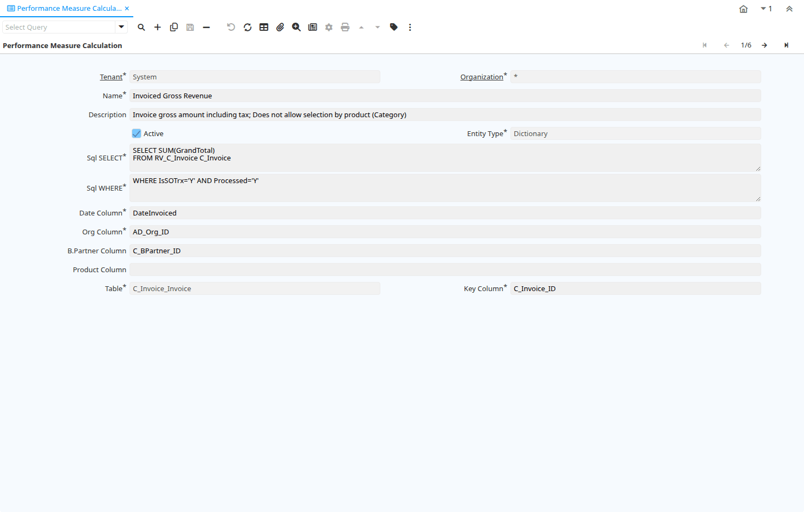

# Performance Measure Calculation

Window ID 213

*24/04/2001 → 30/09/2022*

**Description:** Define how you calculate your performance measures

**Comment/Help:** The Performance Measure Calculation defines how performance measures will be calculated.
The sql needs to return a single value.  Please check examples.&lt;br&gt;
The date restriction is defined in the Goal.
Any restrictions for Organizations, Business Partners, Products, etc. are as Performance Goal Restrictions.

## Tab: Performance Measure Calculation

*Tab Level 0 · Created 24/04/2001 · Updated 30/09/2022*

**Description:** Maintain your Performance Measure Calculation

**Comment/Help:** The Performance Measure Calculation defines how performance measures will be calculated. See examples.&lt;br&gt;
The SELECT definition must contain the SELECT and FROM keywords in upper case.  The WHERE clause can only contain values of the main table (e.g. when selecting from Header and lines, only header variables can be used in the where clause) and be fully qualified if there is more then one table.

| **Name** | **Description** | **Comment/Help** | **Technical Data** |
|---|---|---|---|
| Tenant | Tenant for this installation. | A Tenant is a company or a legal entity. You cannot share data between Tenants. | PA_MeasureCalc.AD_Client_ID<small> numeric(10)   Table Direct</small> |
| Organization | Organizational entity within tenant | An organization is a unit of your tenant or legal entity - examples are store, department. You can share data between organizations. | PA_MeasureCalc.AD_Org_ID<small> numeric(10)   Table Direct</small> |
| Name | Alphanumeric identifier of the entity | The name of an entity (record) is used as an default search option in addition to the search key. The name is up to 60 characters in length. | PA_MeasureCalc.Name<small> character varying(60)   String</small> |
| Description | Optional short description of the record | A description is limited to 255 characters. | PA_MeasureCalc.Description<small> character varying(255)   String</small> |
| Active | The record is active in the system | There are two methods of making records unavailable in the system: One is to delete the record, the other is to de-activate the record. A de-activated record is not available for selection, but available for reports. There are two reasons for de-activating and not deleting records: (1) The system requires the record for audit purposes. (2) The record is referenced by other records. E.g., you cannot delete a Business Partner, if there are invoices for this partner record existing. You de-activate the Business Partner and prevent that this record is used for future entries. | PA_MeasureCalc.IsActive<small> character(1)   Yes-No</small> |
| Entity Type | Dictionary Entity Type; Determines ownership and synchronization | The Entity Types "Dictionary", "iDempiere" and "Application" might be automatically synchronized and customizations deleted or overwritten.    For customizations, copy the entity and select "User"! | PA_MeasureCalc.EntityType<small> character varying(40)   Table</small> |
| Sql SELECT | SQL SELECT clause | The Select Clause indicates the SQL SELECT clause to use for selecting the record for a measure calculation. Do not include the SELECT itself. | PA_MeasureCalc.SelectClause<small> character varying(2000)   Text</small> |
| Sql WHERE | Fully qualified SQL WHERE clause | The Where Clause indicates the SQL WHERE clause to use for record selection. The WHERE clause is added to the query. Fully qualified means "tablename.columnname". | PA_MeasureCalc.WhereClause<small> character varying(2000)   Text</small> |
| Date Column | Fully qualified date column | The Date Column indicates the date to be used when calculating this measurement | PA_MeasureCalc.DateColumn<small> character varying(124)   String</small> |
| Org Column | Fully qualified Organization column (AD_Org_ID) | The Organization Column indicates the organization to be used in calculating this measurement. | PA_MeasureCalc.OrgColumn<small> character varying(124)   String</small> |
| B.Partner Column | Fully qualified Business Partner key column (C_BPartner_ID) | The Business Partner Column indicates the Business Partner to use when calculating this measurement | PA_MeasureCalc.BPartnerColumn<small> character varying(124)   String</small> |
| Product Column | Fully qualified Product column (M_Product_ID) | The Product Column indicates the product to use to use when calculating this measurement. | PA_MeasureCalc.ProductColumn<small> character varying(124)   String</small> |
| Table | Database Table information | The Database Table provides the information of the table definition | PA_MeasureCalc.AD_Table_ID<small> numeric(10)   Table Direct</small> |
| Key Column | Key Column for Table |  | PA_MeasureCalc.KeyColumn<small> character varying(124)   String</small> |

