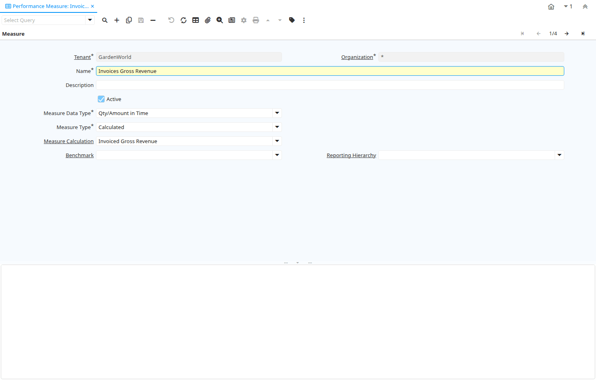

# Performance Measure

Window ID 215

*24/04/2001 → 26/12/2005*

**Description:** Define your Performance Measures

**Comment/Help:** The Performance Measure Window allows you to define the rules and restrictions for performance measurement.  You can, for example, restrict performance measurement to sales for a certain product category for a defined time frame.

## Tab: Measure

*Tab Level 0 · Created 24/04/2001 · Updated 02/01/2000*

**Description:** Performance Measure

**Comment/Help:** The Performance Measure Tab defines the date range and method to be used for measuring performance.

| **Name** | **Description** | **Comment/Help** | **Technical Data** |
|---|---|---|---|
| Tenant | Tenant for this installation. | A Tenant is a company or a legal entity. You cannot share data between Tenants. | PA_Measure.AD_Client_ID<small> numeric(10)   Table Direct</small> |
| Organization | Organizational entity within tenant | An organization is a unit of your tenant or legal entity - examples are store, department. You can share data between organizations. | PA_Measure.AD_Org_ID<small> numeric(10)   Table Direct</small> |
| Name | Alphanumeric identifier of the entity | The name of an entity (record) is used as an default search option in addition to the search key. The name is up to 60 characters in length. | PA_Measure.Name<small> character varying(60)   String</small> |
| Description | Optional short description of the record | A description is limited to 255 characters. | PA_Measure.Description<small> character varying(255)   String</small> |
| Active | The record is active in the system | There are two methods of making records unavailable in the system: One is to delete the record, the other is to de-activate the record. A de-activated record is not available for selection, but available for reports. There are two reasons for de-activating and not deleting records: (1) The system requires the record for audit purposes. (2) The record is referenced by other records. E.g., you cannot delete a Business Partner, if there are invoices for this partner record existing. You de-activate the Business Partner and prevent that this record is used for future entries. | PA_Measure.IsActive<small> character(1)   Yes-No</small> |
| Measure Data Type | Type of data - Status or in Time | Status represents values valid at a certain time (e.g. Open Invoices) - No history is maintained.&lt;br&gt; Time represents a values at a given time (e.g. Invoice Amount on 1/1) - History is maintained | PA_Measure.MeasureDataType<small> character(1)   List</small> |
| Measure Type | Determines how the actual performance is derived | The Measure Type indicates how the actual measure is determined.  For example, one measure may be manual while another is calculated. | PA_Measure.MeasureType<small> character(1)   List</small> |
| Manual Actual | Manually entered actual value | The Manual Active identifies a manually entered actual measurement value. | PA_Measure.ManualActual<small> numeric   Number</small> |
| Note | Note for manual entry | The Note allows for entry for additional information regarding a manual entry. | PA_Measure.ManualNote<small> character varying(2000)   Text</small> |
| Measure Calculation | Calculation method for measuring performance | The Measure Calculation indicates the method of measuring performance. | PA_Measure.PA_MeasureCalc_ID<small> numeric(10)   Table Direct</small> |
| Calculation Class | Java Class for calculation, implementing Interface Measure | The Calculation Class indicates the Java Class used for calculating measures. | PA_Measure.CalculationClass<small> character varying(60)   String</small> |
| Ratio | Performance Ratio | Calculation instruction set  for a performance ratio | PA_Measure.PA_Ratio_ID<small> numeric(10)   Table Direct</small> |
| Request Type | Type of request (e.g. Inquiry, Complaint, ..) | Request Types are used for processing and categorizing requests. Options are Account Inquiry, Warranty Issue, etc. | PA_Measure.R_RequestType_ID<small> numeric(10)   Table Direct</small> |
| Project Type | Type of the project | Type of the project with optional phases of the project with standard performance information | PA_Measure.C_ProjectType_ID<small> numeric(10)   Table Direct</small> |
| Benchmark | Performance Benchmark | Data Series to compare internal performance with (e.g. stock price, ...) | PA_Measure.PA_Benchmark_ID<small> numeric(10)   Table Direct</small> |
| Reporting Hierarchy | Optional Reporting Hierarchy - If not selected the default hierarchy trees are used. | Reporting Hierarchy allows you to select different Hierarchies/Trees for the report. Accounting Segments like Organization, Account, Product may have several hierarchies to accommodate different views on the business. | PA_Measure.PA_Hierarchy_ID<small> numeric(10)   Table Direct</small> |

## Tab: › Achievement

*Tab Level 1 · Created 24/04/2001 · Updated 25/12/2005*

**Description:** Performance Achievement

**Comment/Help:** The Performance Achievement Tab defines the Tasks to be achieved.  The performance is measured by the percentage of reached achievements.

| **Name** | **Description** | **Comment/Help** | **Technical Data** |
|---|---|---|---|
| Tenant | Tenant for this installation. | A Tenant is a company or a legal entity. You cannot share data between Tenants. | PA_Achievement.AD_Client_ID<small> numeric(10)   Table Direct</small> |
| Organization | Organizational entity within tenant | An organization is a unit of your tenant or legal entity - examples are store, department. You can share data between organizations. | PA_Achievement.AD_Org_ID<small> numeric(10)   Table Direct</small> |
| Measure | Concrete Performance Measurement | The Measure identifies a concrete, measurable indicator of performance.  For example, sales dollars, prospects contacted. | PA_Achievement.PA_Measure_ID<small> numeric(10)   Table Direct</small> |
| Name | Alphanumeric identifier of the entity | The name of an entity (record) is used as an default search option in addition to the search key. The name is up to 60 characters in length. | PA_Achievement.Name<small> character varying(60)   String</small> |
| Description | Optional short description of the record | A description is limited to 255 characters. | PA_Achievement.Description<small> character varying(255)   String</small> |
| Active | The record is active in the system | There are two methods of making records unavailable in the system: One is to delete the record, the other is to de-activate the record. A de-activated record is not available for selection, but available for reports. There are two reasons for de-activating and not deleting records: (1) The system requires the record for audit purposes. (2) The record is referenced by other records. E.g., you cannot delete a Business Partner, if there are invoices for this partner record existing. You de-activate the Business Partner and prevent that this record is used for future entries. | PA_Achievement.IsActive<small> character(1)   Yes-No</small> |
| Sequence | Method of ordering records; lowest number comes first | The Sequence indicates the order of records | PA_Achievement.SeqNo<small> numeric(10)   Integer</small> |
| Document Date | Date of the Document | The Document Date indicates the date the document was generated.  It may or may not be the same as the accounting date. | PA_Achievement.DateDoc<small> timestamp without time zone   Date</small> |
| Note | Optional additional user defined information | The Note field allows for optional entry of user defined information regarding this record | PA_Achievement.Note<small> character varying(2000)   Text</small> |
| Achieved | The goal is achieved | The Achieved checkbox indicates if this goal has been achieved. | PA_Achievement.IsAchieved<small> character(1)   Yes-No</small> |
| Manual Actual | Manually entered actual value | The Manual Active identifies a manually entered actual measurement value. | PA_Achievement.ManualActual<small> numeric   Number</small> |

